

<h3>Universidad Peruana de Ciencias Aplicadas</h3>
<h4>Facultad de Ingeniería</h4>
<h4>Carrera de Ingeniería de Software</h4>
<h4>Periodo 202601</h4>
<h4>1ASI0729 Desarrollo de Aplicaciones Open Source</h4>
<h4>NRC: 12010</h4>
<h4>Docente: Ivan Robles Fernández</h4>
<h4>Informe del Trabajo Final</h4>
<h4>Startup: HydroSmart</h4>
<h4>Producto: AquaPulse</h4>

 

<h2 style="text-align: center;">Team members:</h2>

<table style="margin: 0 auto; text-align: center;">
  <thead>
    <tr>
      <th>Código</th>
      <th>Nombre</th>
    </tr>
  </thead>
  <tbody>
    <tr>
      <td>U202415618</td>
      <td>Braden Raid Garcia Cerpa</td>
    </tr>
    <tr>
      <td>U20221C726</td>
      <td>Keyner Ivan Hancco Poma</td>
    </tr>
    <tr>
      <td>U202411622</td>
      <td>Oscar Fernando Vara Velásquez</td>
    </tr>
    <tr>
      <td>U202411567</td>
      <td>Victor Manuel Espino Rossi</td>
    </tr>
    <tr>
      <td>U202320776</td>
      <td>Hernan Gabriel Huayta Fuentes</td>
    </tr>
  </tbody>
</table>

 
<h4 style="text-align: center;">Abril 2026</h4>

## Registro de Versiones del Informe

| Version | Fecha | Autor | Descripcion de Modificacion |
|--------|------|------|-----------------------------|
| 0.1 | 09/04/2026 | Equipo | Se actualizó el README incorporando el perfil de la solución, antecedentes, problemática, misión, visión y perfiles del equipo. |
| 0.2 | 10/04/2026 | Equipo | Se desarrolló el Capítulo 1, incluyendo Lean UX Problem Statements, Assumptions, Hypothesis Statements, segmentos objetivos y Lean UX Canvas. |
| 0.3 | 11/04/2026 | Equipo | Se añadieron business assumptions y se consolidó la documentación Lean UX. |
| 0.4 | 12/04/2026 | BradenGarcia | Se diseñaron y documentaron las entrevistas. |
| 0.5 | 13/04/2026 | varometro159 | Se añadieron entrevistas del segundo segmento objetivo. |
| 0.6 | 14/04/2026 | BradenGarcia | Se incorporaron y corrigieron entrevistas. |
| 0.7 | 15/04/2026 | BradenGarcia | Se añadieron user personas, needfinding y evidencias. |
| 0.8 | 17/04/2026 | Equipo | Se desarrolló el análisis de entrevistas, Ubiquitous Language y EventStorming. |
| 0.9 | 18/04/2026 | Homesman | Se añadieron resúmenes de entrevistas y User Journey Mapping. |
| 1.0 | 24/04/2026 | Homesman / Equipo | Se incorporaron Empathy Mapping e imágenes. |
| 1.1 | 17/04/2026 | Vmer140 | Se inició el Capítulo 3 con la definición de Epics, User Stories y Technical Stories. |
| 1.2 | 17/04/2026 | BradenGarcia | Se desarrolló el Impact Mapping. |
| 1.3 | 18/04/2026 | 1Kanan2 | Se agregó el Product Backlog completo. |
| 1.4 | 19/04/2026 | Vmer140 | Se inició el Capítulo 4 con Navigation Systems, Searching Systems y diseño de Landing Page (wireframes y mockups). |
| 1.5 | 19/04/2026 | BradenGarcia | Se desarrollaron sistemas de organización, arquitectura de información y guías de estilo. |
| 1.6 | 19/04/2026 | varometro159 | Se añadieron EventStorming de diseño y diagramas C4. |
| 1.7 | 21/04/2026 | Homesman | Se desarrolló el diseño orientado a objetos y base de datos. |
| 1.8 | 22/04/2026 | Vmer140 / Equipo | Se desarrolló el diseño UX/UI de la aplicación web, incluyendo estructura general. |
| 1.9 | 23/04/2026 | 1Kanan2 | Se añadieron wireflows, mockups y actualización del prototipo. |
| 2.0 | 22/04/2026 | varometro159 | Se inició el Capítulo 5 con Sprint Planning y evidencias. |
| 2.1 | 23/04/2026 | BradenGarcia | Se documentó la configuración del entorno y gestión del código. |
| 2.2 | 23/04/2026 | 1Kanan2 | Se añadieron conclusiones, recomendaciones y bibliografía. |
| 2.3 | 24/04/2026 | Homesman | Se agregaron evidencias de ejecución y despliegue. |
| 2.4 | 24/04/2026 | Vmer140 | Se documentó la implementación de la Landing Page, servicios y aplicaciones. |
| 2.5 | 24/04/2026 | Equipo | Se añadieron insights del equipo y cierre del proyecto. |
| 2.6 | 13/05/2026 | 1Kanan2 | Se añadieron líderes de aspectos y colaboradores del Sprint 2. |
| 2.7 | 13/05/2026 | 1Kanan2 | Se incorporaron evidencias de desarrollo para el Sprint 2 Review. |
| 2.8 | 13/05/2026 | 1Kanan2 | Se agregaron evidencias de ejecución para el Sprint 2 Review. |
| 2.9 | 13/05/2026 | 1Kanan2 | Se añadió documentación de servicios como evidencia para el Sprint Review. |
| 3.0 | 13/05/2026 | 1Kanan2 | Se incorporó el Sprint Backlog 2. |
| 3.1 | 13/05/2026 | varometro159 | Se añadieron evidencias visuales del Sprint 2 (imágenes). |
| 3.2 | 13/05/2026 | varometro159 | Se agregaron imágenes de apoyo para commits. |
| 3.3 | 13/05/2026 | varometro159 | Se actualizaron extensiones y tamaños de imágenes. |
| 3.4 | 13/05/2026 | varometro159 | Se refactorizaron etiquetas de imágenes para mayor consistencia. |
| 3.5 | 13/05/2026 | Homesman | Se añadieron evidencias de contribuciones del frontend. |
| 3.6 | 13/05/2026 | Homesman | Se corrigieron nombres de archivos de imágenes. |
| 3.7 | 13/05/2026 | Homesman | Se actualizaron imágenes del proyecto. |
| 3.8 | 13/05/2026 | Vmer140 | Se actualizó el archivo README.md. |
| 3.9 | 13/05/2026 | BradenGarcia | Se añadió evidencia de contribuciones en la documentación del Sprint 2. |
| 4.0 | 13/05/2026 | BradenGarcia | Se incorporaron evidencias de commits del documento. |
| 4.1 | 13/05/2026 | BradenGarcia | Se actualizaron detalles de despliegue y colaboración del proyecto. |

## Project Report Collaboration Insights

**Link de la organización:**
[https://github.com/upc-pre-1ASI0730-2610-HydroSmart](https://github.com/upc-pre-1ASI0729-2610-12010-HydroSmart)

**Link del Repositorio del Informe:** [https://github.com/upc-pre-1ASI0730-2610-HydroSmart/Report.git](https://github.com/upc-pre-1ASI0729-2610-12010-HydroSmart/Report)

### Reporte de Colaboración para la Entrega del AV1

**AV1 - Desarrollo del reporte y diseño de la landing page:**

En esta primera evaluación del proyecto HydroSmart, el trabajo se centró en establecer una base sólida tanto a nivel conceptual como de diseño, definiendo la propuesta de la startup y su aplicación AquaPulse. Se priorizó la identificación de las necesidades de los usuarios, específicamente propietarios de viviendas con áreas verdes y estudiantes que alquilan, quienes presentan dificultades para controlar su consumo de agua. A través de técnicas de análisis y levantamiento de información, se logró comprender la problemática y orientar el desarrollo de una solución alineada a estos contextos.

A partir de este análisis, se desarrollaron componentes clave del proyecto como la definición del problema, la propuesta de valor y el enfoque Lean UX, que permitió estructurar las ideas de manera centrada en el usuario. Asimismo, se complementó con la elaboración de user personas y la identificación de sus principales comportamientos, objetivos y frustraciones, lo que facilitó una mejor comprensión del escenario de uso. Este proceso también permitió organizar la información necesaria para sustentar el diseño de la solución.

En la fase de diseño, se establecieron lineamientos visuales para garantizar coherencia en la interfaz, junto con la definición de la arquitectura de información, incluyendo sistemas de organización, etiquetado y navegación. Se desarrollaron wireframes, mockups y flujos de usuario que representan las principales interacciones dentro de la plataforma. Como resultado tangible, se implementó la landing page del proyecto, evidenciando el avance alcanzado en esta etapa y dejando una base estructurada para las siguientes fases de desarrollo.

## Contributors

  

  

  

**Braden Raid Garcia Cerpa**  
- **Lean UX y Definición Inicial.** Contribuyó en el desarrollo del proceso Lean UX, incluyendo la formulación de supuestos e hipótesis, estableciendo una base clara para el enfoque del proyecto.  
- **Investigación de Usuarios.** Participó en el registro de entrevistas y en la construcción de user stories, permitiendo comprender mejor las necesidades del usuario.  
- **Arquitectura de Información.** Aportó en la definición de sistemas de búsqueda y navegación, mejorando la estructura de la información.  
- **Diseño de Landing Page.** Desarrolló wireframes, mockups y el diseño visual de la landing page.  
- **Configuración Técnica.** Documentó guías de estilo de código y configuraciones iniciales para el despliegue del sistema.

**Hancco Poma, Keyner Ivan**  
- **Análisis Competitivo.** Realizó el análisis de competidores y propuso estrategias para fortalecer la propuesta de valor.  
- **Gestión del Producto.** Participó en la elaboración del product backlog y en la definición de funcionalidades.  
- **Diseño de Aplicación Web.** Desarrolló wireframes, wireflows, mockups y diagramas de flujo de usuario.  
- **Landing Page.** Contribuyó en la sección de FAQ, footer y estructura general.  
- **Documentación.** Elaboró conclusiones, recomendaciones y bibliografía del proyecto.

**Victor Manuel Espino Rossi**  
- **Lean UX Canvas y Segmentación.** Elaboró el Lean UX Canvas y definió los segmentos objetivos del proyecto.  
- **Investigación y Análisis.** Diseñó entrevistas, analizó resultados y desarrolló user personas y user task matrix.  
- **Impact Mapping.** Construyó el mapeo de impactos alineando objetivos del negocio con funcionalidades.  
- **Guías de Estilo y Arquitectura.** Definió lineamientos visuales, arquitectura de información, sistemas de organización y etiquetado.  
- **Diseño de Landing Page.** Participó en el diseño UI, wireframes y mockups.  
- **Configuración de Software.** Documentó aspectos de gestión, entorno y administración del código.

**Oscar Fernando Vara Velásquez**  
- **Definición del Problema.** Desarrolló la descripción de la startup, antecedentes y problemática.  
- **Análisis del Usuario.** Elaboró user journey mapping y empathy mapping para entender la experiencia del usuario.  
- **Diseño de Software.** Trabajó en diseño orientado a objetos, diagramas de clases y base de datos.  
- **Arquitectura Técnica.** Desarrolló diagramas y estructura de base de datos.  
- **Evidencias Técnicas.** Documentó evidencias de ejecución, servicios y despliegue del sistema.

**Hernan Gabriel Huayta Fuentes**  
- **Análisis de Competencia.** Identificó competidores y apoyó en el registro de entrevistas.  
- **Modelado del Dominio.** Participó en Big Picture Event Storming y lenguaje ubicuo.  
- **Arquitectura de Software.** Desarrolló diagramas C4: contexto, contenedores y componentes.  
- **Prototipado Web.** Contribuyó en el desarrollo de prototipos de la aplicación.  
- **Gestión Ágil.** Participó en sprint planning, backlog y organización del equipo.  
- **Evidencias de Desarrollo.** Documentó avances y evidencias para la revisión del sprint.

**Contribuciones Grupales**  
- **Investigación de Usuarios.** Desarrollo conjunto de entrevistas y análisis de necesidades.  
- **Diseño UX/UI.** Creación colaborativa de la landing page, incluyendo wireframes y mockups.  
- **Arquitectura de Información.** Definición de sistemas de organización, navegación y etiquetado.  
- **Modelado del Sistema.** Elaboración de diagramas y estructura inicial del sistema.  
- **Planificación del Proyecto.** Construcción del backlog, planificación del sprint y coordinación del equipo.

### Reporte de Colaboración para la Entrega del TB1

**TB1 - Desarrollo del reporte y diseño de la solución AquaPulse:**

En esta segunda entrega del proyecto AquaPulse, el trabajo se centró en establecer una base sólida tanto a nivel conceptual como de diseño, definiendo la propuesta de la startup y su aplicación orientada a la optimización del consumo de agua en entornos domésticos. Se priorizó la identificación de las necesidades de los usuarios, especialmente aquellos que buscan monitorear y comprender su consumo de agua, quienes presentan dificultades para interpretar su gasto y tomar decisiones informadas. A través de técnicas de análisis y levantamiento de información, se logró comprender la problemática y orientar el desarrollo de una solución alineada a estos contextos.

A partir de este análisis, se desarrollaron componentes clave del proyecto como la definición del problema, la propuesta de valor y el enfoque Lean UX, que permitió estructurar las ideas de manera centrada en el usuario. Asimismo, se complementó con la elaboración de user personas y la identificación de sus principales comportamientos, objetivos y frustraciones, lo que facilitó una mejor comprensión del escenario de uso. Este proceso también permitió organizar la información necesaria para sustentar el diseño de la solución.

En la fase de diseño, se establecieron lineamientos visuales para garantizar coherencia en la interfaz, junto con la definición de la arquitectura de información, incluyendo sistemas de organización, etiquetado y navegación. Se desarrollaron wireframes, mockups y flujos de usuario que representan las principales interacciones dentro de la plataforma, como la visualización del consumo, el análisis de datos y la gestión de alertas. Como resultado tangible, se implementaron prototipos de la aplicación web, evidenciando el avance alcanzado en esta etapa y dejando una base estructurada para las siguientes fases de desarrollo.

## Contributors

  

  

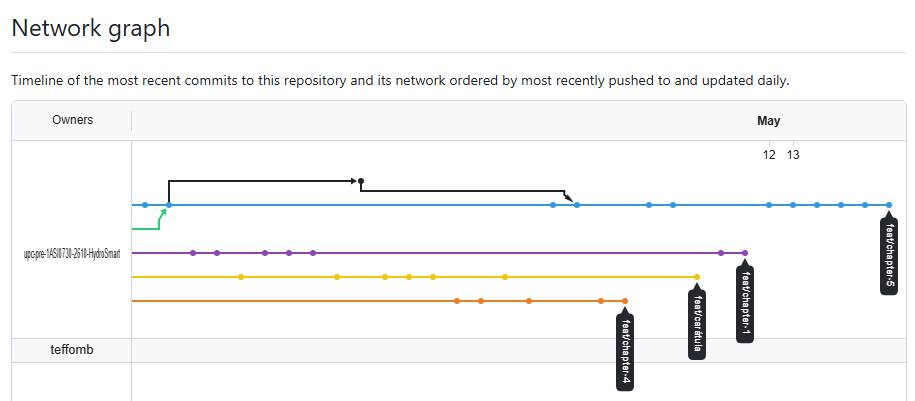  

**Espino Rossi, Victor Manuel**
- **Módulo de Reportes.** Participó en la definición y diseño de la visualización del historial y análisis del consumo de agua.
- **Investigación de Usuarios.** Apoyó en la construcción de user stories relacionadas al análisis de consumo.
- **Diseño de la Aplicación.** Desarrolló wireframes y mockups enfocados en reportes y gráficos.
- **Documentación.** Contribuyó en la elaboración del reporte del proyecto

**Hancco Poma, Keyner Ivan**
- **Módulo Dashboard - Analytics.** Lideró el diseño del dashboard principal para la visualización clara del consumo de agua.
- **Gestión del Producto.** Participó en la elaboración del product backlog y definición de funcionalidades analíticas.
- **Diseño de Aplicación Web.** Desarrolló wireframes, wireflows y mockups del dashboard.
- **Documentación.** Apoyó en conclusiones y desarrollo del reporte.

**Garcia Cerpa, Braden Raid**
- **Módulo Profile y Notifications.** Participó en la definición de funcionalidades relacionadas al perfil de usuario y sistema de notificaciones.
- **Lean UX Canvas y Segmentación.** Elaboró el Lean UX Canvas y definió segmentos de usuarios.
- **Investigación y Análisis.** Diseñó entrevistas y desarrolló user personas.
- **Diseño UX/UI.** Contribuyó en wireframes y mockups enfocados en experiencia del usuario.

**Vara Velásquez, Oscar Fernando**
- **Módulo Settings.** Participó en la definición de funcionalidades de configuración y personalización de la aplicación.
- **Definición del Problema.** Desarrolló la problemática del proyecto y su contexto.
- **Análisis del Usuario.** Elaboró user journey mapping y empathy mapping.
- **Arquitectura Técnica.** Apoyó en la estructura inicial del sistema.

**Huayta Fuentes, Hernán Gabriel**
- **Módulo Devices.** Participó en la conceptualización de la gestión de dispositivos dentro de la plataforma.
- **Análisis de Competencia.** Identificó soluciones similares en el mercado.
- **Modelado del Dominio.** Apoyó en la definición del sistema y sus componentes.
- **Prototipado Web.** Contribuyó en el desarrollo de interfaces.

**Contribuciones Grupales**
- **Investigación de Usuarios.** Desarrollo conjunto del análisis de necesidades relacionadas al consumo de agua.
- **Diseño UX/UI.** Creación colaborativa de wireframes, mockups y flujos de usuario.
- **Arquitectura de Información.** Definición de sistemas de organización, navegación y etiquetado.
- **Planificación del Proyecto.** Construcción del backlog y organización del trabajo del equipo.

# Contenido

- [Student Outcome](#student-outcome)
- [Capítulo I: Introducción](#capitulo-i-introduccion)
    - [1.1. Startup Profile](#11-startup-profile)
        - [1.1.1. Descripción de la Startup](#111-descripción-de-la-startup)
        - [1.1.2. Perfiles de integrantes del equipo](#112-perfiles-de-integrantes-del-equipo)
    - [1.2. Solution Profile](#12-solution-profile)
        - [1.2.1. Antecedentes y problemática](#121-antecedentes-y-problemática)
        - [1.2.2. Lean UX Process](#122-lean-ux-process)
            - [1.2.2.1. Lean UX Problem Statements](#1221-lean-ux-problem-statements)
            - [1.2.2.2. Lean UX Assumptions](#1222-lean-ux-assumptions)
            - [1.2.2.3. Lean UX Hypothesis Statements](#1223-lean-ux-hypothesis-statements)
            - [1.2.2.4. Lean UX Canvas](#1224-lean-ux-canvas)
    - [1.3. Segmentos Objetivo](#13-segmentos-objetivo)

- [Capítulo II: Requirements Elicitation & Analysis](#capitulo-ii-requirements-elicitation--analysis)
    - [2.1. Competidores](#21-competidores)
        - [2.1.1. Análisis competitivo](#211-análisis-competitivo)
        - [2.1.2. Estrategias y tácticas frente a competidores](#212-estrategias-y-tácticas-frente-a-competidores)
    - [2.2. Entrevistas](#22-entrevistas)
        - [2.2.1. Diseño de entrevistas](#221-diseño-de-entrevistas)
        - [2.2.2. Registro de entrevistas](#222-registro-de-entrevistas)
        - [2.2.3. Análisis de entrevistas](#223-análisis-de-entrevistas)
    - [2.3. Needfinding](#23-needfinding)
        - [2.3.1. User Personas](#231-user-personas)
        - [2.3.2. User Task Matrix](#232-user-task-matrix)
        - [2.3.3. User Journey Mapping](#233-user-journey-mapping)
        - [2.3.4. Empathy Mapping](#234-empathy-mapping)
    - [2.4. Big Picture EventStorming](#24-big-picture-eventstorming)
    - [2.5. Ubiquitous Language](#25-ubiquitous-language)

- [Capítulo III: Requirements Specification](#capitulo-iii-requirements-specification)
    - [3.1. User Stories](#31-user-stories)
    - [3.2. Impact Mapping](#32-impact-mapping)
    - [3.3. Product Backlog](#33-product-backlog)

- [Capítulo IV: Product Design](#capitulo-iv-product-design)
    - [4.1. Style Guidelines](#41-style-guidelines)
        - [4.1.1. General Style Guidelines](#411-general-style-guidelines)
        - [4.1.2. Web Style Guidelines](#412-web-style-guidelines)
    - [4.2. Information Architecture](#42-information-architecture)
        - [4.2.1. Organization Systems](#421-organization-systems)
        - [4.2.2. Labeling Systems](#422-labeling-systems)
        - [4.2.3. SEO Tags and Meta Tags](#423-seo-tags-and-meta-tags)
        - [4.2.4. Searching Systems](#424-searching-systems)
        - [4.2.5. Navigation Systems](#425-navigation-systems)
    - [4.3. Landing Page UI Design](#43-landing-page-ui-design)
        - [4.3.1. Landing Page Wireframe](#431-landing-page-wireframe)
        - [4.3.2. Landing Page Mock-up](#432-landing-page-mock-up)
    - [4.4. Web Applications UX/UI Design](#44-web-applications-uxui-design)
        - [4.4.1. Web Applications Wireframes](#441-web-applications-wireframes)
        - [4.4.2. Web Applications Wireflow Diagrams](#442-web-applications-wireflow-diagrams)
        - [4.4.3. Web Applications Mock-ups](#443-web-applications-mock-ups)
        - [4.4.4. Web Applications User Flow Diagrams](#444-web-applications-user-flow-diagrams)
    - [4.5. Web Applications Prototyping](#45-web-applications-prototyping)
    - [4.6. Domain-Driven Software Architecture](#46-domain-driven-software-architecture)
        - [4.6.1. Design-Level EventStorming](#461-design-level-eventstorming)
        - [4.6.2. Software Architecture Context Diagram](#462-software-architecture-context-diagram)
        - [4.6.3. Software Architecture Container Diagrams](#463-software-architecture-container-diagrams)
        - [4.6.4. Software Architecture Components Diagrams](#464-software-architecture-components-diagrams)
    - [4.7. Software Object-Oriented Design](#47-software-object-oriented-design)
        - [4.7.1. Class Diagrams](#471-class-diagrams)
    - [4.8. Database Design](#48-database-design)
        - [4.8.1. Database Diagrams](#481-database-diagrams)

- [Capítulo V: Product Implementation, Validation & Deployment](#capitulo-v-product-implementation-validation--deployment)
    - [5.1. Software Configuration Management](#51-software-configuration-management)
        - [5.1.1. Software Development Environment Configuration](#511-software-development-environment-configuration)
        - [5.1.2. Source Code Management](#512-source-code-management)
        - [5.1.3. Source Code Style Guide & Conventions](#513-source-code-style-guide--conventions)
        - [5.1.4. Software Deployment Configuration](#514-software-deployment-configuration)
    - [5.2. Landing Page, Services & Applications Implementation](#52-landing-page-services--applications-implementation)
        - [5.2.1. Sprint 1](#521-sprint-n)
            - [5.2.1.1. Sprint Planning 1](#5211-sprint-planning-n)
            - [5.2.1.2. Aspect Leaders and Collaborators](#5212-aspect-leaders-and-collaborators)
            - [5.2.1.3. Sprint Backlog 1](#5213-sprint-backlog-n)
            - [5.2.1.4. Development Evidence for Sprint Review](#5214-development-evidence-for-sprint-review)
            - [5.2.1.5. Execution Evidence for Sprint Review](#5215-execution-evidence-for-sprint-review)
            - [5.2.1.6. Services Documentation Evidence for Sprint Review](#5216-services-documentation-evidence-for-sprint-review)
            - [5.2.1.7. Software Deployment Evidence for Sprint Review](#5217-software-deployment-evidence-for-sprint-review)
            - [5.2.1.8. Team Collaboration Insights during Sprint](#5218-team-collaboration-insights-during-sprint)

            - [5.2.2. Sprint 2](#522-sprint-n)
            - [5.2.2.1. Sprint Planning 2](#5221-sprint-planning-n)
            - [5.2.2.2. Aspect Leaders and Collaborators](#5212-aspect-leaders-and-collaborators)
            - [5.2.2.3. Sprint Backlog 2](#5223-sprint-backlog-n)
            - [5.2.2.4. Development Evidence for Sprint Review](#5224-development-evidence-for-sprint-review)
            - [5.2.2.5. Execution Evidence for Sprint Review](#5225-execution-evidence-for-sprint-review)
            - [5.2.2.6. Services Documentation Evidence for Sprint Review](#5226-services-documentation-evidence-for-sprint-review)
            - [5.2.2.7. Software Deployment Evidence for Sprint Review](#5227-software-deployment-evidence-for-sprint-review)
            - [5.2.2.8. Team Collaboration Insights during Sprint](#5228-team-collaboration-insights-during-sprint)

            - [5.2.3. Sprint 3](#523-sprint-3)
            - [5.2.3.1. Sprint Planning 3](#5231-sprint-planning-3)
            - [5.2.3.2. Aspect Leaders and Collaborators](#5232-aspect-leaders-and-collaborators)
            - [5.2.3.3. Sprint Backlog 3](#5233-sprint-backlog-3)
            - [5.2.3.4. Development Evidence for Sprint Review](#5234-development-evidence-for-sprint-review)
            - [5.2.3.5. Execution Evidence for Sprint Review](#5235-execution-evidence-for-sprint-review)
            - [5.2.3.6. Services Documentation Evidence for Sprint Review](#5236-services-documentation-evidence-for-sprint-review)
            - [5.2.3.7. Software Deployment Evidence for Sprint Review](#5237-software-deployment-evidence-for-sprint-review)
            - [5.2.3.8. Team Collaboration Insights during Sprint](#5238-team-collaboration-insights-during-sprint)

            - [5.3. Validation Interviews](#53-validation-interviews)
            - [5.3.1. Diseño de Entrevistas](#5221-diseno-de-entrevistas)
            - [5.3.2. Registro de Entrevistas](#5212-registro-de-entrevistas)
            - [5.3.3. Evaluaciones según heurísticas](#5212-evaluaciones-segun-heuristicas)
            - [5.4. Video About-the-Product](#54-video-about-the-product)

- [Conclusiones](#conclusiones)
    - [Conclusiones y recomendaciones](#conclusiones-y-recomendaciones)
- [Bibliografía](#bibliografía)
- [Anexos](#anexos)

## Student Outcome

| Criterio Especifico | Acciones Realizadas | Conclusiones                                                                                                                                                                                                                                                                                                                                                                                                                                                                                                                                                                                                                                                                                         |
|--------------------|--------------------|------------------------------------------------------------------------------------------------------------------------------------------------------------------------------------------------------------------------------------------------------------------------------------------------------------------------------------------------------------------------------------------------------------------------------------------------------------------------------------------------------------------------------------------------------------------------------------------------------------------------------------------------------------------------------------------------------|
| Trabaja en equipo para proporcionar liderazgo en forma conjunta | **Braden Raid Garcia Cerpa:**  **Acciones AV1:** Participé en la organización del equipo, apoyando en la definición de ideas clave y asegurando que todos mantuvieran una misma línea de trabajo. Coordiné tareas y apoyé en la toma de decisiones.  **Acciones TB1:** Contribuí en la definición de funcionalidades del módulo de reportes y apoyé en la organización del equipo para el desarrollo de la propuesta de solución.   **Hancco Poma, Keyner Ivan:**  **Acciones AV1:** Colaboré en reuniones grupales y en la ejecución de tareas asignadas. Aporté ideas para mejorar el enfoque del landing y mantener el avance del equipo.  **Acciones TB1:** Lideré la definición del dashboard analítico, proponiendo ideas para la visualización del consumo y asegurando coherencia en el diseño.   **Victor Manuel Espino Rossi:**  **Acciones AV1:** Contribuí en el diseño UX/UI y en la estructuración del contenido del landing. Apoyé en la coordinación del equipo y revisión de avances.  **Acciones TB1:** Participé en la definición de funcionalidades de perfil y notificaciones, apoyando en la experiencia de usuario y coherencia del sistema.   **Hernan Gabriel Huayta Fuentes:**  **Acciones AV1:** Participé en la planificación de tareas y en la organización del contenido. Apoyé en la comunicación del equipo para mantener coherencia.  **Acciones TB1:** Definí aspectos del módulo de configuración, asegurando que las opciones de personalización estén alineadas con las necesidades del usuario.   **Oscar Fernando Vara Velásquez:**  **Acciones AV1:** Colaboré en la definición de ideas y en la organización del trabajo. Participé activamente en las coordinaciones grupales.  **Acciones TB1:** Apoyé en la conceptualización del módulo de dispositivos, proponiendo ideas para su gestión dentro del sistema. | **Conclusión grupal AV1:** El equipo logró mantener un liderazgo compartido, donde cada integrante aportó desde su rol para avanzar de manera coordinada. La comunicación constante y la organización de tareas permitieron un desarrollo ordenado del landing. Este enfoque facilitó la toma de decisiones y aseguró coherencia en el resultado final.   **Conclusión grupal TB1:** El equipo mantuvo un liderazgo colaborativo, distribuyendo responsabilidades por módulos y asegurando una participación activa de todos los integrantes. La coordinación permitió avanzar de forma organizada en la definición de la solución y sentar bases claras para el desarrollo del sistema. |
| Crea un entorno colaborativo e inclusivo, establece metas, planifica tareas y cumple objetivos. | **Braden Raid Garcia Cerpa:**  **Acciones AV1:** Apoyé en la definición de objetivos y en la organización de tareas, asegurando claridad en las responsabilidades de cada integrante.  **Acciones TB1:** Participé en la planificación de tareas relacionadas a reportes y en la organización de actividades del equipo.   **Hancco Poma, Keyner Ivan:**  **Acciones AV1:** Participé en tareas asignadas y reuniones, manteniendo un ambiente colaborativo y cumpliendo con los objetivos.  **Acciones TB1:** Definí objetivos para el desarrollo del dashboard y coordiné tareas relacionadas al análisis de consumo.   **Victor Manuel Espino Rossi:**  **Acciones AV1:** Establecí metas para el diseño UX/UI y planifiqué tareas del landing, asegurando el cumplimiento de objetivos.  **Acciones TB1:** Planifiqué tareas relacionadas a perfil y notificaciones, asegurando una experiencia de usuario coherente.   **Hernan Gabriel Huayta Fuentes:**  **Acciones AV1:** Colaboré en la planificación de actividades y mantuve comunicación constante para un avance ordenado.  **Acciones TB1:** Participé en la planificación del módulo de configuración y en la organización de tareas del equipo.   **Oscar Fernando Vara Velásquez:**  **Acciones AV1:** Participé en la organización del trabajo y en la planificación de tareas, contribuyendo al cumplimiento de metas.  **Acciones TB1:** Apoyé en la planificación de funcionalidades relacionadas a dispositivos y en la coordinación del trabajo grupal. | **Conclusión grupal AV1:** Se logró un entorno colaborativo donde se definieron metas claras y se organizaron las tareas de manera eficiente. La participación activa permitió cumplir los objetivos establecidos, manteniendo un trabajo ordenado y alineado con lo requerido.   **Conclusión grupal TB1:** El equipo logró establecer metas claras y distribuir tareas de acuerdo a los módulos del sistema. La planificación permitió cumplir los objetivos planteados y avanzar de manera organizada en la construcción de la propuesta de AquaPulse.                                                                                                                                |

# Capítulo I: Introducción

## 1.1. Startup Profile

### 1.1.1. Descripción de la Startup

## 1.1. Startup Profile

### 1.1.1. Descripción de la Startup

**HydroSmart** es una startup de base tecnológica dedicada al desarrollo de soluciones digitales orientadas a mejorar la eficiencia en el uso del agua dentro del entorno doméstico. Mediante su plataforma inteligente, la aplicación brinda a los usuarios la capacidad de supervisar su consumo hídrico en tiempo real, identificar fugas de forma anticipada y acceder a recomendaciones personalizadas que contribuyen a disminuir el desperdicio. La herramienta convierte la gestión de un recurso vital en un proceso digital, traduciendo información compleja en datos concretos y accionables para promover hogares más responsables ambiental y económicamente.

La plataforma ha sido concebida para responder a las necesidades particulares de distintos tipos de usuarios. De un lado, pone a disposición de los **propietarios con áreas verdes** un seguimiento detallado del riego y cuidado de sus jardines; de otro, facilita a los **arrendadores de departamentos con servicios incluidos** la supervisión del consumo de sus inquilinos para evitar pérdidas económicas. Del mismo modo, ofrece a los **jóvenes arrendatarios y estudiantes** una alternativa asequible para cuidar su economía mensual mediante alertas de consumo y objetivos de ahorro ajustados a sus posibilidades.

Con un compromiso genuino con la innovación y la sostenibilidad, **HydroSmart** aspira a posicionarse como referente en la digitalización del sector hídrico residencial en América Latina. Al integrar una interfaz moderna con tecnología de análisis preventivo, la startup no solo contribuye a reducir el importe de las facturas mensuales, sino que también impulsa una cultura de transparencia y responsabilidad ambiental, garantizando que cada litro de agua sea aprovechado al máximo en el hogar.

**Misión:**  
Promover la gestión inteligente del recurso hídrico en los hogares a través de soluciones tecnológicas accesibles que optimicen el consumo, reduzcan costos operativos y estimulen hábitos sostenibles que preserven el agua a largo plazo.

**Visión:**  
Consolidarse como la plataforma de referencia en eficiencia hídrica residencial en Latinoamérica, liderando la construcción de hogares inteligentes donde la tecnología y la conciencia ambiental se articulen para garantizar un uso responsable y transparente del agua.

### 1.1.2. Perfiles de integrantes del equipo
| Integrante                                                                        | Código Estudiante | Descripcion de Carrera | Conocimientos y Habilidades a apuntar |
|-----------------------------------------------------------------------------------|-------------------|------------------------|---------------------------------------|
|  Braden Garcia Cerpa       | U202415618       | Ingeniería de Software |  Proactivo, Excelente trabajando en equipo y dominio en lenguajes como python, HTML, CSS y JS        |
|    Keyner Ivan Hancco Poma           | U20221C726        | Ingeniería de Software | C++, Python, CSS, HTML, Figma, SQL, JS, Excelente en comunicación, organización y en el idioma inglés  |
|    Hernan Gabriel Huayta Fuentes | U202320776       | Ingeniería de Software | SQL, Postgres, Prisma, TS, JS, HTML, CSS, Desarrollador fullstack, orientado a desarrollo frontend con agil aprendizaje |
|    Victor Manuel Espino Rossi        | U202411567       | Ingeniería de Software |  Desarrollador proactivo con dominio en lenguajes como C++ y Python. Orientado a la creación de soluciones eficientes y excelente capacidad para el trabajo en equipo.                              |
|  Oscar Fernando Vara Velásquez             | U202411622        | Ingeniería de Software |  Enfocado en crear soluciones tecnológicas de acuerdo a las necesidades de los usuarios. Cuento una rápida adquisición de conocimientos y trabajo en equipo                  |

## 1.2. Solution Profile

### 1.2.1. Antecedentes y problemática
### Antecedentes

En el sector residencial y de gestión inmobiliaria, la ausencia de control sobre el uso del agua constituye un desafío tanto económico como ambiental de primer orden. El desconocimiento de los patrones de gasto y la identificación tardía de fugas invisibles generan un desperdicio considerable del recurso e incrementos injustificados en las facturas mensuales. De acuerdo con el Banco Mundial (2023), el agua no contabilizada en redes urbanas y domésticas puede representar hasta el 40% del total debido a fugas sin detectar y a la ausencia de sistemas de monitoreo, afectando directamente la economía familiar, en especial en regiones con escasez hídrica como América Latina.

Una situación particularmente crítica se presenta en viviendas con áreas verdes y en edificios donde el agua está incluida en el precio del alquiler. En el primer caso, el riego sin considerar la humedad real del suelo genera un consumo hasta un 50% mayor al necesario para el mantenimiento del jardín. En el segundo, los propietarios asumen el riesgo de inquilinos que, al no costear directamente el servicio, no tienen motivación para ahorrar, lo que reduce los márgenes de rentabilidad. Según la SUNASS (2022), un inodoro en mal estado o una fuga interna puede desperdiciar hasta 150,000 litros de agua al mes, un costo que la mayoría de los usuarios recién advierte cuando llega el recibo semanas más tarde.

En la actualidad, la gestión del agua en el hogar es principalmente reactiva y manual. Los usuarios dependen de medidores analógicos de difícil acceso y de una facturación mensual que no ofrece información sobre el momento ni el lugar del consumo. La carencia de herramientas digitales accesibles que integren alertas inmediatas y análisis de datos impide que tanto propietarios como estudiantes con presupuesto ajustado puedan optimizar su gasto, dejando un vacío tecnológico que HydroSmart aspira a cubrir para transformar el consumo pasivo en una gestión inteligente y sostenible.

### Problemática

Para comprender la necesidad del proyecto, se utilizó la técnica de las 5W's + 2H's:

### 5W's
### What (¿Cuál es el problema?):
Los usuarios residenciales carecen de visibilidad y control sobre su gasto hídrico en tiempo real, lo que deriva en facturas elevadas por fugas no identificadas, riego deficiente en áreas verdes y escasa conciencia sobre el consumo diario. Los propietarios que alquilan con servicios incluidos ven afectada su rentabilidad al no poder controlar el uso excesivo por parte de sus inquilinos.

### When (¿Cuándo ocurre el problema?):
El problema es constante, aunque se intensifica cuando existen fugas internas imperceptibles o durante periodos de riego intensivo. El usuario generalmente detecta el inconveniente semanas después, al recibir el recibo de pago, cuando el daño económico y el desperdicio del recurso ya resultan irreversibles.

### Where (¿Dónde ocurre el problema?):
En viviendas particulares con jardines, edificios de departamentos en alquiler y residencias estudiantiles donde el control hídrico es nulo o se limita a un medidor general administrado por la empresa proveedora del servicio.

### Who (¿A quién o quiénes afecta el problema?):
- **Propietarios de viviendas:** Que enfrentan elevados costos de mantenimiento por un riego poco eficiente.
- **Arrendadores:** Que ven disminuida su utilidad por el consumo sin control en unidades con servicios incluidos.
- **Estudiantes e inquilinos:** Que manejan presupuestos reducidos y necesitan minimizar sus gastos fijos.
- **El Medio Ambiente:** Por el agotamiento innecesario de fuentes de agua dulce.

### Why (¿Por qué sucede el problema?):
Porque la infraestructura de medición vigente es analógica y no proporciona retroalimentación inmediata al usuario. No existe una cultura de monitoreo preventivo, en parte por la ausencia de plataformas digitales que traduzcan el flujo hídrico en datos de costo y ahorro comprensibles para el usuario común.

### 2H's
### How (¿Cómo aparece el problema?):
El problema se evidencia a través del incremento gradual o repentino de las facturas de agua. Sin sistemas de alerta inteligente, un grifo con goteo o una tubería dañada pueden pasar inadvertidos durante varios meses. Además, la ausencia de objetivos de ahorro personalizados impide que los usuarios con recursos limitados identifiquen qué hábitos modificar para reducir su gasto de manera efectiva.

### How Much (¿Cuánto afecta el problema?):
El impacto económico es directo: una sola fuga sin detectar puede duplicar o triplicar el costo de la factura mensual. Para un propietario de departamentos, el consumo ineficiente de varios inquilinos puede representar pérdidas de cientos de dólares al año, mientras que a escala ecológica se desperdician miles de litros que agravan la crisis hídrica local.

### 1.2.2. Lean UX Process
#### 1.2.2.1. Lean UX Problem Statements.

El estado actual del monitoreo hídrico en viviendas con jardines depende de medidores analógicos y facturas mensuales que no detallan cuándo ni dónde se genera el gasto. Lo que los propietarios requieren es una forma de visualizar su consumo en tiempo real y recibir alertas ante situaciones anómalas. Hemos identificado que esta carencia produce un riego ineficiente que puede desperdiciar hasta un 50% más del agua realmente necesaria.

¿Cómo podríamos diseñar una solución que permita a los propietarios gestionar su consumo de forma anticipada y reducir sus costos mensuales?

El estado actual de la gestión hídrica en edificios con servicios incluidos no permite al arrendador supervisar el consumo individual por unidad. Lo que los arrendadores necesitan es visibilidad sobre el uso del agua en cada departamento para resguardar su rentabilidad. Hemos identificado que la falta de esta información genera pérdidas económicas significativas para el propietario.

¿Cómo podríamos ofrecer a los arrendadores herramientas de monitoreo por unidad que les permitan detectar consumos excesivos oportunamente?

El estado actual del acceso a información hídrica no provee a los jóvenes arrendatarios datos que les permitan modificar sus hábitos. Lo que los estudiantes necesitan es una herramienta accesible que muestre su gasto en tiempo real y les proponga metas de ahorro ajustadas a su presupuesto. Hemos identificado que sin esta información, las facturas elevadas los sorprenden afectando su economía mensual.

¿Cómo podríamos diseñar una experiencia que incentive a los jóvenes a adoptar hábitos de consumo responsable desde su dispositivo móvil?

#### 1.2.2.2. Lean UX Assumptions.
Assumptions Worksheet

- ¿Quién es el usuario?
  Contamos con dos perfiles de usuario: los propietarios (dueños de viviendas con áreas verdes y arrendadores con departamentos de servicios incluidos) y los inquilinos (estudiantes y jóvenes con presupuesto limitado).

- ¿Dónde encaja nuestro producto en su trabajo o vida?
  Nuestro producto servirá para supervisar y administrar el consumo de agua del hogar de manera sencilla, integrándose en la rutina diaria del usuario como una herramienta de control financiero y ambiental desde su smartphone.

- ¿Qué problemas resuelve nuestro producto?
  El producto aborda la falta de visibilidad en tiempo real sobre el consumo hídrico, la detección tardía de fugas y el descontrol del gasto que impacta directamente en la economía del hogar.

- ¿Cuándo y cómo es usado nuestro producto?
  Cuando el usuario desee revisar su consumo diario, recibir alertas ante fugas o anomalías, o establecer objetivos de ahorro personalizados desde su celular.

- ¿Qué características son importantes? Para el segmento propietarios: monitoreo por unidad, alertas de consumo elevado y reportes históricos. Para el segmento inquilinos: metas de ahorro ajustadas a su presupuesto y notificaciones en tiempo real.

- ¿Cómo debe verse nuestro producto y cómo comportarse? Nuestro producto deberá transmitir confianza y claridad, presentando información compleja de consumo de forma visual y sencilla. Debe lucir moderno, minimalista e intuitivo para cualquier tipo de usuario.

Business Assumptions:
- Creemos que los usuarios están dispuestos a pagar por una solución digital que les ayude a reducir su factura mensual de agua.
- Estas necesidades pueden atenderse con una plataforma inteligente que traduzca datos de consumo hídrico en información clara, alertas automáticas y metas de ahorro personalizadas.
- Creemos que el mercado peruano tiene suficiente penetración de smartphones para adoptar una aplicación de monitoreo hídrico.
- Creemos que HydroSmart puede generar ingresos a través de planes de suscripción mensuales o anuales.
- Nuestro mayor riesgo es que los usuarios no perciban el valor de pagar por monitorear su consumo al estar habituados a herramientas gratuitas o analógicas.
- Creemos que alianzas estratégicas con empresas prestadoras de servicios de agua como SEDAPAL pueden acelerar la adopción de la plataforma.

#### 1.2.2.3. Lean UX Hypothesis Statements

- Creemos que si ofrecemos a los propietarios de viviendas con áreas verdes un sistema de monitoreo en tiempo real con alertas de consumo elevado, entonces podrán reducir su gasto hídrico mensual. Sabremos que estamos en lo correcto cuando los usuarios reporten una disminución de al menos 20% en su factura de agua durante los primeros tres meses de uso.

- Creemos que si brindamos a los arrendadores una herramienta de monitoreo por unidad que les permita identificar consumos desmedidos de sus inquilinos, entonces podrán proteger su rentabilidad y reducir pérdidas económicas. Sabremos que estamos en lo correcto cuando los arrendadores reporten una mejora en el control de sus gastos hídricos y una disminución de conflictos con inquilinos por consumo excesivo.

- Creemos que si proporcionamos a los jóvenes arrendatarios objetivos de ahorro personalizados y alertas de consumo ajustadas a su presupuesto, entonces adoptarán hábitos de uso más responsables. Sabremos que estamos en lo correcto cuando los usuarios del segmento inquilinos logren mantenerse dentro de su meta de consumo mensual durante al menos dos meses consecutivos.

#### 1.2.2.4. Lean UX Canvas.

https://drive.google.com/file/d/1wwpBe4NPq4E3-tbdaST1Rjr0F1oCtPOZ/view?usp=sharing

## 1.3. Segmentos Objetivos.

|    | Segmento 1 | Segmento 2 |
|----|------------|------------|
| **Variables** | Propietarios de viviendas con áreas verdes | Estudiantes y jóvenes arrendatarios |
| **Geográfica** | Ubicados principalmente en zonas urbanas y suburbanas, en distritos residenciales con viviendas que cuentan con jardines o espacios al aire libre. | Ubicados en zonas urbanas próximas a universidades o centros laborales, en distritos con alta concentración de alquiler de habitaciones o departamentos. |
| **Demográfica** | Edad: 30-60 años; Género: Mixto; Educación: Secundaria completa o superior; Ingresos: Medio a alto; Estado civil: Familias o parejas con vivienda propia. | Edad: 18-30 años; Género: Mixto; Educación: Estudiantes universitarios o técnicos; Ingresos: Bajo a medio; Estado civil: Solteros. |
| **Psicológica** | Orientados al ahorro y al cuidado del hogar. Valoran la eficiencia, la sostenibilidad y el control de gastos. Muestran interés en soluciones prácticas que optimicen recursos y minimicen desperdicios. | Enfocados en el ahorro y el manejo de su presupuesto mensual. Buscan soluciones simples, accesibles e intuitivas. Tienen una actitud pragmática frente a la tecnología y valoran herramientas que les ayuden a evitar gastos imprevistos. |
| **Función de comportamiento** | Uso frecuente de servicios del hogar vinculados al mantenimiento (agua, riego, limpieza). Adoptan tecnología cuando es útil y fácil de operar. Buscan reducir costos y prevenir problemas como fugas o consumo excesivo. Se frustran por la falta de control y visibilidad sobre el gasto. | Uso cotidiano de aplicaciones móviles. Alta disposición a adoptar soluciones digitales si son intuitivas. Se frustran ante facturas inesperadas o información poco clara sobre su consumo. Su objetivo es controlar gastos, evitar excesos y mantenerse dentro de su presupuesto. |

# Capítulo II: Requirements Elicitation & Analysis

## 2.1. Competidores

### 1. Hydrao

Hydrao es una startup de origen francés que fabrica duchas inteligentes donde, mediante LED que cambian de color, indican el consumo de agua en litros en tiempo real. La aplicación móvil, que es gratuita, ofrece al usuario acceso a su historial de uso, visualización del progreso de ahorro de agua en sus hogares y establecer logros. Su uso de sistemas IoT la convierte en una referencia importante dentro del mercado de la optimización del agua en hogares.

Su modelo de negocio incluye una aplicación gratuita; sin embargo, esta funciona únicamente con su producto, el cual tiene un costo superior a los 70 euros.

### 2. Dropcountr

Dropcountr es una aplicación móvil y web estadounidense que ayuda a los usuarios a monitorear, gestionar y reducir su consumo de agua. A su vez, tiene integrado un sistema IoT por el cual interpreta datos de contadores inteligentes, lo que permite comparar el consumo con otros hogares, recibir alertas de posibles áreas en las que estén desperdiciando agua y establecer presupuestos a completar. Un factor diferenciador de Dropcountr es su conexión con proveedores de agua, que permite que sus usuarios puedan ver sus recibos, así como mantener una comunicación con los mismos.

En cuanto a costos, es una aplicación totalmente gratuita para los usuarios; sin embargo, solo está disponible para los usuarios de proveedores asociados con Dropcountr.

### 3. Yakumetro

Yakumetro es una iniciativa peruana hecha por Sunass. Esta es una plataforma web que funciona como simulador tarifario para calcular el consumo de agua y alcantarillado. Esta iniciativa destaca por la variedad de prestadores de servicio con los que se puede simular, así como el detalle del consumo, incluyendo el consumo promedio del lugar de residencia. Asimismo, resalta información importante como fugas y su equivalente en costo, y también consejos y demás.

Al ser una iniciativa de un organismo público, es totalmente gratuita.

### 2.1.1. Análisis Competitivo

<table>
  <tr>
    <th colspan="6">Competitive Analysis Landscape</th>
  </tr>
  <tr>
    <td colspan="2"><b>¿Por qué llevar a cabo este análisis?</b></td>
    <td colspan="4">El objetivo de este análisis es conocer mejor a los competidores que existen en el mercado de gestión inteligente del agua, entender qué están haciendo bien y mal, y así identificar en qué puntos HydroSmart puede diferenciarse. Esto es especialmente importante considerando que en Latinoamérica casi no hay soluciones digitales de este tipo consolidadas, lo que representa una gran oportunidad para la startup.</td>
  </tr>
  <tr>
    <td colspan="2"></td>
    <td><b>Su startup</b></td>
    <td><b>Competidor 1</b></td>
    <td><b>Competidor 2</b></td>
    <td><b>Competidor 3</b></td>
  </tr>
  <tr>
    <td colspan="2"></td>
    <td><b>HydroSmart</b> Perú / Latinoamérica</td>
    <td>
      <b>Hydrao</b>
      
       Francia
    </td>
    <td>
      <b>Dropcountr</b>
      
       EE.UU.
    </td>
    <td>
      <b>Yakumetro</b>
      
       Perú (SUNASS)
    </td>
  </tr>

  <!-- PERFIL -->
  <tr>
    <td rowspan="2"><b>Perfil</b></td>
    <td><b>Overview</b></td>
    <td>Startup peruana en etapa inicial que ofrece una plataforma digital (app móvil y web) para monitorear el consumo de agua en hogares. No necesita hardware físico, lo que la hace más accesible. Está pensada para propietarios, arrendadores y estudiantes que quieren controlar su gasto de agua sin complicaciones técnicas, con enfoque en Latinoamérica.</td>
    <td>Startup francesa que fabrica duchas inteligentes con LEDs que cambian de color para indicar en tiempo real cuántos litros de agua se consumen. Tiene una app móvil gratuita que complementa el producto físico con historial de uso, seguimiento del progreso de ahorro y logros desbloqueables.</td>
    <td>Aplicación móvil y web estadounidense que ayuda a los usuarios a monitorear y reducir su consumo de agua interpretando datos de contadores inteligentes. Permite comparar el consumo con otros hogares, recibir alertas de posibles fugas y gestionar presupuestos de consumo.</td>
    <td>Iniciativa peruana desarrollada por SUNASS que funciona como simulador tarifario web para calcular el consumo de agua y alcantarillado. Incluye información sobre fugas y su equivalente económico, consumo promedio del lugar de residencia y consejos de ahorro.</td>
  </tr>
  <tr>
    <td><b>Ventaja competitiva ¿Qué valor ofrece a los clientes?</b></td>
    <td>No requiere hardware, eliminando la barrera económica de entrada. Modelo freemium adaptado al contexto latinoamericano con metas de ahorro según el presupuesto del usuario. Módulo exclusivo para arrendadores con departamentos de agua incluida en el alquiler. Combina ahorro económico con conciencia ambiental de forma accesible.</td>
    <td>Retroalimentación visual e intuitiva en tiempo real mediante LEDs, sin necesidad de abrir ninguna app. Cualquier miembro del hogar puede entender su consumo en el momento. Es una forma gamificada y física de promover el ahorro hídrico en el punto exacto donde ocurre el desperdicio.</td>
    <td>Integración con proveedores de agua que permite ofrecer datos reales y detallados del consumo sin hardware adicional. El usuario tiene historial, alertas, presupuestos y comunicación con su empresa de agua en un solo lugar. Muy útil donde ya existen contadores inteligentes instalados.</td>
    <td>Accesibilidad y confianza institucional al estar respaldada por SUNASS. Permite simular tarifas con varios prestadores del Perú y muestra información relevante sobre fugas y consumo promedio local. Es una herramienta educativa útil para el ciudadano promedio.</td>
  </tr>

  <!-- PERFIL DE MARKETING -->
  <tr>
    <td rowspan="2"><b>Perfil de Marketing</b></td>
    <td><b>Mercado objetivo</b></td>
    <td>Usuarios residenciales urbanos en Latinoamérica, foco inicial en Perú. Tres perfiles principales: propietarios con jardines, arrendadores de departamentos con agua incluida en el alquiler, y estudiantes o jóvenes inquilinos con presupuesto ajustado. Segmentos B y C con acceso a smartphone. Secundariamente, municipalidades e instituciones.</td>
    <td>Hogares europeos conscientes del medio ambiente, dispuestos a invertir en tecnología para reducir su consumo. Perfil adulto con interés en sostenibilidad y capacidad adquisitiva suficiente para adquirir el producto físico (más de 70 euros). También apunta a hoteles y establecimientos que quieran mejorar su imagen ecológica.</td>
    <td>Usuarios residenciales en zonas de EE.UU. donde los proveedores de agua ya cuentan con contadores inteligentes y tienen alianza con la plataforma. El alcance está limitado geográficamente a las ciudades donde operan sus proveedores asociados. Perfil de usuario bastante amplio en cuanto a edad.</td>
    <td>Todos los ciudadanos del Perú que quieran simular su consumo y tarifa de agua. No tiene un perfil de usuario muy específico; está pensada para cualquier persona que quiera entender mejor su recibo o calcular cuánto podría gastar.</td>
  </tr>
  <tr>
    <td><b>Estrategias de marketing</b></td>
    <td>Marketing digital en redes sociales (Instagram, TikTok, YouTube) con contenido educativo sobre ahorro hídrico. Modelo freemium como palanca de crecimiento orgánico. Alianzas con administradores de edificios, inmobiliarias y Sedapal. Campañas con datos locales impactantes sobre el costo de una fuga en Lima. Programa de referidos entre arrendadores.</td>
    <td>Marketing apoyado en la propuesta visual y ecológica del producto. Usa canales digitales, ferias de tecnología y sostenibilidad, y tiendas especializadas en productos eco-friendly. El producto mismo funciona como su mejor argumento de venta por su impacto visual en redes sociales.</td>
    <td>Modelo B2B2C: los proveedores de agua ofrecen la plataforma a sus usuarios como servicio adicional, lo que permite llegar a grandes volúmenes sin invertir tanto en marketing directo. Complementado con marketing de contenido sobre sostenibilidad y ahorro económico.</td>
    <td>Al ser una iniciativa pública, no tiene estrategia de marketing comercial. Su difusión se da a través de los canales institucionales de SUNASS, notas de prensa y campañas de educación ambiental del Estado peruano.</td>
  </tr>

  <!-- PERFIL DE PRODUCTO -->
  <tr>
    <td rowspan="3"><b>Perfil de Producto</b></td>
    <td><b>Productos & Servicios</b></td>
    <td>App móvil (iOS y Android) con seis módulos: monitoreo en tiempo real, alertas ante consumo anómalo o fugas, metas de ahorro personalizadas, historial de consumo por períodos, panel de control para arrendadores con varias unidades, y recomendaciones de ahorro. Plataforma web complementaria.</td>
    <td>Ducha inteligente con LEDs que cambian de color según los litros consumidos (verde, azul, naranja, rojo). Se complementa con una app móvil gratuita que muestra historial de uso, progreso de ahorro y logros desbloqueables. La app solo funciona si se tiene el hardware físico.</td>
    <td>Plataforma web y app móvil gratuita que interpreta datos de contadores inteligentes. Ofrece comparativas de consumo con hogares similares, alertas de posible desperdicio, gestión de presupuestos y comunicación directa con el proveedor de agua. No requiere hardware adicional.</td>
    <td>Plataforma web gratuita que funciona como simulador tarifario. El usuario selecciona su prestador de servicio y simula su consumo de agua y alcantarillado. Incluye información sobre fugas, consumo promedio de la zona y consejos básicos de ahorro. Sin app móvil ni funciones en tiempo real.</td>
  </tr>
  <tr>
    <td><b>Precios & Costos</b></td>
    <td>Modelo freemium sin costo de hardware. Plan gratuito con funciones básicas. Plan Premium individual (~S/. 15–25/mes) con alertas avanzadas y análisis detallado. Plan Arrendador (~S/. 40–60/mes) para gestionar múltiples unidades. Costo de entrada prácticamente cero.</td>
    <td>App gratuita, pero depende del hardware. El producto físico (ducha inteligente) supera los 70 euros, lo que representa una barrera de entrada considerable. No tiene modelo de suscripción mensual.</td>
    <td>Totalmente gratuita para el usuario final. Los costos son asumidos por los proveedores de agua que contratan la plataforma. Para el usuario no hay ningún costo directo, lo que facilita mucho su adopción.</td>
    <td>Completamente gratuita al ser una herramienta pública de SUNASS. No tiene ningún costo asociado para el usuario ni modelo de monetización.</td>
  </tr>
  <tr>
    <td><b>Canales de distribución (Web y/o Móvil)</b></td>
    <td>Plataforma 100% digital. App disponible en App Store y Google Play. Web para gestión de arrendadores. Sin hardware ni visita técnica necesaria. Distribución directa sin intermediarios.</td>
    <td>App móvil gratuita en App Store y Google Play, condicionada a la compra del hardware. El producto físico se vende en tienda oficial online y tiendas especializadas en tecnología y productos ecológicos en Europa.</td>
    <td>App móvil (iOS y Android) y plataforma web. La distribución depende completamente de los acuerdos con proveedores de agua. No hay venta directa ni distribución en retail.</td>
    <td>Solo disponible como plataforma web, sin app móvil. Accesible desde cualquier navegador sin registro ni descarga. Distribuida únicamente a través de los canales oficiales de SUNASS.</td>
  </tr>

  <!-- ANÁLISIS SWOT -->
  <tr>
    <td rowspan="4"><b>Análisis SWOT</b></td>
    <td><b>Fortalezas</b></td>
    <td>No requiere hardware, costo de entrada casi cero. Modelo freemium que facilita la adopción masiva. Única solución pensada para el mercado latinoamericano con módulos para arrendadores y estudiantes. Bajo costo operativo sin inventario físico. Capacidad de adaptarse rápido al feedback de sus usuarios.</td>
    <td>Retroalimentación visual en tiempo real sin necesidad de abrir ninguna app. Enfoque claro y fácil de comunicar. Solución concreta en el punto donde ocurre el mayor desperdicio. Presencia consolidada en el mercado europeo en el segmento eco-friendly.</td>
    <td>Completamente gratuita para el usuario final. Integración con proveedores de agua que da acceso a datos reales sin hardware adicional. Función de comunicación directa con el proveedor, un diferenciador único. Modelo B2B2C escalable y sostenible.</td>
    <td>Respaldada por SUNASS, lo que le da credibilidad institucional inmediata. Totalmente gratuita y de fácil acceso desde cualquier navegador. Cubre múltiples prestadores del Perú con información local detallada sobre tarifas y consumo promedio.</td>
  </tr>
  <tr>
    <td><b>Debilidades</b></td>
    <td>Startup nueva sin historial comprobado. Depende de medidores analógicos existentes, lo que puede limitar la precisión del monitoreo. Recursos financieros y de equipo limitados. Sin alianzas aseguradas con Sedapal. Cultura de pago por apps de servicios básicos aún incipiente en Perú.</td>
    <td>La app no funciona sin el hardware, elevando el costo total de la solución. Solo monitorea la ducha, no toda la instalación del hogar. Presencia concentrada en Europa con poca penetración en otros mercados.</td>
    <td>Dependencia total de los proveedores de agua asociados: si el proveedor local no tiene alianza con Dropcountr, el usuario no puede usarla. Escalabilidad geográfica muy limitada. Sin funciones de recomendaciones personalizadas más allá de alertas básicas.</td>
    <td>Es un simulador estático, sin monitoreo en tiempo real ni alertas. Sin app móvil ni funciones interactivas avanzadas. Su evolución tecnológica es lenta al depender de SUNASS. No está diseñada para gestión activa del consumo, solo para consulta y simulación.</td>
  </tr>
  <tr>
    <td><b>Oportunidades</b></td>
    <td>Mercado latinoamericano de gestión hídrica digital prácticamente vacío de competidores. Creciente conciencia ambiental en jóvenes urbanos. ODS 6 de la ONU presiona por eficiencia hídrica. Posibles alianzas con Sedapal y municipalidades. Expansión del acceso a smartphones en la región e interés creciente de inversionistas de impacto.</td>
    <td>Expansión a mercados fuera de Europa donde crece la conciencia ambiental, como Latinoamérica o Asia-Pacífico. Posibilidad de desarrollar más módulos de monitoreo más allá de la ducha. Regulación medioambiental europea cada vez más exigente.</td>
    <td>A medida que más proveedores implementen contadores inteligentes, su mercado potencial crece. Posible expansión a Latinoamérica con alianzas locales como Sedapal. Podría agregar funciones de recomendación personalizada para aumentar el valor percibido.</td>
    <td>Podría evolucionar hacia una plataforma más completa con funciones en tiempo real si recibe más financiamiento o establece alianzas tecnológicas. Su base institucional le da ventaja para convertirse en el estándar digital de gestión hídrica en Perú.</td>
  </tr>
  <tr>
    <td><b>Amenazas</b></td>
    <td>Competidores con más recursos podrían entrar al mercado latinoamericano. Baja cultura de pago recurrente por apps en Perú. Infraestructura deficiente de medidores en zonas periféricas. Yakumetro, al ser gratuita y pública, podría restar usuarios que buscan solo información básica. Riesgo de baja retención si los usuarios no adoptan el hábito de uso regular.</td>
    <td>El alto costo del hardware puede frenar su adopción frente a soluciones digitales gratuitas. Competidores puramente digitales como HydroSmart o Dropcountr representan una alternativa más accesible para el grueso del mercado.</td>
    <td>Si los proveedores de agua desarrollan sus propias apps de monitoreo, Dropcountr podría perder su posición. Cambios en las políticas de datos de los proveedores asociados podrían afectar su acceso a la información. En mercados sin contadores inteligentes, simplemente no puede operar.</td>
    <td>Al depender de un organismo público, está sujeta a cambios presupuestarios o de gestión que podrían dejarla desactualizada. Startups privadas con más recursos tecnológicos podrían ofrecer herramientas más completas que la hagan obsoleta rápidamente.</td>
  </tr>
</table>

## 2.1.2. Estrategias y tácticas frente a competidores.

HydroSmart cuenta con una ventaja clara frente a sus competidores más cercanos: es la única solución completamente digital, sin hardware, diseñada específicamente para el contexto latinoamericano. Frente a Hydrao, que requiere invertir más de 70 euros solo en el producto físico, HydroSmart elimina esa barrera por completo con su modelo freemium, lo que lo hace mucho más accesible para los segmentos B y C del mercado peruano.

Frente a Dropcountr, la táctica debe ser anticiparse: desarrollar alianzas tempranas con Sedapal y otros proveedores de agua del Perú antes de que un competidor externo lo haga. Si HydroSmart logra integrarse con los datos de consumo de Sedapal, replicaría la propuesta más fuerte de Dropcountr pero con el contexto local que ninguna app extranjera puede ofrecer de forma natural.

Respecto a Yakumetro, que es gratuita y tiene respaldo institucional, la estrategia no es competir directamente sino diferenciarse en profundidad: Yakumetro es un simulador estático, mientras que HydroSmart ofrece gestión activa, alertas en tiempo real y metas personalizadas. La táctica es comunicar claramente esa diferencia y posicionarse como el siguiente paso natural para un usuario que ya conoce Yakumetro pero quiere algo más completo.

La táctica central de HydroSmart debe ser crecer mediante comunidad y contenido educativo, convirtiendo a los usuarios satisfechos en embajadores de la app, mientras construye las alianzas institucionales que le den acceso a datos reales de consumo y le otorguen credibilidad frente a un mercado que aún no conoce este tipo de soluciones.

## 2.2. Entrevistas

Con el objetivo de conocer cómo los usuarios gestionan actualmente su consumo de agua y qué dificultades enfrentan, se llevaron a cabo entrevistas dirigidas a dos grupos principales: propietarios de viviendas con áreas verdes y estudiantes que alquilan. Para cada segmento se diseñaron preguntas abiertas que permitieran entender sus hábitos, nivel de control sobre el gasto y su interés en utilizar soluciones tecnológicas para optimizar el uso del agua.

La información recopilada fue revisada y organizada para identificar comportamientos recurrentes, problemas comunes y necesidades no cubiertas. Este análisis permitió obtener una visión más clara sobre cómo los usuarios toman decisiones respecto al consumo de agua y qué factores influyen en su disposición a adoptar nuevas herramientas.

A partir de estos hallazgos, se pudieron establecer criterios clave para el desarrollo de AquaPulse, asegurando que la solución responda a situaciones reales, facilite el control del consumo y aporte valor tanto en el ahorro económico como en la gestión eficiente del recurso hídrico.

### 2.2.1. Diseño de entrevistas 
En esta sección se define la información a recolectar de los segmentos objetivo. 

**Entrevistas Segmento 1: Propietarios de viviendas con áreas verdes**
1. ¿Podría contarnos un poco sobre su ocupación y su tipo de vivienda actual?
2. ¿Cuenta con jardín o áreas verdes en su hogar? ¿Cómo gestiona actualmente el riego?
3. ¿Qué tan importante es para usted el control del consumo de agua en su hogar?
4. ¿Con qué frecuencia revisa su recibo de agua y qué decisiones toma a partir de él?
5. ¿Ha tenido problemas con fugas o consumos elevados de agua? ¿Cómo los detectó?
6. ¿Cuáles son las mayores frustraciones que tiene respecto al consumo de agua en su vivienda?
7. ¿Ha utilizado alguna herramienta o tecnología para monitorear su consumo de agua?
8. ¿Qué aspectos considera más importantes para optimizar el uso del agua en su hogar?
9. Si existiera una aplicación que le permita ver su consumo en tiempo real, ¿cómo cree que la usaría?
10. ¿Le resultaría útil recibir alertas cuando su consumo de agua sea inusualmente alto?
11. ¿Qué tipo de información le gustaría ver en una aplicación de este tipo?
12. ¿Qué lo motivaría a usar una herramienta para controlar su consumo de agua de manera constante?
13. ¿Qué preocupaciones tendría al usar una solución tecnológica para gestionar el agua en su hogar?
14. ¿Estaría dispuesto a pagar por una solución que le ayude a reducir su consumo de agua? ¿Por qué?

**Entrevistas Segmento 2: Estudiantes que alquilan**
1. ¿Podría compartirnos su edad, a qué se dedica y su situación actual de vivienda?
2. ¿Cómo maneja su presupuesto mensual, especialmente en servicios como agua?
3. ¿Qué tan consciente es de su consumo de agua en el día a día?
4. ¿Ha tenido alguna sorpresa con el recibo de agua? ¿Cómo reaccionó?
5. ¿Cuáles son sus principales frustraciones respecto al gasto de agua?
6. ¿Qué tan seguido piensa en ahorrar agua o reducir su consumo?
7. ¿Ha intentado cambiar sus hábitos para gastar menos agua? ¿Cómo?
8. Si pudiera ver su consumo de agua en tiempo real desde su celular, ¿cree que cambiaría algo en su rutina?
9. ¿Le ayudaría recibir alertas cuando esté gastando más agua de lo normal?
10. ¿Qué tipo de información le gustaría ver en una app de consumo de agua?
11. ¿Cómo debería ser una aplicación para que realmente la uses (simple, rápida, etc.)?
12. ¿Qué cosas te harían dejar de usar una app de este tipo?
13. ¿Qué tan dispuesto estarías a cambiar tus hábitos para ahorrar dinero en agua?
14. ¿Estarías dispuesto a pagar por una app que te ayude a controlar tu consumo y ahorrar dinero? ¿Por qué?

### 2.2.2. Registro de entrevistas

**Entrevistas Segmento 1: Propietarios de viviendas con áreas verdes**

**Entrevista 1:**

  

RESUMEN

Fátima Gómez, analista de marketing, busca mayor control sobre el consumo de agua en su hogar debido a su actual dependencia del recibo mensual, lo que le impide detectar fugas o excesos a tiempo. Para solucionar esto, desea una aplicación móvil que ofrezca historiales comparativos y alertas en tiempo real para gestionar el gasto familiar de forma proactiva. Aunque le preocupa la privacidad de sus datos de ocupación, está dispuesta a pagar una suscripción siempre y cuando la herramienta le genere un ahorro mensual que supere el costo del servicio.
| **Detalle**          | **Información**                                                                 |
|----------------------|---------------------------------------------------------------------------------|
| **Entrevistador**    | Braden Garcia                                                     |
| **Entrevistado**     | Fátima Gómez                                  |
| **Edad**             | 19                                                    |
| **Inicio entrevista**| 0:00                                                    |
| **Duración**         | 03:43                                                   |
| **Enlace**           | https://upcedupe-my.sharepoint.com/:v:/g/personal/u202415618_upc_edu_pe/IQDWdCwR_8ONQb8iIb144XwMAVWZFxfej5rM2dNfA9EtmTs?nav=eyJyZWZlcnJhbEluZm8iOnsicmVmZXJyYWxBcHAiOiJPbmVEcml2ZUZvckJ1c2luZXNzIiwicmVmZXJyYWxBcHBQbGF0Zm9ybSI6IldlYiIsInJlZmVycmFsTW9kZSI6InZpZXciLCJyZWZlcnJhbFZpZXciOiJNeUZpbGVzTGlua0NvcHkifX0&e=406t1m|  

**Entrevista 2:**

  

RESUMEN

El entrevistado es un propietario de vivienda familiar en Lima que cuenta con jardín y gestiona el riego de forma manual. Tiene una preocupación moderada por el consumo de agua, principalmente por el costo económico, aunque no realiza un seguimiento constante. Su control es reactivo, ya que revisa el consumo únicamente al recibir el recibo mensual. Ha tenido problemas como fugas detectadas tardíamente, lo que le genera frustración por la falta de información en tiempo real. Muestra interés en una solución tecnológica que le permita monitorear su consumo, recibir alertas y optimizar el uso del agua, siempre que sea sencilla y efectiva.

| **Detalle**          | **Información**                                                                 |
|----------------------|---------------------------------------------------------------------------------|
| **Entrevistador**    | Hernan Huayta                                                     |
| **Entrevistado**     | Juan Quispe                                 |
| **Edad**             | 25                                             |
| **Inicio entrevista**| 0:00                                                  |
| **Duración**         | 5:14                                                   |
| **Enlace**           | https://upcedupe-my.sharepoint.com/:v:/g/personal/u202320776_upc_edu_pe/IQBp6NKtSfYSRYAGmUctzGjaAffqbdpl18xiMpeR5DKJDog?nav=eyJyZWZlcnJhbEluZm8iOnsicmVmZXJyYWxBcHAiOiJPbmVEcml2ZUZvckJ1c2luZXNzIiwicmVmZXJyYWxBcHBQbGF0Zm9ybSI6IldlYiIsInJlZmVycmFsTW9kZSI6InZpZXciLCJyZWZlcnJhbFZpZXciOiJNeUZpbGVzTGlua0NvcHkifX0&e=FGrCjh

**Entrevistas Segmento 2: Estudiantes que alquilan**

**Entrevista 1:**

  

RESUMEN

Alexandra Zavala, una estudiante de 19 años que alquila un departamento, busca reducir su consumo de agua por motivos económicos y ambientales, especialmente tras haber enfrentado cobros elevados debido a fugas. Para evitar gastos innecesarios, le interesaría utilizar una aplicación móvil sencilla y sin anuncios invasivos que le ofrezca gráficos de su historial (diario, semanal y mensual) junto con alertas de exceso en tiempo real. Se muestra dispuesta a cambiar sus hábitos diarios y consideraría pagar una suscripción por esta herramienta, siempre y cuando el precio sea accesible y le ayude efectivamente a regular su consumo.

| **Detalle**          | **Información**                                                                 |
|----------------------|---------------------------------------------------------------------------------|
| **Entrevistador**    | Victor Espino                                                     |
| **Entrevistado**     | Alexandra Zavala                                  |
| **Edad**             | 19                                                    |
| **Inicio entrevista**| 00:00:00                                                      |
| **Duración**         | 03:58                                                   |
| **Enlace**           | https://upcedupe-my.sharepoint.com/:v:/g/personal/u202411567_upc_edu_pe/IQC-lfDnAXNYQayQ13s-IvOOAbHzHw5F41nXe-Z8NDOrLPo?nav=eyJyZWZlcnJhbEluZm8iOnsicmVmZXJyYWxBcHAiOiJPbmVEcml2ZUZvckJ1c2luZXNzIiwicmVmZXJyYWxBcHBQbGF0Zm9ybSI6IldlYiIsInJlZmVycmFsTW9kZSI6InZpZXciLCJyZWZlcnJhbFZpZXciOiJNeUZpbGVzTGlua0NvcHkifX0&e=Q6BKSl|  

**Entrevista 2:**

  

RESUMEN

Stephano, un estudiante de la UPC que comparte un cuarto alquilado, busca optimizar constantemente sus gastos básicos. Aunque considera que su uso del agua es eficiente, ha enfrentado cobros imprevistos en su recibo debido a descuidos cotidianos. Por ello, ve un gran potencial en la aplicación HydroSmart para monitorear su consumo diario y obtener estimaciones del pago a fin de mes. Estaría dispuesto a pagar una suscripción siempre y cuando la plataforma ofrezca una interfaz minimalista, presente los datos de forma clara y demuestre ayudarle efectivamente a ahorrar dinero en sus recibos mensuales.

| **Detalle**          | **Información**                                                                 |
|----------------------|---------------------------------------------------------------------------------|
| **Entrevistador**    | Keyner Hancco                                                     |
| **Entrevistado**     |  Stephano Espinoza                                |
| **Edad**             |  21                                            |
| **Inicio entrevista**|  0:00                                                 |
| **Duración**         |   09:47                                                |
| **Enlace**           | https://upcedupe-my.sharepoint.com/:v:/g/personal/u20221c726_upc_edu_pe/IQCV9VJV8AVoTpuKwD4uFo4fASp7kxdyQFDHsLbIHLqPJBY?nav=eyJyZWZlcnJhbEluZm8iOnsicmVmZXJyYWxBcHAiOiJPbmVEcml2ZUZvckJ1c2luZXNzIiwicmVmZXJyYWxBcHBQbGF0Zm9ybSI6IldlYiIsInJlZmVycmFsTW9kZSI6InZpZXciLCJyZWZlcnJhbFZpZXciOiJNeUZpbGVzTGlua0NvcHkifX0&e=3Fwdu9

**Entrevista 3:**

  

RESUMEN

Elvira, una estudiante de 23 años que vive sola, mantiene un consumo de agua responsable y estable. Aunque actualmente no siente la necesidad de cambiar sus hábitos, afirma que utilizaría una aplicación para monitorear su gasto hídrico en tiempo real, motivada principalmente por la conciencia ambiental antes que por el ahorro económico. Estaría interesada en conocer también su huella hídrica indirecta y consideraría pagar una suscripción si la herramienta demuestra un valor real para ayudarla a reducir su impacto ecológico.

| **Detalle**          | **Información**                                                                 |
|----------------------|---------------------------------------------------------------------------------|
| **Entrevistador**    |    Oscar Vara                                                  |
| **Entrevistada**     |    Elvira                              |
| **Edad**             |     23                                         |
| **Inicio entrevista**|    0:00                                               |
| **Duración**         |    06:36                                               |
| **Enlace**           | https://upcedupe-my.sharepoint.com/:v:/g/personal/u202411622_upc_edu_pe/IQClOMXTv562R7N2LHbRebP2AcrMhdqXm0VdzajUEJujgKI?e=i8AkwG&nav=eyJyZWZlcnJhbEluZm8iOnsicmVmZXJyYWxBcHAiOiJTdHJlYW1XZWJBcHAiLCJyZWZlcnJhbFZpZXciOiJTaGFyZURpYWxvZy1MaW5rIiwicmVmZXJyYWxBcHBQbGF0Zm9ybSI6IldlYiIsInJlZmVycmFsTW9kZSI6InZpZXcifX0%3D

### 2.2.3. Análisis de entrevistas

| Segmento | Características                                                                                                                                                                                                                                  | Objetivos comunes | Características subjetivas comunes |
|----------|--------------------------------------------------------------------------------------------------------------------------------------------------------------------------------------------------------------------------------------------------|------------------|-----------------------------------|
| Segmento #1: Propietarios de viviendas con áreas verdes | Sexo: Mixto Edad: 30-60 años Dispositivos: Smartphone, laptop, dispositivos inteligentes Programas: Redes sociales profesional.  Canales de información: Plataformas digitales y apps Canales de uso: Gestión del hogar y consumo | Controlar el consumo de agua  Optimizar el riego de áreas verdes  Prevenir fugas y desperdicios  Reducir costos de servicios  Implementar tecnología en el hogar  Mejorar eficiencia de recursos | Motivación: Tener control del consumo y evitar gastos innecesarios.  Frustración: No detectar fugas a tiempo y falta de información clara. |
| Segmento #2: Estudiantes que alquilan | Sexo: Mixto Edad: 18-28 años Dispositivos: Smartphone, laptop Programas: Apps móviles y redes sociales Canales de información: Redes sociales y entorno digital Canales de uso: Organización de gastos y convivencia              | Reducir gastos del hogar  Tener control del consumo de agua  Evitar conflictos entre roommates  Adoptar hábitos de ahorro  Usar soluciones simples  Mantener comodidad | Motivación: Ahorrar dinero y mejorar la convivencia.  Frustración: No saber en qué se gasta el agua y falta de control. |

## 2.3. Needfinding

El proceso de needfinding se centró en comprender a profundidad las necesidades, hábitos y dificultades de dos segmentos clave: los propietarios de viviendas con áreas verdes, representados por Santiago Vela, y los estudiantes que alquilan, representados por Arianna Flores. A partir de entrevistas cualitativas, se lograron identificar tanto comportamientos compartidos como diferencias importantes entre ambos grupos, especialmente en la forma en que gestionan y perciben el consumo de agua dentro de sus hogares.

Por un lado, los propietarios buscan mayor control, monitoreo y prevención de problemas como fugas o consumos excesivos, mientras que los estudiantes priorizan soluciones simples que se adapten a su estilo de vida y les permitan reducir gastos sin complicaciones. En conjunto, los hallazgos evidencian una oportunidad clara para desarrollar herramientas tecnológicas que faciliten el seguimiento del consumo de agua, promuevan hábitos más eficientes y se ajusten a las distintas dinámicas de cada tipo de usuario. Este análisis permitió establecer una base sólida para diseñar una solución alineada con las verdaderas necesidades y expectativas de ambos segmentos.

### 2.3.1. User Personas

En esta etapa se construyeron perfiles ficticios, conocidos como User Personas, que sintetizan las características más relevantes de los usuarios a partir del análisis de las entrevistas realizadas. Esta herramienta permite convertir la información recolectada en representaciones claras y útiles, que orientan el proceso de diseño y apoyan la toma de decisiones sobre funcionalidades y experiencia de uso. Para el desarrollo del proyecto, se definieron dos perfiles principales: uno enfocado en propietarios de viviendas con áreas verdes y otro en estudiantes que alquilan.

Anexo Diagrama User Persona: https://drive.google.com/drive/folders/1g8x4MvTkakZxi8A5aEAyUPbTgnLntpWk?usp=drive_link

**Segmento 1: Propietarios de viviendas con áreas verdes**

  

**Segmento 2: Estudiantes que alquilan**

  

### 2.3.2. User Task Matrix

El análisis de las entrevistas permitió organizar las principales actividades de los usuarios en una matriz comparativa que refleja cómo interactúan con el consumo de agua en su día a día. En esta se detallan las tareas más comunes de cada segmento, junto con qué tan seguido las realizan y la relevancia que tienen para ellos. Esta visión facilita entender diferencias y coincidencias entre los perfiles, y sirve como base para tomar decisiones más acertadas durante el diseño, enfocándose en lo que realmente aporta valor a la experiencia del usuario.

| No. | Task | Santiago Vela |  | Arianna Flores |  |
|-----|------|---------------|--------------|----------------|--------------|
|     |      | Frequency     | Importance   | Frequency      | Importance   |
| 1   | Revisar el consumo de agua en el recibo | Monthly | High | Monthly        | Medium |
| 2   | Controlar el uso de agua en actividades diarias | Weekly | High | Occasionally   | Medium |
| 3   | Detectar posibles fugas en el hogar | Weekly | High | Occasionally   | High |
| 4   | Gestionar el riego de áreas verdes | Frequent | High | Rarely         | Low |
| 5   | Identificar momentos de mayor consumo | Weekly | High | Occasionally   | Medium |
| 6   | Aplicar prácticas de ahorro de agua | Frequent | High | Occasionally   | Medium |
| 7   | Establecer objetivos de ahorro | Sometimes | High | Occasionally   | Medium |
| 8   | Comparar consumo entre meses | Sometimes | Medium | Frequent         | Medium |
| 9   | Supervisar el uso del agua en el hogar compartido | Frequent | High | Frequent       | High |
| 10  | Buscar herramientas o soluciones para optimizar consumo | Occasionally | High | Occasionally   | High |

### 2.3.3. User Journey Mapping

**User Journey Segmento 1: Propietarios de viviendas con áreas verdes:**

**User Journey Segmento 2: Estudiantes que alquilan:**

### 2.3.4. Empathy Mapping.

**Segmento 1: Propietarios de viviendas con áreas verdes**

**Segmento 2: Estudiantes que alquilan**

## 2.4. Big Picture EventStorming

Para el desarrollo del Big Picture EventStorming de HydroSmart, se utilizó una herramienta colaborativa que es Miro, la cual permitió organizar de manera visual los eventos, actores y flujos del sistema enfocado en la gestión inteligente del consumo de agua en entornos residenciales.

Para ello se definió una leyenda:

- **Domain Events:** Representa hechos del sistema ya ocurridos.
- **Hotspot:** Punto de duda o mejora dentro del flujo.
- **Definition:** Conceptos clave del dominio.
- **Actor:** Usuario o sistema que ejecuta acciones.
- **Command:** Acción que se desea ejecutar.
- **Policy:** Regla que conecta eventos con acciones.
- **External System:** Sistemas externos como proveedores de agua.

**Big Picture EventStorming 1:**

Para el desarrollo del primer EventStorming se identificaron los domain events relacionados con el registro y acceso del usuario a la plataforma, como la validación correcta de los datos, la creación del usuario y el inicio de sesión. Primero se reconocen los pasos que ejecuta el actor principal (propietario o inquilino), como registrarse en la aplicación, ingresar sus datos personales y autenticar sus credenciales para acceder al sistema. También se muestran las validaciones realizadas por HydroSmart. Finalmente, se plantean preguntas para mejorar el flujo, como qué datos mínimos solicitar al usuario y cómo validar correctamente la información. 

**Big Picture EventStorming 2:**

Para el desarrollo de este segundo EventStorming se identificaron los domain events relacionados con el monitoreo y visualización del consumo de agua, además de la generación de reportes y configuración de parámetros. Al igual que en el anterior se reconocen los pasos que ejecuta el actor principal para acceder al panel y a estos reportes. También se muestran las acciones de Hydrosmart como el procesamiento de información. Finalmente se plantean preguntas para mejorar el flujo, como qué métricas mostrar en pantalla.

**Big Picture EventStorming 3:**

Este tercer EventStorming se trató la detección de anomalías y generación de alertas. Se reconocieron los domain events relacionados junto con la presentación de sugerencias. Se reconocen los pasos que sigue el sistema, como analizar los patrones de consumo, comparar el comportamiento actual con umbrales definidos y la generación de notificaciones. Finalmente, se plantean hotspots acerca de cómo definir con precisión una falla o cada cuánto se realizan los análisis. 

**Big Picture EventStorming 4:**

Para el desarrollo del cuarto EventStorming se identificaron los eventos de dominio relacionados con el historial de consumo, la configuración de metas de ahorro y la generación de recomendaciones automáticas. Se reconocieron las acciones del usuario como actor principal como acceder a la sección, revisar el consumo y definir una meta. En cuanto a las acciones del sistema se consideró, el análisis de datos previos, el cálculo del progreso de ahorro y las sugerencias personalizadas. Finalmente, se plantean preguntas para mejorar el flujo, como cómo definir metas realistas y cómo mostrar el avance de forma clara.

**Conclusión**

El Big Picture EventStorming permitió establecer de manera clara el funcionamiento de HydroSmart, identificando los principales comportamientos, eventos, las reglas y los actores involucrados. 

Asimismo ayudó a detectar ciertos puntos que no están del todo claros que deberán ser resueltos en etapas posteriores del desarrollo, para asegurar que la solución esté alineada con las necesidades reales de los usuarios.

## 2.5. Ubiquitous Language

| Ubiquitous Term       | Definición del Dominio Funcional                                                                                                  |
|-----------------------|-----------------------------------------------------------------------------------------------------------------------------------|
| User                  | Persona que utiliza la plataforma HydroSmart para monitorear y gestionar su consumo de agua.                                      |
| Property Owner        | Propietario de una vivienda que usa HydroSmart para controlar el consumo de agua en su hogar.                                     |
| Tenant                | Inquilino que utiliza la plataforma para supervisar su consumo de agua.                                                           |
| Dashboard             | Interfaz principal de la plataforma donde el usuario puede visualizar su consumo, reportes, alertas, historial y recomendaciones. |
| Water Consumption     | Cantidad de agua utilizada por el usuario en una cantidad de tiempo determinado.                                                  |
| Consumption History   | Registro histórico del consumo de agua del usuario mostrado por periodos.                                                         |
| Saving Goal           | Meta de ahorro definida por el usuario para reducir su consumo de agua.                                                           |
| Saving Progress       | Avance del usuario respecto a la meta de ahorro establecida.                                                                      |
| Report                | Resumen del consumo de agua mostrado de forma detallada.                                                                          |
| Alert                 | Notificación emitida por el sistema cuando se detecta un consumo inusual, una posible fuga y otra situación relevante.            |
| Anomalous Consumption | Consumo de agua que esta fuera del patrón normal registrado.                                                                      |
| Recomendation         | Sugerencia genera automáticamente para ayudar al usuario a optimizar su consumo de agua.                                          |
| Parameter             | Valor configurable dentro del sistema para personalizar elementos.                                                                |
| Device                | Sensor asociado al monitoreo del consumo de agua.                                                                                 |
| Authentication        | Proceso de validación de credenciales para permitir el acceso del usuario a la aplicación.                                        |
| Notification          | Mensaje enviado al usuario para informarle sobre eventos importante detectados por el sistema.                                    |

#  Capítulo III: Requirements Specification

## 3.1. User Stories.

### Épicas

| Epic / Story ID | Título                                   | Descripción                                                                 | Criterios de Aceptación | Relación con Epic ID |
|----------------|-------------------------------------------|-----------------------------------------------------------------------------|------------------------|----------------------|
| EP01           | Autenticación y gestión de usuarios       | Como usuario, quiero registrarme e iniciar sesión de forma segura para acceder a las funcionalidades de HydroSmart según mi perfil. | --                     |                      |
| EP02           | Monitoreo de consumo                     | Como usuario, quiero visualizar mi consumo de agua en tiempo real para tomar decisiones informadas sobre mi gasto hídrico. | --                     |                      |
| EP03           | Alertas y notificaciones                 | Como usuario, quiero recibir alertas automáticas ante consumos inusuales o fugas para actuar antes de que impacten mi factura. | --                     |                      |
| EP04           | Gestión de propiedades e inquilinos      | Como arrendador, quiero administrar mis unidades y monitorear el consumo por inquilino para proteger mi rentabilidad. | --                     |                      |
| EP05           | Ahorro y recomendaciones                 | Como usuario, quiero establecer metas de ahorro y recibir recomendaciones personalizadas para reducir mi consumo de agua. | --                     |                      |
| EP06           | Reportes y historial                     | Como usuario, quiero acceder a mi historial de consumo y generar reportes para identificar patrones y tomar decisiones. | --                     |                      |
| EP07           | Configuración y privacidad               | Como usuario, quiero gestionar mis preferencias de notificaciones y datos personales para tener control sobre mi privacidad. | --                     |                      |
| EP08           | Landing Page                             | Como visitante, quiero conocer HydroSmart a través de su sitio web para entender sus beneficios y decidir si registrarme. | --                     |                      |
| EP09           | API RESTful                              | Como developer, quiero consumir endpoints del API de HydroSmart para integrar las funcionalidades en el frontend. | --                     |                      |

### User Stories

| Epic / Story ID | Título | Descripción | Criterios de Aceptación | Relación con Epic ID |
|----------------|--------|------------|------------------------|----------------------|
| US01 | Registro de usuario |Como usuario nuevo, quiero registrarme indicando mi tipo de perfil para acceder a las funcionalidades adaptadas a mis necesidades de consumo de agua. | **Escenario 1: Registro exitoso.** Given que el usuario completa el formulario con datos válidos, When presiona el botón de registro, Then el sistema crea su cuenta y lo redirige al dashboard según su perfil.    **Escenario 2: Datos inválidos.** Given que el usuario ingresa datos incompletos o incorrectos, When presiona el botón de registro, Then el sistema muestra un mensaje de error indicando los campos a corregir. | EP01 |
| US02 | Inicio de sesión |Como usuario registrado, quiero iniciar sesión de forma segura para acceder a mi información de consumo sin riesgo a que otros accedan a mis datos.| **Escenario 1: Login exitoso.** Given que el usuario ingresa credenciales válidas, When presiona el botón de ingresar, Then el sistema autentica al usuario y lo redirige a su dashboard.    **Escenario 2: Credenciales incorrectas.** Given que el usuario ingresa credenciales inválidas, When presiona el botón de ingresar, Then el sistema muestra un mensaje de error y no permite el acceso. | EP01 |
| US03 | Cierre de sesión | Como usuario autenticado, quiero cerrar sesión para proteger mis datos en dispositivos compartidos. | **Escenario 1: Cierre exitoso.** Given que el usuario está autenticado, When selecciona la opción de cerrar sesión, Then el sistema cierra la sesión y redirige al usuario a la página de inicio. | EP01 |
| US04 | Visualización de consumo en tiempo real |Como usuario, quiero visualizar mi consumo de agua en tiempo real para reducir la incertidumbre sobre mi gasto y poder tomar decisiones inmediatas. | **Escenario 1: Visualización exitosa.** Given que el usuario accede al dashboard, When el sistema muestra el consumo actual, Then muestra el consumo actual expresado en litros y en soles.    **Escenario 2: Sin conexión al medidor.** Given que el sistema no detecta conexión con el medidor, When el usuario accede al dashboard, Then muestra un mensaje indicando que los datos no están disponibles. | EP02 |
| US05 | Claridad del consumo en el dashboard | Como inquilino, quiero visualizar mi consumo de agua de forma clara y entendible en el dashboard para interpretar fácilmente mi gasto sin necesidad de conocimientos técnicos. | **Escenario 1: Información clara.** Given que el inquilino accede al dashboard, When visualiza su consumo, Then el sistema muestra los datos acompañados de etiquetas, colores o indicadores que faciliten su comprensión.    **Escenario 2: Información confusa.** Given que los datos no están representados de forma clara, When el inquilino revisa su consumo, Then el sistema mejora la visualización mostrando ayudas visuales o descripciones adicionales. | EP02 |
| US06| Historial de consumo |Como usuario, quiero revisar mi historial de consumo para identificar patrones y entender cómo varía mi gasto en el tiempo.| **Escenario 1: Visualización de historial.** Given que el usuario accede a la sección de historial, When selecciona un período de tiempo, Then el sistema muestra gráficos de consumo organizados por el período seleccionado.    **Escenario 2: Sin historial disponible.** Given que el usuario es nuevo y no tiene historial, When accede a la sección, Then el sistema muestra un mensaje indicando que aún no hay datos registrados. | EP02 |
| US07 | Proyección de gasto mensual | Como usuario, quiero ver una proyección de mi gasto mensual para anticiparme al monto del recibo y planificar mejor mi presupuesto.| **Escenario 1: Proyección disponible.** Given que el sistema tiene suficiente información del consumo del usuario, When accede al dashboard, Then el sistema muestra una proyección aproximada del gasto mensual en soles.    **Escenario 2: Datos insuficientes.** Given que el usuario tiene menos de una semana de consumo registrado, When accede al dashboard, Then el sistema indica que aún no hay suficientes datos para generar una proyección. | EP02 |
| US08 | Alerta de consumo inusual | Como usuario, quiero recibir alertas cuando mi consumo sea inusual para poder actuar a tiempo y evitar gastos excesivos.| **Escenario 1: Alerta generada.** Given que el sistema detecta un consumo superior al umbral configurado, When el consumo supera dicho umbral, Then el usuario recibe una notificación push con el detalle de la anomalía.    **Escenario 2: Consumo normal.** Given que el consumo del usuario se mantiene dentro del rango habitual, When el sistema evalúa los datos, Then no se genera ninguna alerta. | EP03 |
| US09 | Alerta de posible fuga | Como propietario, quiero recibir una alerta cuando el sistema detecte una posible fuga para tomar acción antes de que el desperdicio sea irreversible. | **Escenario 1: Fuga detectada.** Given que el sistema identifica un consumo continuo fuera del horario habitual, When el patrón se mantiene por un período determinado, Then el usuario recibe una notificación indicando una posible fuga con la ubicación aproximada. | EP03 |
| US10 | Configuración de notificaciones |Como usuario, quiero configurar mis notificaciones para recibir solo la información que sea relevante para mí. | **Escenario 1: Configuración guardada.** Given que el usuario accede a la sección de ajustes, When modifica sus preferencias de notificación y guarda los cambios, Then el sistema aplica la configuración de forma inmediata. | EP03 |
| US11 | Registro de unidades | Como arrendador, quiero registrar las unidades de mi inmueble en la plataforma para gestionar el consumo de cada una de forma independiente. | **Escenario 1: Registro exitoso.** Given que el arrendador accede al panel de gestión, When ingresa los datos de una nueva unidad, Then el sistema registra la unidad y la muestra en el listado de propiedades.    **Escenario 2: Datos incompletos.** Given que el arrendador no completa los campos requeridos, When intenta guardar, Then el sistema muestra un mensaje indicando los campos faltantes. | EP04 |
| US12 | Monitoreo por unidad | Como arrendador, quiero monitorear el consumo de agua de cada unidad de mi inmueble para identificar inquilinos con consumo excesivo. | **Escenario 1: Vista por unidad.** Given que el arrendador accede al panel de gestión, When selecciona una unidad específica, Then el sistema muestra el consumo individual de esa unidad en tiempo real expresado en litros y soles. | EP04 |
| US13 | Reporte de consumo por unidad | Como arrendador, quiero generar reportes de consumo por unidad para tener evidencia documentada ante disputas con inquilinos. | **Escenario 1: Reporte generado.** Given que el arrendador selecciona una unidad y un período de tiempo, When solicita el reporte, Then el sistema genera un documento descargable con el detalle del consumo del período seleccionado. | EP04 |
| US14 | Establecer meta de ahorro | Como inquilino , quiero establecer una meta de consumo mensual para controlar mi gasto y evitar exceder mi presupuesto. | **Escenario 1: Meta configurada.** Given que el usuario accede a la sección de metas, When ingresa su presupuesto mensual disponible, Then el sistema calcula y establece una meta de consumo en litros.    **Escenario 2: Alerta de meta próxima a alcanzarse.** Given que el usuario tiene una meta activa, When su consumo alcanza el 80% de la meta establecida, Then el sistema envía una notificación de advertencia. | EP05 |
| US15 | Recomendaciones personalizadas | Como usuario, quiero recibir recomendaciones de ahorro basadas en mi consumo para adoptar hábitos más responsables sin necesidad de ser un experto. | **Escenario 1: Recomendaciones disponibles.** Given que el sistema detecta patrones de consumo elevado en el historial del usuario, When el usuario accede a la sección de recomendaciones, Then el sistema muestra sugerencias específicas y prácticas para reducir el gasto. | EP05 |
| US16 | Comparativo de consumo semanal | Como usuario, quiero comparar mi consumo entre semanas para evaluar si mis hábitos están mejorando con el tiempo. | **Escenario 1: Comparativo disponible.** Given que el usuario tiene al menos dos semanas de consumo registrado, When accede a la sección de historial, Then el sistema muestra un gráfico comparativo entre la semana actual y la anterior. | EP06 |
| US17 | Gestión de privacidad de datos | Como usuario, quiero saber cómo se almacenan y protegen mis datos personales para sentirme seguro al usar la plataforma. | **Escenario 1: Política de privacidad visible.** Given que el usuario accede a la sección de configuración, When selecciona la opción de privacidad, Then el sistema muestra la política de privacidad y las opciones para gestionar sus datos. | EP07 |
| US18 | Visualización de propuesta de valor | Como visitante, quiero ver claramente qué hace HydroSmart al ingresar a la landing page para entender si el producto resuelve mi problema. | **Escenario 1: Propuesta visible.** Given que el visitante accede a la landing page, When la página carga correctamente, Then visualiza una sección principal con el título, descripción y beneficios clave de HydroSmart. | EP08 |
| US19 | Visualización de funcionalidades | Como visitante, quiero conocer las funcionalidades principales de la app para evaluar si se adapta a mis necesidades antes de registrarme. | **Escenario 1: Sección de funcionalidades visible.** Given que el visitante navega por la landing page, When llega a la sección de funcionalidades, Then el sistema muestra las características principales organizadas de forma clara y visual. | EP08 |
| US20 | Visualización de segmentos objetivo | Como visitante del segmento propietario, quiero identificar si HydroSmart está diseñado para mi perfil para decidir si me registro. | **Escenario 1: Segmentos visibles.** Given que el visitante navega por la landing page, When llega a la sección de segmentos, Then el sistema muestra los perfiles de usuario a los que está dirigida la plataforma con sus respectivos beneficios. | EP08 |
| US21 | Navegación por secciones | Como visitante, quiero navegar fácilmente entre las secciones de la landing page para encontrar la información que necesito sin perderme. | **Escenario 1: Navegación funcional.** Given que el visitante está en la landing page, When hace clic en una opción del menú de navegación, Then la página desplaza la vista hacia la sección correspondiente de forma fluida. | EP08 |
| US22 | Acceso al registro desde la landing page | Como visitante, quiero acceder al formulario de registro desde la landing page para comenzar a usar HydroSmart sin tener que buscar el enlace. | **Escenario 1: Redirección al registro.** Given que el visitante está en la landing page, When hace clic en el botón de registro o llamada a la acción, Then el sistema lo redirige al formulario de registro de la aplicación. | EP08 |
| US23 | Visualización en dispositivos móviles | Como visitante que accede desde su celular, quiero que la landing page se adapte a mi pantalla para poder leer el contenido sin dificultad. | **Escenario 1: Diseño responsive.** Given que el visitante accede a la landing page desde un dispositivo móvil, When la página carga, Then el contenido se adapta correctamente a la resolución de la pantalla sin pérdida de calidad ni funcionalidad. | EP08 | 
| TS01 | Endpoint de registro de usuario | Como developer, quiero consumir un endpoint de registro para crear nuevos usuarios en el sistema. | **Escenario 1: Registro exitoso.** Given que el developer envía una solicitud POST con datos válidos, When el servidor procesa la solicitud, Then retorna un status 201 con los datos del usuario creado.    **Escenario 2: Datos inválidos.** Given que el developer envía datos incompletos o inválidos, When el servidor procesa la solicitud, Then retorna un status 400 con el detalle del error. | EP09 |
| TS02 | Endpoint de autenticación | Como developer, quiero consumir un endpoint de login para autenticar usuarios y obtener un token de acceso seguro. | **Escenario 1: Autenticación exitosa.** Given que el developer envía una solicitud POST con credenciales válidas, When el servidor procesa la solicitud, Then retorna un status 200 con el token JWT del usuario y su tiempo de expiración.    **Escenario 2: Credenciales inválidas.** Given que el developer envía credenciales incorrectas, When el servidor procesa la solicitud, Then retorna un status 401 con un mensaje de error. | EP09 |
| TS03 | Endpoint de consumo en tiempo real | Como developer, quiero consumir un endpoint que retorne el consumo actual del usuario para mostrarlo en el dashboard. | **Escenario 1: Datos disponibles.** Given que el developer envía una solicitud GET con un token válido, When el servidor procesa la solicitud, Then retorna un status 200 con el consumo actual en litros, su equivalente en soles y la fecha/hora de la medición.    **Escenario 2: Sin datos.** Given que el medidor no tiene conexión, When el servidor procesa la solicitud, Then retorna un status 404 con un mensaje indicando que los datos no están disponibles. | EP09 |
| TS04 | Endpoint de historial de consumo | Como developer, quiero consumir un endpoint que retorne el historial de consumo por período para mostrarlo en gráficos. | **Escenario 1: Historial disponible.** Given que el developer envía una solicitud GET con un token válido y un rango de fechas, When el servidor procesa la solicitud, Then retorna un status 200 con los datos de consumo organizados por el período solicitado.    **Escenario 2: Sin historial.** Given que el usuario no tiene datos en el período solicitado, When el servidor procesa la solicitud, Then retorna un status 200 con una lista vacía. | EP09 |
| TS05 | Endpoint de alertas | Como developer, quiero consumir un endpoint que registre y retorne las alertas generadas para notificar al usuario. | **Escenario 1: Alertas disponibles.** Given que el developer envía una solicitud GET con un token válido, When el servidor procesa la solicitud, Then retorna un status 200 con el listado de alertas activas del usuario.    **Escenario 2: Sin alertas.** Given que el usuario no tiene alertas activas, When el servidor procesa la solicitud, Then retorna un status 200 con una lista vacía. | EP09 |
| TS06 | Endpoint de metas de ahorro | Como developer, quiero consumir un endpoint para crear y consultar las metas de ahorro del usuario. | **Escenario 1: Meta creada.** Given que el developer envía una solicitud POST con los datos de la meta, When el servidor procesa la solicitud, Then retorna un status 201 con los datos de la meta creada.    **Escenario 2: Meta consultada.** Given que el developer envía una solicitud GET con un token válido, When el servidor procesa la solicitud, Then retorna un status 200 con la meta activa del usuario. | EP09 |
| TS07 | Endpoint de cierre de sesión | Como developer, quiero consumir un endpoint para cerrar la sesión del usuario de forma segura. | **Escenario 1: Logout exitoso.** Given que el developer envía una solicitud POST con un token válido, When el servidor procesa la solicitud, Then retorna un status 200 confirmando el cierre de sesión.    **Escenario 2: Token inválido.** Given que el token es inválido o ha expirado, When el servidor procesa la solicitud, Then retorna un status 401 con un mensaje de error. | EP09 |
| TS08 | Endpoint de configuración de notificaciones | Como developer, quiero consumir un endpoint para actualizar las preferencias de notificación del usuario. | **Escenario 1: Configuración actualizada.** Given que el developer envía una solicitud PUT con los nuevos ajustes, When el servidor procesa la solicitud, Then retorna un status 200 confirmando los cambios.    **Escenario 2: Datos inválidos.** Given que los datos no cumplen el formato requerido, When el servidor procesa la solicitud, Then retorna un status 400 con el detalle del error. | EP09 |
| TS09 | Endpoint de gestión de unidades | Como developer, quiero consumir endpoints para registrar y consultar unidades de un arrendador. | **Escenario 1: Unidad registrada.** Given que el developer envía una solicitud POST con los datos de la unidad, When el servidor procesa la solicitud, Then retorna un status 201 con la unidad creada.    **Escenario 2: Listado de unidades.** Given que el developer envía una solicitud GET con un token válido, When el servidor procesa la solicitud, Then retorna un status 200 con el listado de unidades del usuario. | EP09|

## 3.2. Impact Mapping.

El Impact Mapping es una herramienta estratégica que permite vincular los objetivos del negocio con las acciones de los usuarios y las funcionalidades del producto digital. A través de una representación visual en forma de estructura jerárquica, facilita entender cómo las metas planteadas se traducen en comportamientos específicos de los usuarios y, a su vez, en características concretas dentro de la solución.

En este proyecto, esta metodología se aplicó para organizar de manera coherente la relación entre los objetivos del modelo de negocio, los segmentos de usuarios definidos y las funcionalidades propuestas. Para ello, se consideraron los siguientes elementos:

- Los Business Goals, definidos bajo un enfoque medible y temporal, orientados tanto a la adquisición de usuarios como a su permanencia en la plataforma.

- Los actores principales, representados por los segmentos de propietarios de viviendas con áreas verdes y estudiantes que alquilan, definidos a partir de sus necesidades, comportamientos y contexto de uso.

- Los impactos esperados, entendidos como los cambios de comportamiento que se busca generar en cada tipo de usuario, como el monitoreo constante del consumo, la adopción de hábitos de ahorro o el uso recurrente de la aplicación.

- Los deliverables, que corresponden a las funcionalidades del producto diseñadas para generar dichos impactos, como paneles de monitoreo, alertas inteligentes, recomendaciones personalizadas y sistemas de seguimiento del consumo.

El desarrollo del mapa se realizó bajo un enfoque centrado en el usuario, permitiendo alinear los objetivos del negocio con la experiencia del usuario y las decisiones de diseño, asegurando que la solución responda a necesidades reales y aporte valor tangible.

"Anexo: Impact Mapping"
https://shorturl.at/HBRTR

**Business Goal 1: Alcanzar 800 usuarios activos en un periodo de 6 meses**

Este objetivo representa una etapa clave para validar la propuesta de valor del producto, enfocándose en la captación inicial de usuarios que permitan medir su aceptación en el mercado. Alcanzar 800 usuarios activos en un periodo de 6 meses no solo establece una meta clara y medible, sino que también busca generar una base sólida de adopción que respalde el crecimiento del producto.

Asimismo, este objetivo se relaciona directamente con los comportamientos de los segmentos identificados, quienes, mediante el uso constante de la aplicación para monitorear su consumo de agua y mejorar sus hábitos, contribuyen al posicionamiento de la solución. De esta manera, se busca evidenciar que la aplicación no solo es funcional, sino que también aporta valor real en la optimización del consumo, incentivando su uso continuo y su recomendación dentro de su entorno cercano.

  

**Business Goal 2: Optimizar el 70 % del monitoreo del consumo de agua en 6 meses y aumentar la retención de usuarios en un 25 % en 9 meses**

Este objetivo se enfoca en fortalecer la permanencia de los usuarios dentro de la plataforma, priorizando la generación de valor continuo a través de funcionalidades más avanzadas y automatizadas. La optimización del monitoreo del consumo de agua busca mejorar la experiencia del usuario, permitiéndole acceder a información más precisa, oportuna y accionable, lo que facilita la toma de decisiones y fomenta un uso más eficiente del recurso.

Por otro lado, el incremento en la retención de usuarios responde a la necesidad de consolidar una base activa y comprometida, asegurando que quienes adoptan la solución continúen utilizándola en el tiempo. Este objetivo se vincula directamente con los comportamientos esperados de los segmentos identificados, quienes, al percibir beneficios claros como el ahorro económico, la detección temprana de problemas y la mejora en sus hábitos de consumo, desarrollan una relación constante con la aplicación.

En este sentido, las funcionalidades asociadas, como la automatización de alertas, el seguimiento del consumo y la personalización de la experiencia, cumplen un rol clave en la fidelización de los usuarios. Así, este Business Goal no solo busca mejorar el desempeño técnico del producto, sino también consolidar su relevancia en la vida cotidiana de los usuarios, garantizando su uso sostenido y su crecimiento a largo plazo.

  

## 3.3. Product Backlog.

| # Orden | User Story Id | Título | Descripción | Story Points (1 / 2 / 3 / 5 / 8) |
|---------|--------------|--------|-------------|-----------------------------------|
| 1 | US18 | Visualización de propuesta de valor | Como visitante, quiero ver claramente qué hace HydroSmart al ingresar a la landing page para entender si el producto resuelve mi problema. | 1 |
| 2 | US19 | Visualización de funcionalidades | Como visitante, quiero conocer las funcionalidades principales de la app para evaluar si se adapta a mis necesidades antes de registrarme. | 1 |
| 3 | US20 | Visualización de segmentos objetivo | Como visitante del segmento propietario, quiero identificar si HydroSmart está diseñado para mi perfil para decidir si me registro. | 1 |
| 4 | US21 | Navegación por secciones | Como visitante, quiero navegar fácilmente entre las secciones de la landing page para encontrar la información que necesito sin perderme. | 2 |
| 5 | US23 | Visualización en dispositivos móviles | Como visitante que accede desde su celular, quiero que la landing page se adapte a mi pantalla para poder leer el contenido sin dificultad. | 2 |
| 6 | US22 | Acceso al registro desde la landing page | Como visitante, quiero acceder al formulario de registro desde la landing page para comenzar a usar HydroSmart sin tener que buscar el enlace. | 1 |
| 7 | US04 | Visualización de consumo en tiempo real | Como usuario, quiero visualizar mi consumo de agua en tiempo real para reducir la incertidumbre sobre mi gasto y poder tomar decisiones inmediatas. | 5 |
| 8 | US05 | Claridad del consumo en el dashboard | Como inquilino, quiero visualizar mi consumo de agua de forma clara y entendible en el dashboard para interpretar fácilmente mi gasto sin necesidad de conocimientos técnicos. | 3 |
| 9 | US06 | Historial de consumo | Como usuario, quiero revisar mi historial de consumo para identificar patrones y entender cómo varía mi gasto en el tiempo. | 5 |
| 10 | US07 | Proyección de gasto mensual | Como usuario, quiero ver una proyección de mi gasto mensual para anticiparme al monto del recibo y planificar mejor mi presupuesto. | 5 |
| 11 | US08 | Alerta de consumo inusual | Como usuario, quiero recibir alertas cuando mi consumo sea inusual para poder actuar a tiempo y evitar gastos excesivos. | 3 |
| 12 | US09 | Alerta de posible fuga | Como propietario, quiero recibir una alerta cuando el sistema detecte una posible fuga para tomar acción antes de que el desperdicio sea irreversible. | 5 |
| 13 | US14 | Establecer meta de ahorro | Como inquilino, quiero establecer una meta de consumo mensual para controlar mi gasto y evitar exceder mi presupuesto. | 3 |
| 14 | US15 | Recomendaciones personalizadas | Como usuario, quiero recibir recomendaciones de ahorro basadas en mi consumo para adoptar hábitos más responsables sin necesidad de ser un experto. | 5 |
| 15 | US16 | Comparativo de consumo semanal | Como usuario, quiero comparar mi consumo entre semanas para evaluar si mis hábitos están mejorando con el tiempo. | 3 |
| 16 | US11 | Registro de unidades | Como arrendador, quiero registrar las unidades de mi inmueble en la plataforma para gestionar el consumo de cada una de forma independiente. | 3 |
| 17 | US12 | Monitoreo por unidad | Como arrendador, quiero monitorear el consumo de agua de cada unidad de mi inmueble para identificar inquilinos con consumo excesivo. | 5 |
| 18 | US13 | Reporte de consumo por unidad | Como arrendador, quiero generar reportes de consumo por unidad para tener evidencia documentada ante disputas con inquilinos. | 5 |
| 19 | US10 | Configuración de notificaciones | Como usuario, quiero configurar mis notificaciones para recibir solo la información que sea relevante para mí. | 2 |
| 20 | US01 | Registro de usuario | Como usuario nuevo, quiero registrarme indicando mi tipo de perfil para acceder a las funcionalidades adaptadas a mis necesidades de consumo de agua. | 3 |
| 21 | US02 | Inicio de sesión | Como usuario registrado, quiero iniciar sesión de forma segura para acceder a mi información de consumo sin riesgo a que otros accedan a mis datos. | 3 |
| 22 | US03 | Cierre de sesión | Como usuario autenticado, quiero cerrar sesión para proteger mis datos en dispositivos compartidos. | 1 |
| 23 | US17 | Gestión de privacidad de datos | Como usuario, quiero saber cómo se almacenan y protegen mis datos personales para sentirme seguro al usar la plataforma. | 2 |
| 24 | TS01 | Endpoint de registro de usuario | Como developer, quiero consumir un endpoint de registro para crear nuevos usuarios en el sistema. | 3 |
| 25 | TS02 | Endpoint de autenticación | Como developer, quiero consumir un endpoint de login para autenticar usuarios y obtener un token de acceso seguro. | 3 |
| 26 | TS03 | Endpoint de consumo en tiempo real | Como developer, quiero consumir un endpoint que retorne el consumo actual del usuario para mostrarlo en el dashboard. | 5 |
| 27 | TS04 | Endpoint de historial de consumo | Como developer, quiero consumir un endpoint que retorne el historial de consumo por período para mostrarlo en gráficos. | 3 |
| 28 | TS05 | Endpoint de alertas | Como developer, quiero consumir un endpoint que registre y retorne las alertas generadas para notificar al usuario. | 3 |
| 29 | TS06 | Endpoint de metas de ahorro | Como developer, quiero consumir un endpoint para crear y consultar las metas de ahorro del usuario. | 2 |
| 30 | TS07 | Endpoint de cierre de sesión | Como developer, quiero consumir un endpoint para cerrar la sesión del usuario de forma segura. | 1 |
| 31 | TS08 | Endpoint de configuración de notificaciones | Como developer, quiero consumir un endpoint para actualizar las preferencias de notificación del usuario. | 2 |
| 32 | TS09 | Endpoint de gestión de unidades | Como developer, quiero consumir endpoints para registrar y consultar unidades de un arrendador. | 3 |

#  Capítulo IV: Product Design

## 4.1. Style Guidelines

### 4.1.1. General Style Guidelines

**Tipografía**

La tipografía seleccionada para el desarrollo del landing y todos los contenidos textuales es Hind. Esta elección responde a la necesidad de contar con una fuente altamente legible en entornos digitales, especialmente en dispositivos móviles, donde la claridad y la facilidad de lectura son fundamentales para la experiencia del usuario.

El uso consistente de Hind a lo largo de toda la interfaz permite mantener una identidad visual uniforme, moderna y accesible. Su diseño limpio y equilibrado facilita la organización de la información, contribuyendo a que los usuarios comprendan rápidamente los contenidos sin esfuerzo cognitivo innecesario.

Por otro lado, para el diseño del logotipo se optó por una tipografía sans serif diferenciada, con el objetivo de reforzar la identidad de marca y generar un elemento visual distintivo. Esta decisión permite separar el componente gráfico del logo del resto del contenido textual, aportando personalidad, reconocimiento y coherencia con el enfoque tecnológico del producto.

**Colores**

 
 

La paleta de colores del proyecto ha sido definida para transmitir una identidad visual coherente con el enfoque tecnológico y sostenible de la solución. El azul oscuro (#031635) actúa como color principal, aportando una sensación de confianza, solidez y profesionalismo, lo cual es clave en una plataforma orientada a la gestión de recursos.

Los tonos verdes (#4AB787) se incorporan para reforzar el componente ambiental, asociándose directamente con el ahorro, la eficiencia y el uso responsable del agua. Este color cumple además un rol importante como acento visual, ayudando a destacar elementos interactivos como botones o llamados a la acción.

Por su parte, el azul verdoso (#23707D) funciona como un punto de equilibrio dentro de la paleta, integrando el aspecto tecnológico con el concepto de sostenibilidad, y permitiendo una transición visual armoniosa entre los colores principales.

En cuanto a los colores neutros, se utilizan grises (#666666 y #B7B7B7) para textos secundarios y elementos de soporte, facilitando la jerarquización de la información sin generar sobrecarga visual. El blanco (#FFFFFF) se emplea como base en la interfaz, contribuyendo a una apariencia limpia, ordenada y favoreciendo la legibilidad.

En conjunto, la selección cromática no solo responde a criterios estéticos, sino que también apoya la experiencia del usuario, guiando la atención hacia los elementos más relevantes y manteniendo una interfaz clara y funcional.

**Lenguaje**

En HydroSmart, la comunicación se construye en torno a una propuesta centrada en mejorar la gestión del agua en el hogar mediante soluciones digitales. El objetivo es conectar tanto con propietarios de viviendas como con estudiantes que alquilan, utilizando un estilo que facilite la comprensión y transmita confianza en todo momento. Para ello, se define la siguiente línea de comunicación:

- **Técnico pero comprensible:** La información se presenta de manera precisa, pero evitando complejidades innecesarias. Se busca que cualquier usuario pueda entender cómo funciona la solución y qué beneficios obtiene, sin necesidad de conocimientos previos.

- **Serio pero cercano:** Aunque se mantiene una comunicación ordenada y confiable, el tono no resulta distante. Se prioriza una forma de expresión natural que permita al usuario sentirse cómodo al interactuar con la plataforma.

- **Considerado y orientado al usuario:** Se toman en cuenta distintos contextos de uso, desde personas que buscan reducir sus gastos hasta quienes desean tener mayor control en su hogar. Por ello, el lenguaje se enfoca en acompañar y orientar, sin resultar impositivo.

- **Directo y funcional:** Los mensajes están diseñados para ser claros y útiles, enfocándose en acciones concretas como controlar, identificar o mejorar el uso del agua. Se evita la ambigüedad, facilitando la toma de decisiones.

- **Positivo y enfocado en resultados:** La comunicación transmite una visión donde el uso eficiente del agua es alcanzable. Se busca generar una percepción de utilidad real, mostrando que la tecnología puede aportar mejoras tangibles en la vida diaria.

### 4.1.2. Web Style Guidelines

**Descripción General:**

Este diseño representa la landing page de HydroSmart, una solución orientada a mejorar la gestión del consumo de agua en el hogar mediante el uso de tecnología. La interfaz está pensada para ofrecer una experiencia sencilla y práctica, permitiendo a los usuarios visualizar su consumo, identificar posibles desperdicios y tomar decisiones informadas. A través de sus funcionalidades, la plataforma busca facilitar el control del uso del agua, promoviendo hábitos más eficientes y contribuyendo tanto al ahorro económico como al uso responsable de los recursos.

**Header y Navegación:**

En esta sección se establece la identidad de navegación de la plataforma. Presenta el logotipo de HydroSmart a la izquierda para reforzar el branding, seguido de un menú de navegación limpio que permite el acceso directo a los puntos clave de la página. Finaliza con un botón de llamada a la acción (Call to Action) destacado en azul marino, diseñado para captar conversiones inmediatas.

- Arquitectura: Presenta un menú horizontal con una distribución de espaciado equilibrada que mejora la experiencia de usuario (UX).

- Conversión: Incluye un botón de acción con un radio de borde redondeado y un color de contraste, ubicado estratégicamente al final del recorrido visual para incentivar el registro.

 
 

**Inicio:**

Aquí se presenta la propuesta de valor principal mediante un eslogan potente sobre una imagen conceptual de agua en movimiento, evocando precisión y claridad. El diseño utiliza una tipografía robusta en blanco para garantizar la legibilidad y un botón de "Optimizar Ahora" que guía al usuario hacia el primer paso de la transformación hídrica.

- Estética: Se utiliza una imagen con texturas hídricas que refuerzan el propósito de la marca.

- Jerarquía:La tipografía en caja alta para el eslogan principal asegura que el mensaje de "tecnología inteligente" sea el centro de atención inmediato.

 
 

**Beneficios (¿Por qué elegirnos?):**

En esta sección, se utilizan tarjetas asimétricas con iconos de línea fina en degradado para desglosar las ventajas competitivas del software. Se enfoca en pilares como el ahorro estratégico, el control 24/7 y el eco-cumplimiento, utilizando un lenguaje directo que conecta el beneficio técnico con la necesidad del cliente.

 
 

**Características (Poder Tecnológico):**

Esta sección cambia el ritmo visual hacia un fondo oscuro (Dark Mode) para transmitir robustez y alta tecnología. Describe las capacidades internas de la app, como la IA Predictiva y la Auditoría Ambiental, utilizando iconos minimalistas en color verde menta que resaltan sobre el azul profundo.

 
 

**Planes:**

Aquí se despliega la arquitectura comercial de HydroSmart. A través de una comparativa de tres niveles (Básico, Pro y Smart), se detallan las funcionalidades de cada suscripción. El plan "Pro" se destaca visualmente como la opción recomendada mediante un cambio de color y una etiqueta superior, facilitando la toma de decisiones del usuario.

 
 

**Nosotros:**

Utiliza un layout limpio con contenedores para fotografías y descripciones de rol, manteniendo la paleta de colores corporativa para generar confianza y transparencia.

**FAQ:**

Diseñada para resolver dudas rápidas, esta sección utiliza un formato de acordeón minimalista. Su estructura de fondo claro y bordes suaves permite que el usuario encuentre respuestas sobre la compatibilidad y el funcionamiento de la app sin generar fatiga visual.

 
 

**Footer:**

Finalmente, en esta sección se consolida la información de contacto y legal. Presenta un breve resumen de la misión de la empresa, enlaces rápidos de exploración, iconos de redes sociales para fomentar la comunidad digital y los créditos de propiedad intelectual, cerrando la página con sobriedad y profesionalismo.

 
 

## 4.2. Information Architecture

UX Heuristics & Principles Evaluation 
 
Usability – Inclusive Design – Information Architecture
 
CARRERA: Ingeniería de Software
 
CURSO: Desarrollo de aplicaciones Open Source
 
NRC: 12010
 
PROFESOR: Ivan Robles Fernández
 
CLIENTE(S): Yusnury Vivar Olivos, Camila Díaz Díaz
 
SITE o APP A EVALUAR: HydroSmart

TAREAS A EVALUAR:
El alcance de esta evaluación contempla el análisis de la usabilidad en la ejecución de las siguientes tareas:

Segmento Objetivo #1: Propietarios de viviendas con áreas verdes

- **Monitoreas el consumo de agua en el hogar:** Facilidad para visualizar información clara sobre el uso del agua en tiempo real y comprender los datos presentados.
- **Gestionar el riego de áreas verdes:** Simplicidad en el control y seguimiento del consumo asociado al riego, así como en la identificación de posibles excesos.
- **Detectar fugas o consumos inusuales:** Eficiencia del sistema para alertar sobre anomalías y facilidad para interpretar dichas notificaciones.

Segmento Objetivos #2: Estudiantes que alquilan 

- **Visualizar el consumo compartido del hogar:** Claridad en la presentación del consumo total y facilidad para entender cómo se distribuye entre los usuarios.
- **Controlar y reducir gastos de agua:** Utilidad de la información brindada para tomar decisiones orientadas al ahorro.
- **Recibir alertas y recomendaciones:** Facilidad para entender notificaciones relacionadas con el consumo y aplicar sugerencias para mejorar hábitos.

### 4.2.1. Organization Systems

En el diseño de productos digitales centrados en el usuario, la forma en la que se organiza la información es fundamental para garantizar una experiencia clara y eficiente. El Organization System define cómo se estructuran y presentan los contenidos dentro de la interfaz, permitiendo que los usuarios comprendan rápidamente el propósito de la solución y naveguen sin dificultad. Una adecuada organización contribuye a reducir la complejidad, mejorar la orientación y destacar los elementos más importantes.

En el caso de HydroSmart, la Landing Page de su aplicación AquaPulse está estructurada en secciones que siguen una secuencia lógica orientada a la comprensión progresiva del producto. En primer lugar, se presenta un hero section con un mensaje directo que comunica el valor principal de la aplicación, acompañado de un llamado a la acción visible (“Optimizar ahora”). Esta sección busca captar la atención del usuario y motivarlo a interactuar desde el inicio.

A continuación, el contenido se organiza en bloques que desarrollan la propuesta, incluyendo apartados como beneficios, características y funcionalidades clave de AquaPulse. Estas secciones permiten al usuario entender cómo la aplicación contribuye al monitoreo y optimización del consumo de agua en el hogar. Posteriormente, se incorporan elementos complementarios como los planes de suscripción, la presentación del equipo y una sección de preguntas frecuentes, los cuales ayudan a reforzar la confianza y resolver dudas antes de la toma de decisión.

Asimismo, tanto el header como el footer cumplen un rol importante dentro de la estructura, ya que agrupan los accesos principales y secundarios de navegación, facilitando el recorrido del usuario dentro de la página. Esta organización permite que cualquier visitante identifique rápidamente qué es AquaPulse, qué beneficios ofrece y cómo puede comenzar a utilizarla.

En conjunto, la estructura planteada responde a un enfoque centrado en el usuario, asegurando una experiencia ordenada, intuitiva y adaptable a distintos dispositivos.

### 4.2.2. Labeling Systems

En el marco del diseño de la arquitectura de información, los **Labeling Systems** de **HydroSmart** cumplen la función de comunicar de forma clara, coherente y predecible los elementos de interacción y contenido presentes en la interfaz. Cada etiqueta textual utilizada en la navegación, llamados a la acción (CTA), planes y secciones informativas está diseñada para guiar al usuario en su recorrido, facilitando la comprensión de una solución tecnológica compleja y motivando la conversión.

La siguiente tabla resume las etiquetas estratégicas implementadas, su ubicación y su función en la experiencia de usuario:

| Etiqueta | Ubicación / Componente | Función |
| :--- | :--- | :--- |
| **Inicio / Beneficios / FAQ** | Header (Navegación) | Enlaces directos a secciones clave. Utiliza términos convencionales para reducir la carga cognitiva. |
| **Empezar Ahora** | Header / Botón Primario | CTA de alta jerarquía. El uso del imperativo fomenta una decisión inmediata de registro o compra. |
| **Optimizar Ahora** | Hero Section (CTA) | Refuerza la propuesta de valor del proyecto (optimización) vinculándola a una acción directa. |
| **Ahorro Estratégico** | Sección "Por qué elegirnos" | Etiqueta de beneficio orientada al valor económico, comunicando eficiencia de forma profesional. |
| **Poder Tecnológico** | Sección Técnica | Encabezado que posiciona la robustez de la plataforma (IA e IoT) frente al usuario técnico. |
| **IA Predictiva** | Sección de Características | Terminología técnica específica que describe la funcionalidad avanzada de detección de fugas. |
| **Básico / Pro / Smart** | Sección de Planes | Clasificación de niveles de servicio. "Pro" y "Smart" sugieren escalabilidad y mayor valor agregado. |
| **Nuestro Equipo** | Sección de Staff | Identifica el capital humano detrás del proyecto, fomentando la transparencia y la confianza. |
| **Preguntas Frecuentes** | Sección FAQ | Etiqueta estándar que indica soporte y resolución de dudas comunes de manera accesible. |
| **Explorar** | Footer (Navegación) | Agrupa enlaces secundarios y legales, manteniendo la consistencia de navegación en el cierre del sitio. |
| **HydroSmart** | Marca / Identidad | Nombre distintivo que combina "Agua" e "Inteligencia". Actúa como el ancla identitaria del ecosistema. |

El sistema de etiquetado en la Landing Page de **HydroSmart** refleja una aplicación rigurosa de principios de usabilidad y arquitectura de información. Las etiquetas emplean un lenguaje que equilibra la precisión técnica (como "IA Predictiva" o "Detección Precisa") con términos orientados al negocio y al usuario final (como "Cero Desperdicio").

Existe una coherencia semántica integral: los términos utilizados en el menú superior se replican fielmente en los encabezados de las secciones, lo que garantiza que el usuario siempre sepa dónde se encuentra. El uso de imperativos en los botones de acción y sustantivos descriptivos en las tarjetas de beneficios refuerza la accesibilidad cognitiva, permitiendo que tanto profesionales del sector hídrico como administradores de hogares puedan interactuar con la plataforma sin fricciones, asegurando la claridad y consistencia de la experiencia web.

### 4.2.3. SEO Tags and Meta Tags

Los meta tags y etiquetas SEO son elementos esenciales dentro de la arquitectura de cualquier página web, ya que permiten definir cómo es interpretado, indexado y presentado el contenido de un sitio por parte de los motores de búsqueda y las redes sociales. Aunque estos componentes operan en el código subyacente, desempeñan un papel determinante en el posicionamiento orgánico y en la coherencia visual de los enlaces compartidos.

En el desarrollo de la Landing Page de HydroSmart, se han implementado etiquetas específicas diseñadas para maximizar la relevancia del sitio. A través de descripciones precisas, el sitio comunica su identidad como una herramienta para el control hídrico. Además, se han integrado palabras clave estratégicas como IoT, eficiencia hídrica y gestión inteligente, reforzando la autoridad del dominio

- **Charset:** Define la codificación de caracteres del documento para asegurar la correcta interpretación del contenido.

 
 

- **Viewport:** Controla cómo se muestra la página en dispositivos móviles, garantizando uan experiencia accesible y responsiva.

 
 

- **Título:** El título actual de la página consolida la identidad digital del proyecto.

 
 

- **Meta Description:** Resume la propuesta de valor orientada a la optimización de recursos y detección de fugas.
- **Keywords:** Incluye términos estratégicos que refuerzan la visibilidad en búsquedas relacionadas con tecnología hídrica.
- **Open Graph:** Asegura una visualización atractiva y profesional al compartir el sitio en redes sociales. 
### 4.2.4. Searching Systems

Al ingresar a HydroSmart, el usuario encontrará su información de consumo organizada de forma clara y accesible, reduciendo la necesidad de búsquedas complejas.

Para los casos en que el usuario requiera consultar datos específicos, la aplicación contará con opciones de filtrado dentro de la sección de historial, permitiendo seleccionar el período de tiempo deseado entre vistas diarias, semanales y mensuales.

En el caso de los arrendadores, se añade la posibilidad de filtrar por unidad de inmueble, facilitando la identificación del consumo individual de cada inquilino.

Los resultados se presentan mediante gráficos y tablas ordenadas cronológicamente, permitiendo al usuario reconocer patrones de consumo o detectar anomalías con facilidad.

El sistema está diseñado para que la información relevante esté siempre al alcance del usuario sin necesidad de realizar búsquedas extensas, priorizando una experiencia fluida y directa que se adapta tanto a propietarios como a inquilinos según su perfil.

### 4.2.5. Navigation Systems
La navegación es un elemento fundamental HydroSmart porque estructura el recorrido del usuario y facilita el acceso a la información clave sobre la plataforma. Bajo principios de simplicidad, accesibilidad y jerarquía visual, el sistema de navegación ha sido diseñado para garantizar una experiencia clara e intuitiva tanto en dispositivos de escritorio como en móviles.
HydroSmart implementa un sistema de navegación global, persistente y horizontal, ubicado en la parte superior de la página. Este está compuesto por los siguientes elementos principales:

- Inicio: vinculado al logotipo de HydroSmart, permite regresar a la sección principal desde cualquier punto de la página.
- Beneficios: apartado que resalta las ventajas concretas de usar HydroSmart para cada segmento objetivo.
- Características: detalle de las funcionalidades principales de la plataforma.
- Planes: presenta las opciones de suscripción disponibles: Básico, Pro y Smart.
- Nosotros: ofrece información sobre la misión, visión y equipo detrás de HydroSmart.
- FAQ: sección de preguntas frecuentes que resuelve las dudas más comunes de los visitantes.
- Empezar Ahora (CTA): botón destacado que impulsa la conversión, visualmente diferenciado del resto de enlaces, redirigiendo al usuario al registro de la aplicación.

El diseño del header utiliza un fondo uniforme con elementos de alto contraste, siguiendo un estilo minimalista que evita distracciones y centra la atención en las decisiones de navegación. La organización de los enlaces sigue una estructura en tres zonas: el logotipo alineado a la izquierda, las secciones principales al centro y el botón de acción alineado a la derecha.
En cuanto a adaptabilidad, la barra de navegación está construida bajo un enfoque mobile-first, ajustándose dinámicamente a distintas resoluciones. En pantallas pequeñas, el menú horizontal se convierte en un menú tipo hamburguesa, asegurando que todas las secciones permanezcan accesibles sin comprometer la usabilidad.
Finalmente, la navegación en HydroSmart cumple con los siguientes principios de usabilidad:

- Claridad: los enlaces son directos y fácilmente identificables.
- Consistencia: la barra se mantiene visible y uniforme en todo momento.
- Jerarquía: las secciones más relevantes están ubicadas estratégicamente en el centro de la navegación.
- Retroalimentación visual: se incluyen estados hover y focus que refuerzan la interacción del usuario.

## 4.3. Landing Page UI Design

En esta sección se presenta la propuesta de diseño de interfaz para la Landing Page de HydroSmart. Las decisiones de diseño están fundamentadas en los Style Guidelines establecidos, la arquitectura de información definida y las necesidades identificadas para cada segmento objetivo. El objetivo es transmitir confianza, claridad y sostenibilidad, guiando al visitante de forma progresiva hacia el registro en la plataforma.

### 4.3.1. Landing Page Wireframe
[Link del Figma](https://shorturl.at/S4uw4)
#### 1. Home
- La interfaz presenta un header fijo que incluye el logotipo de HydroSmart y el menú principal con las secciones Inicio, Beneficios, Características, Planes, Nosotros y FAQ, acompañado de un botón de llamada a la acción "Empezar Ahora" visualmente destacado. La sección hero presenta un mensaje principal con un subtítulo descriptivo y un botón de acción. En las secciones intermedias se presentan los beneficios en formato de seis tarjetas con íconos, seguidas de la sección de poder tecnológico. El diseño es claro y enfocado en la conversión, guiando al usuario de manera natural desde el primer contacto hasta la acción final.

    

### 2. Planes y Nosotros

- La sección de planes presenta tres tarjetas comparativas: Básico, Pro y Smart, donde el plan Pro aparece visualmente destacado con fondo oscuro como opción recomendada. Cada tarjeta incluye el nombre del plan, precio y lista de características. Inmediatamente debajo se presenta la sección del equipo con cinco integrantes organizados en fila horizontal, cada uno con su fotografía, nombre y rol.

    

### 3. FAQ

- La sección de preguntas frecuentes adopta un diseño de acordeón que permite al visitante expandir y contraer cada pregunta según su interés. El footer incluye el nombre de la marca, una descripción breve, enlaces de exploración y accesos a redes sociales.

    

### 4.3.2. Landing Page Mock-up

#### 1.Home
-   El mock-up incorpora los elementos visuales definitivos de HydroSmart. El header presenta el logotipo acompañado de una gota de agua como ícono representativo sobre fondo claro. La sección hero utiliza una fotografía de agua como fondo con texto superpuesto en blanco y el botón "Optimizar Ahora" destacado. La sección de beneficios presenta seis tarjetas con íconos y descripciones que refuerzan la propuesta de valor de la plataforma.

    

#### 2. Planes y Nosotros
- La sección de planes presenta tres tarjetas con los planes Básico, Pro y Smart, donde el plan Pro se diferencia visualmente con un fondo oscuro y la etiqueta "Recomendado". Cada tarjeta detalla el precio mensual y las características incluidas. La sección del equipo muestra a los cinco integrantes con sus fotografías, nombres y roles sobre un fondo claro.

    

### 3. FAQ
- La sección de preguntas frecuentes mantiene el diseño de acordeón con tipografía clara y espaciado generoso. El footer adopta un fondo oscuro con el nombre de la marca, descripción breve, enlaces de exploración y accesos a redes sociales, manteniendo consistencia con la identidad visual de HydroSmart.

    

# 4.4  Web Applications UX/UI Design

La sección de Diseño UX/UI de Aplicaciones Web se enfoca en la creación de interfaces y la definición de la experiencia de usuario para la solución web de HydroSmart. Este proceso va desde la conceptualización de las vistas funcionales hasta la definición de flujos de interacción completos, diseñados específicamente para satisfacer las necesidades de nuestros dos segmentos clave: propietarios con áreas verdes o inmuebles en alquiler, e inquilinos y estudiantes con presupuesto limitado.

En esta etapa inicial, se procedió al diseño de mockups de alta fidelidad, los cuales se alinearon con el sistema visual y la identidad de marca adoptados para la plataforma HydroSmart. Este enfoque garantiza la consistencia, simplicidad y una clara orientación a la tarea en todas las interacciones.

Los componentes de la interfaz fueron organizados siguiendo flujos de usuario validados previamente, tomando como referencia los Empathy Maps y User Journey Maps desarrollados en fases anteriores. Esto asegura que cada acción del usuario tenga un propósito claro y un recorrido intuitivo dentro de la experiencia de la plataforma.

La estructura de navegación ha sido concebida para ofrecer una experiencia eficiente e inclusiva, aplicando criterios de accesibilidad (a11y) para garantizar que la plataforma sea usable para todos, y soporte multilenguaje (i18n) para una adopción global.

Se integrarán servicios RESTful para la comunicación con el backend y se crearán prototipos navegables que permitan validar funcionalmente las interacciones más críticas del sistema con usuarios reales. Esto asegurará que la solución digital de HydroSmart no solo sea atractiva visualmente, sino también robusta, intuitiva y alineada con las expectativas de sus usuarios.

## 4.4.1 Web Applications Wireframes.

Login - Wireframe

    

Dashboard - Wireframe

    

Dashboard and Notifications - Wireframe

    

Profile - Wireframe

    

Devices 1 - Wireframe

    

Reports - Wireframe

    

Settings - Wireframe

    

## 4.4.2 Web Applications Wireflow Diagrams.

Este Wireflow muestra el camino que seguiría un usuario al entrar por primera vez a la aplicación Web, procede a iniciar sesión y puede consultar el dashboard, su perfil, configuración, notificaciones, etc. Está representado en Wireframes.

    

## 4.4.2 Web Applications Mock-ups.

Login - Mock-Up

    

Dashboard - Mock-Up

    

Dashboard and Notifications - Mock-Up

    

Profile - Mock-Up

    

Devices 1 - Mock-Up

    

Reports - Mock-Up

    

Settings - Mock-Up

    

## 4.4.3 Web Applications User Flow Diagrams.

Este Wireflow muestra el camino que seguiría un usuario al entrar por primera vez a la aplicación Web, procede a iniciar sesión y puede consultar el dashboard, su perfil, configuración, notificaciones, etc. Está representado en Mockups.

    

## 4.5. Web Applications Prototyping
Se realizó los prototipos en figma de la aplicación web de HydroSmart,diseñados para navegadores de escritorio. El objetivo es representar los flujos principales de los segmentos definidos, verificando una experiencia clara y funcional.

**Segmento propietarios de viviendas**

Los propietarios usan la plataforma para monitorear su consumo de agua, revisar alertas, consultar el historial y establecer metas de ahorro.

Desde Home, acceden al Dashboard con información general del consumo. La barra lateral incluye diferentes opciones como Consumption, Alerts y Saving Goals.

**Segmento inquilinos**

Los inquilinos o estudiantes utilizan HydroSmart para controlar su consumo, revisar su historial y recibir recomendaciones para reducir gastos.

El recorrido inicia en Home, donde se muestra un Dashboard con el consumo actual, alertas y progreso de ahorro. El menú lateral incluye diferentes opciones como Consumption, History y Saving Goals.

A continuación, se presenta el video con los prototipos navegables: https://upcedupe-my.sharepoint.com/:v:/g/personal/u202419592_upc_edu_pe/IQBZDvKvlEMDT4o77TmulQGBAUkRwwvXkcnDgq3WCwOwbPw?

    

## 4.6. Domain-Driven Software Architecture
### 4.6.1. Design-Level EventStorming

Para el Design Level Event Storming se tomó como base el trabajo realizado en el Big Picture Event Storming. Sin embargo, se incorporaron nuevos elementos y detalles adicionales, los cuales se explican en la siguiente leyenda.  

Como se puede observar en la leyenda, se agregó un nuevo elemento, que son los aggregates. Además, también se adicionaron, como se verá más adelante, los bounded contexts.

**Aggregates:** Es un conjunto de elementos del dominio que se agrupan y se manejan como una sola unidad.

**Bounded Context:** Es una parte del sistema donde un grupo de conceptos y reglas se entiende de una sola manera.

**User Management**  

Este representa el flujo inicial de registro y acceso del usuario dentro de HydroSmart. En este se modelan las acciones relacionadas con el ingreso de datos, la validación de información, la creación de la cuenta y el inicio de sesión.

Dentro de este bounded context se identifican dos aggregates principales: User Account y User Session. El aggregate User Account concentra la información y el estado de la cuenta del usuario, permitiendo representar procesos como la creación de cuenta y la validación de datos. Por otro lado, el aggregate User Session se relaciona con la autenticación y el acceso al sistema, permitiendo modelar el inicio de sesión y la sesión iniciada como parte del flujo.

**Consumption Analytics / Reporting and Consumption Monitoring**  
[.jpg)](https://postimg.cc/DmbmhdPj)

En este se puede observar el flujo mediante el cual el usuario visualiza su consumo de agua, consulta reportes y configura parámetros asociados a los puntos de monitoreo.

En este diseño se identifican dos bounded contexts principales. El primero es Consumption Analytics / Reporting, encargado del procesamiento de datos y la generación de reportes de consumo. Dentro de este contexto se reconocen los aggregates relacionados con la información procesada y la elaboración de reportes, los cuales permiten transformar los datos capturados en información útil para el usuario. El segundo es Consumption Monitoring, enfocado en la supervisión de los puntos de consumo, donde se ubica el aggregate IoT Device Configuration, asociado a la visualización y ajuste de parámetros de monitoreo.

**Anomaly Detection y Notification**  

El diagrama representa el flujo de análisis del consumo de agua, la detección de anomalías y la generación de notificaciones para el usuario.

En este diseño se identifican dos bounded contexts principales. El primero es Anomaly Detection, encargado de analizar la información de consumo y detectar posibles fugas o comportamientos inusuales. Dentro de este contexto se reconocen los aggregates Consumption Analysis y Consumption Leak Alert, los cuales permiten representar tanto el análisis del consumo como la alerta generada ante una posible fuga. El segundo bounded context es Notification, responsable de comunicar al usuario los resultados del análisis mediante mensajes y sugerencias, dentro del cual se identifica el aggregate Suggestion.

**Saving Goals**  

Este flujo está relacionado con la definición de metas de ahorro y la generación de recomendaciones para el usuario dentro de HydroSmart. El usuario registra su meta, el sistema la toma y analiza la información disponible para calcular el progreso y presentar recomendaciones que ayuden al usuario a cumplir el objetivo.

En este diseño se identifica el bounded context Saving Goals, encargado de gestionar la lógica asociada al ahorro de agua dentro de la plataforma. Dentro de este contexto se reconocen dos aggregates principales: Saving Goal, que representa la meta de ahorro establecida por el usuario, y Recommendation, que agrupa las sugerencias generadas por el sistema en función del comportamiento histórico del consumo.

### 4.6.2. Software Architecture Context Diagram

El diagrama de contexto muestra de manera general de qué trata nuestro proyecto y sus principales relaciones. En este destacan los actores principales y cómo se relacionan con la plataforma, siendo estos los propietarios y aquellos que alquilan.

Asimismo, también destacan las tecnologías externas con las que se relaciona, tanto para el pago, el envío de notificaciones y la recepción de datos de los sensores IoT.

### 4.6.3. Software Architecture Container Diagrams

El diagrama de contenedores profundiza en la estructura interna del sistema y muestra cómo está organizado. HydroSmart está compuesto principalmente por tres contenedores: Landing Page, Web App y API Backend.

La Landing Page funciona como el punto de entrada para ambos usuarios, donde se muestra por qué escoger HydroSmart. Después, los usuarios acceden a la aplicación web, que a su vez se conecta con un API Backend central, encargado de mostrar todas las funcionalidades de HydroSmart.

### 4.6.4. Software Architecture Components Diagrams

El diagrama de componentes muestra la estructura interna del Web Service de HydroSmart, destacando cómo sus capacidades principales se organizan en bounded contexts.

Dentro de la aplicación, el dominio está dividido en los siguientes componentes:

- **User Management:** Gestiona el registro de usuarios, la validación de datos, la creación de cuenta y el inicio de sesión.
- **Consumption Analytics / Reporting:** Se encarga del procesamiento de los datos de consumo de agua y de la generación de reportes.
- **Consumption Monitoring:** Administra el monitoreo del consumo de agua en tiempo real y la configuración de los puntos de consumo asociados.
- **Anomaly Detection:** Analiza los patrones de consumo y detecta comportamientos inusuales, como consumos anómalos o posibles fugas de agua.
- **Notification:** Gestiona la comunicación de alertas, sugerencias y mensajes relevantes para el usuario.
- **Saving Goals:** Administra la definición de metas de ahorro, el seguimiento del progreso y la generación de recomendaciones.

Este diagrama muestra cómo la aplicación se encuentra estructurada a partir de los bounded contexts y cómo se conectan tanto con servicios externos como con la base de datos del sistema.

## 4.7. Software Object-Oriented Design.

### 4.7.1. Class Diagrams.

En esta sección se presentan los diagramas de clases que representan la estructura del sistema, incluyendo las entidades principales, sus atributos y métodos, así como las relaciones entre ellas. Estos diagramas son fundamentales para comprender cómo se modelan los datos y las interacciones dentro de la aplicación.

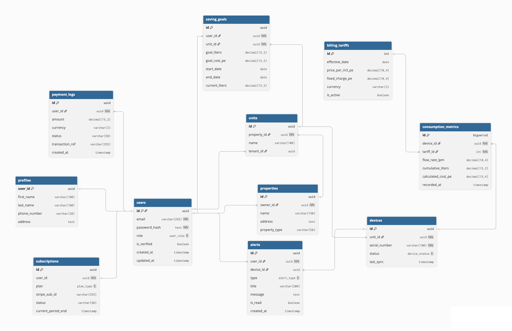

### **4.7.2. Class Dictionary**

A continuación se detallan las clases, enumeraciones y estructuras que conforman el núcleo lógico de **HydroSmart**, organizadas por sus respectivos contextos delimitados (Bounded Contexts).

#### **Identity and Access Management**

| Clase/Enum | Descripción | Atributos | Métodos |
|-------------|--------------|------------|-----------|
| **User** | Clase base para la autenticación y gestión de usuarios en el sistema. | - **id**: Guid (PK) - **email**: String - **passwordHash**: String - **role**: UserType - **createdAt**: DateTime - **isActive**: boolean | - **login**(): Inicia sesión - **logout**(): Finaliza sesión - **updateCredentials**(): Actualiza claves |
| **Profile** | Almacena la información personal y de contacto del usuario. | - **id**: Guid - **firstName**: String - **lastName**: String - **phoneNumber**: String - **address**: String | - **updateContactInfo**(): Actualiza datos personales |
| **UserType** | Define los roles de acceso disponibles. | - **OWNER**: Propietario - **TENANT**: Inquilino/Estudiante - **ADMIN**: Administrador | — |
| **PropertyOwner** | Especialización para usuarios que gestionan propiedades (Santiago). | - **propertyTitle**: String - **managedDevices**: List\<IoTDevice\> | - **registerProperty**(): Vincula una nueva propiedad |
| **StudentTenant** | Especialización para usuarios con consumo compartido (Arianna). | - **roommateGroupId**: Guid - **contractEndDate**: DateTime | - **getSharedConsumption**(): Calcula gasto entre roommates |

---

#### **Consumption and IoT Management**

| Clase/Enum | Descripción | Atributos | Métodos |
|-------------|--------------|------------|-----------|
| **IoTDevice** | Representa el hardware de monitoreo vinculado al medidor de agua. | - **deviceId**: Guid - **serialNumber**: String - **status**: DeviceStatus - **lastSync**: DateTime - **firmwareVersion**: String | - **getLatestRecord**(): Obtiene última lectura - **toggleStatus**(): Cambia estado operativo |
| **ConsumptionRecord** | Registro individual de telemetría hídrica. | - **id**: long (PK) - **volumeLiters**: double - **instantFlowRate**: double - **timestamp**: DateTime - **calculatedCost**: double | - **toSoles**(): Conversión de volumen a moneda PEN |
| **DeviceStatus** | Estados posibles del sensor IoT. | - **ACTIVE** - **INACTIVE** - **MAINTENANCE** - **LEAK_SUSPECTED** | — |

---

#### **Anomaly Detection and Notifications**

| Clase/Enum | Descripción | Atributos | Métodos |
|-------------|--------------|------------|-----------|
| **AnomalyDetector** | Módulo encargado de procesar patrones de consumo inusuales. | - **sensitivityThreshold**: double | - **analyzePattern**(): Compara flujos históricos - **identifyLeak**(): Detecta fugas continuas |
| **Alert** | Mensaje crítico generado ante eventos de riesgo o límites. | - **id**: Guid - **title**: String - **message**: String - **severity**: AlertSeverity - **isRead**: boolean | - **markAsRead**(): Cambia estado a leído - **notifyUser**(): Dispara notificación Push/Email |
| **AlertSeverity** | Niveles de criticidad de una alerta. | - **INFO** - **WARNING** - **CRITICAL** | — |

---

#### **Saving Goals and Recommendations**

| Clase/Enum | Descripción | Atributos | Métodos |
|-------------|--------------|------------|-----------|
| **SavingGoal** | Planificación de ahorro definida por el usuario. | - **id**: Guid - **targetVolume**: double - **targetCost**: double - **startDate**: DateTime - **endDate**: DateTime - **currentProgress**: double | - **isGoalReached**(): Valida cumplimiento - **calculateProjectedSavings**(): Proyecta ahorro |
| **Recommendation** | Sugerencias generadas automáticamente para optimizar el consumo. | - **id**: int - **description**: String - **category**: String - **isApplied**: boolean | - **applyTip**(): Registra aplicación del consejo |

---

#### **Business Logic and Financials**

| Clase/Enum | Descripción | Atributos | Métodos |
|-------------|--------------|------------|-----------|
| **CostCalculator** | Entidad de servicio que aplica el tarifario vigente de Sedapal. | - **pricePerCubicMeter**: double - **fixedCharge**: double - **taxRate**: double | - **calculate**(liters): Devuelve costo total en soles |

## 4.8. Database Design.
### 4.8.1. Database Diagrams.

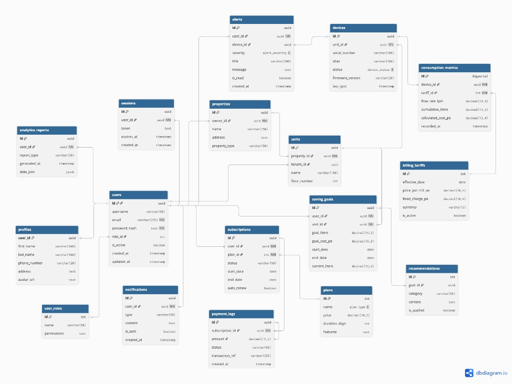

# Capitulo V: Product Implementation, Validation and Deployment 

## 5.1. Software Configuration Management

### 5.1.1. Software Development Environment Configuration

| Producto | Propósito en el proyecto | Categoría | Ruta de descarga / acceso | Descripción |
|----------|------------------------|-----------|---------------------------|-------------|
| JetBrains WebStorm | Desarrollo web moderno utilizando tecnologías como Vue y TypeScript. | Software Development | https://www.jetbrains.com/webstorm/ | IDE especializado en desarrollo frontend y backend con soporte para JavaScript, TypeScript y frameworks modernos como Vue.js. |
| JetBrains Rider | Desarrollo del backend en .NET y lógica del sistema. | Software Development | https://www.jetbrains.com/rider/ | IDE multiplataforma enfocado en desarrollo con .NET, con herramientas avanzadas para depuración, pruebas y productividad. |
| UXPressia | Representación gráfica de la experiencia del usuario. | Product UX/UI Design | https://uxpressia.com/ | Plataforma para crear journey maps y perfiles de usuario, permitiendo analizar visualmente la experiencia dentro del sistema. |
| Structurizr | Diseño y documentación de arquitecturas basadas en el modelo C4. | Product UX/UI Design | https://structurizr.com/ | Herramienta para modelar arquitecturas de software mediante el enfoque C4, facilitando la comprensión de sistemas complejos. |
| Lucidchart | Planificación estructurada del software mediante diagramas. | Product UX/UI Design | https://www.lucidchart.com/ | Aplicación para crear diagramas de flujo, arquitectura y procesos, mejorando la organización visual del proyecto. |
| Figma | Diseño de interfaces y prototipos de usuario. | Product UX/UI Design | https://www.figma.com/ | Herramienta colaborativa en la nube para diseñar interfaces UI/UX, prototipos interactivos y sistemas de diseño. |
| Visual Paradigm | Modelado UML y diseño de sistemas. | Product UX/UI Design | https://www.visual-paradigm.com/ | Plataforma para crear diagramas UML, BPMN y otros modelos, útil para análisis y diseño de software. |
| GitHub | Gestión de código fuente y trabajo colaborativo. | Collaboration & Version Control Tools | https://github.com/ | Plataforma para alojar repositorios, gestionar versiones y colaborar en el desarrollo de software. |
| Git CLI (Git) | Manejo local del control de versiones. | Version Control | https://git-scm.com/ | Sistema distribuido que permite gestionar cambios en el código, trabajar con ramas y sincronizar con repositorios remotos como GitHub. |

### 5.1.2. Source Code Management

En el proyecto HydroSmart, la gestión del código fuente se plantea como un componente clave para asegurar el orden, la trazabilidad y el crecimiento controlado de la solución. A través del uso de herramientas como sistemas de control de versiones, se busca mantener un registro claro de los cambios realizados en el desarrollo, facilitando la organización del proyecto y la posibilidad de retroceder a versiones anteriores en caso sea necesario.

En esta etapa inicial, el control del código se enfoca principalmente en el desarrollo del landing page, permitiendo gestionar de manera estructurada las modificaciones en el diseño y contenido. Este enfoque resulta fundamental para mantener consistencia en la propuesta visual y asegurar una base sólida para futuras implementaciones.

A medida que el proyecto evolucione hacia el desarrollo completo de la aplicación (frontend y backend), la gestión del código permitirá trabajar de forma más eficiente, facilitar la colaboración y asegurar la calidad del producto final. De esta manera, HydroSmart establece desde el inicio buenas prácticas que acompañarán el crecimiento progresivo de la solución.

Finalmente, el equipo dispone de un repositorio alterno, denominado upc-pre-1ASI0730-2610-HydroSmart (https://github.com/upc-pre-1ASI0729-2610-12010-HydroSmart), en el cual se administran versiones en etapa de prueba y entornos experimentales con un enfoque principalmente académico. Este espacio permite trabajar de manera segura en prototipos, realizar validaciones funcionales y explorar nuevas ideas antes de incorporarlas al sistema principal. Gracias a esta separación, se pueden evaluar mejoras en un entorno controlado, reduciendo posibles impactos negativos y asegurando la estabilidad de la plataforma base.

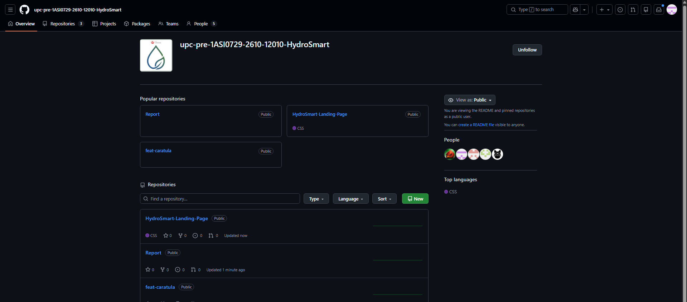

### 5.1.3. Source Code Style Guide & Conventions

El uso de un estilo de código unificado es clave para asegurar la mantenibilidad y la colaboración efectiva en el desarrollo de HydroSmart. Para ello, el equipo ha adoptado convenciones de codificación que promueven la claridad y consistencia en cada módulo de la plataforma, tomando como referencia estándares reconocidos de la industria. Toda la nomenclatura se aplica en inglés.

#### HTML y CSS

Se siguen la Google HTML/CSS Style Guide y las convenciones de W3Schools. Se utiliza minúsculas para etiquetas y atributos, indentación de 2 espacios, comillas dobles para valores de atributos y el atributo alt en todas las imágenes. Para CSS se emplea kebab-case en nombres de clases, variables CSS para colores y tipografías del Design System, y comentarios para separar secciones del archivo.

#### JavaScript y Vue

En JavaScript se siguen la Google JavaScript Style Guide y MDN JavaScript Guidelines, utilizando camelCase para variables y funciones, y const/let en lugar de var. Para Vue se sigue la Vue Style Guide oficial, nombrando los componentes en PascalCase y los archivos en kebab-case. Se aplica internacionalización mediante i18n, gestionando archivos de traducción para español e inglés.

#### Gherkin

Para los criterios de aceptación se siguen las Gherkin Conventions for Readable Specifications, utilizando la estructura Given-When-Then con escenarios redactados en inglés y en tercera persona presente.

### 5.1.4. Software Deployment Configuration

Para el despliegue de los productos digitales de HydroSmart, el equipo ha configurado GitHub Pages como plataforma de publicación para la Landing Page. Este servicio permite alojar sitios web estáticos directamente desde un repositorio de GitHub.
El proceso de despliegue sigue los siguientes pasos:

1. Los cambios se desarrollan en ramas feature siguiendo el flujo GitFlow establecido.
2. Una vez aprobados mediante Pull Request, los cambios se fusionan a la rama `develop`.
3. Cuando el equipo determina que el conjunto de cambios está listo para publicarse, se realiza el merge de `develop` a `main`.
4. GitHub Pages detecta automáticamente los cambios en la rama `main` y publica la nueva versión de la Landing Page.

La URL de despliegue de la Landing Page es la proporcionada por GitHub Pages asociada al repositorio de la organización. Para los Web Services y la Frontend Web Application, la configuración de despliegue se definirá en sprints posteriores conforme avance la implementación.

## 5.2. Landing Page, Services & Applications Implementation.

### 5.2.1. Sprint 1
Durante el Sprint 1 se planifico y se definió la implementación de la primera versión del landing page de HydroSmart. En este se establecio la propuesta de valor además de información necesaria para convencer al cliente. El trabajo planificado incluyó tanto la orgnización de la estructura y diseño visual, cómo funcionalidades esenciales como la internacionalización y sistema responsivo. 

#### 5.2.1.1. Sprint Planning n.

| Sprint #                          | Sprint 1                                                                                                                                                                                                                                                                                                               |
|-----------------------------------|------------------------------------------------------------------------------------------------------------------------------------------------------------------------------------------------------------------------------------------------------------------------------------------------------------------------|
| **Sprint Planning Background**    |                                                                                                                                                                                                                                                                                                                        |
| **Date**                          | 2026-04-19                                                                                                                                                                                                                                                                                                             |
| **Time**                          | 8:00 PM                                                                                                                                                                                                                                                                                                                |
| **Location**                      | Reunion virutal (Google Meet)                                                                                                                                                                                                                                                                                          |
| **Prepared By**                   | Keyner Ivan Hancco Poma                                                                                                                                                                                                                                                                                              |
| **Attendees to Planning Meeting** | - Braden Raid Garcia Cerpa   - Keyner Ivan Hancco Poma  - Hernan Gabriel Huayta Fuentes  - Victor Manuel Espino Rossi  - Oscar Fernando Vara Velasquez                                                                                                                                                         |
| **Sprint 1 Goal**                 | La meta para este sprint es que la landing page MVP DE HydroSmart sea atractiva, informativa, responsiva e internacionalizada. Creemos que esto aportará confianza y afianzará a nuestros usuarios. Esto se confirmará cuando los usuraios puedan navegar y registrarse satisfactoriamente mediante la landing page. |
| **Sprint 1 Velocity**             | 8 story points                                                                                                                                                                                                                                                                                                         |
| **Sum of Story Points**           | 8                                                                                                                                                                                                                                                                                                                      |

### 5.2.1.2. Aspect Leaders and Collaborators
| Team Member                      | GitHub Username | Header | Hero + Beneficios | Características | Planes | Nosotros | FAQ+ Footer |
|----------------------------------|-----------------|--------|-------------------|-----------------|--------|----------|-------------|
| Braden Raid Garcia Cerpa       | BradeGarcia        | L      | L                 | C               | C      | C        | C           |
| Hernan Gabriel Huayta Fuentes   | Homesman         | C      | C                 | L               | C      | C        | C           |
| Victor Manuel Espino Rossi | Vmer140        | C      | C                 | C               | L      | C        | C           |
| Hancco Poma, Keyner Ivan         | 1Kanan2         | C      | C                 | C               | C      | C        | L           |
| Oscar Fernando Vara Velasquez     | varometro159         | C      | C                 | C               | C      | L        | C           |

### 5.2.1.3. Sprint Backlog 1
El Sprint 1 se enfocó en el desarrollo e implementación del Landing Page MVP de HydroSmart, desplegado en un entorno web, utilizando HTML, CSS y JavaScript.

El objetivo principal fue entregar una solución mínima viable que permita a los usuarios comprender claramente la propuesta de valor de la plataforma, junto con una interfaz adaptable a distintos dispositivos y capaz de soportar otro idioma mediante un enfoque de internacionalización.

<table border="1" cellspacing="0" cellpadding="8" style="border-collapse: collapse; width: 100%; text-align: center; font-family: Arial, sans-serif;">
  <thead>
    <tr>
      <th colspan="2">Sprint #</th>
      <th colspan="6">Sprint 1</th>
    </tr>
    <tr>
      <th colspan="2">User Story</th>
      <th colspan="5">Work-Item / Task</th>
      <th rowspan="2">Status (To-do / In-Process / To-Review / Done)</th>
    </tr>
    <tr>
      <th>Id</th>
      <th>Title</th>
      <th>Id</th>
      <th>Title</th>
      <th>Description</th>
      <th>Estimation (Hours)</th>
      <th>Assigned To</th>
    </tr>
  </thead>
  <tbody>
    <tr>a
      <td >US18</td>
      <td>Visualización de propuesta de valor</td>
      <td>T01</td>
      <td>Diseño de Hero</td>
      <td>Implementar la sección principal con título, mensaje de valor y llamada inicial de HydroSmart.</td>
      <td>3</td>
      <td>Garcia Cerpa, Braden Raid</td>
      <td>Done</td>
    </tr>
    <tr>
      <td>US18</td>
      <td>Visualización de propuesta de valor</td>
      <td>T02</td>
      <td>Implementación de beneficios clave</td>
      <td>Agregar los beneficios principales del producto dentro de la sección Hero para reforzar la propuesta de valor.</td>
      <td>2</td>
      <td>Espino Rossi, Victor Manuel</td>
      <td>Done</td>
    </tr>
<tr>
      <td>US19</td>
      <td>Visualización de funcionalidades</td>
      <td>T03</td>
      <td>Diseño de sección de características</td>
      <td>Construir la sección visual donde se presentan las funcionalidades principales de HydroSmart.</td>
      <td>3</td>
      <td>Huayta Fuentes, Hernan Manuel</td>
      <td>Done</td>
    </tr>
<tr>
      <td>US20</td>
      <td>Visualización de segmentos objetivo</td>
      <td>T05</td>
      <td>Diseño de sección de segmentos</td>
      <td>Implementar la sección que muestra los perfiles objetivo de la plataforma y sus beneficios asociados.</td>
      <td>3</td>
      <td>Vara Velasquez, Oscar Fernando</td>
      <td>Done</td>
    </tr>
    <tr>
      <td>US20</td>
      <td>Visualización de segmentos objetivo</td>
      <td>T06</td>
      <td>Integración de FAQ relacionado</td>
      <td>Agregar preguntas frecuentes vinculadas a los segmentos objetivo para reforzar la comprensión del usuario.</td>
      <td>2</td>
      <td>Hancco Poma, Keyner Ivan</td>
      <td>Done</td>
    </tr>
    <tr>
      <td>US21</td>
      <td>Navegación por secciones</td>
      <td>T07</td>
      <td>Implementación de header</td>
      <td>Desarrollar el encabezado principal con enlaces a las secciones de la landing page.</td>
      <td>2</td>
      <td>Garcia Cerpa, Braden Raid</td>
      <td>Done</td>
    </tr>
    <tr>
      <td>US21</td>
      <td>Navegación por secciones</td>
      <td>T09</td>
      <td>Integración de footer navegable</td>
      <td>Agregar enlaces de navegación en el footer para reforzar el acceso a las secciones principales.</td>
      <td>2</td>
      <td>Hancco Poma, Keyner Ivan</td>
      <td>Done</td>
    </tr><tr>
      <td>US22</td>
      <td>Acceso al registro desde la landing page</td>
      <td>T10</td>
      <td>Implementación de CTA principal</td>
      <td>Agregar botón principal de registro en la sección Hero para redirigir al usuario al proceso de registro.</td>
      <td>2</td>
      <td>Espino Rossi, Victor Manuel</td>
      <td>Done</td>
    </tr>
    <tr>
      <td>US22</td>
      <td>Acceso al registro desde la landing page</td>
      <td>T11</td>
      <td>Implementación de sección de planes</td>
      <td>Agregar acciones en la sección de planes para facilitar el acceso al registro.</td>
      <td>2</td>
      <td>Huayta Fuentes, Hernan Manuel</td>
      <td>Done</td>
    </tr>
    <tr>
      <td>US23</td>
      <td>Visualización en dispositivos móviles</td>
      <td>T12</td>
      <td>Adaptación responsive de Hero y Header</td>
      <td>Ajustar la visualización del encabezado y la sección principal para pantallas móviles.</td>
      <td>3</td>
      <td>Garcia Cerpa, Braden Raid</td>
      <td>Done</td>
    </tr>
    <tr>
      <td>US23</td>
      <td>Visualización en dispositivos móviles</td>
      <td>T13</td>
      <td>Adaptación responsive de características</td>
      <td>Optimizar la disposición de la sección de funcionalidades para dispositivos móviles.</td>
      <td>2</td>
      <td>Vara Velasquez, Oscar Fernando</td>
      <td>Done</td>
    </tr>
    <tr>
      <td>US23</td>
      <td>Visualización en dispositivos móviles</td>
      <td>T14</td>
      <td>Adaptación responsive de planes</td>
      <td>Modificar la sección de planes para asegurar correcta legibilidad e interacción en móviles.</td>
      <td>2</td>
      <td>Espino Rossi, Victor Manuel</td>
      <td>Done</td>
    </tr>
    <tr>
      <td>US23</td>
      <td>Visualización en dispositivos móviles</td>
      <td>T15</td>
      <td>Adaptación responsive de FAQ y Footer</td>
      <td>Ajustar la sección de preguntas frecuentes y el pie de página para visualización móvil.</td>
      <td>2</td>
      <td>Hancco Poma, Keyner Ivan</td>
      <td>Done</td>
    </tr>
    <tr>
      <td>US23</td>
      <td>Visualización en dispositivos móviles</td>
      <td>T16</td>
      <td>Adaptación responsive de Nosotros</td>
      <td>Optimizar la sección Nosotros y segmentos objetivo para correcta visualización en dispositivos móviles.</td>
      <td>2</td>
      <td>Huayta Fuentes, Hernan Manuel</td>
      <td>Done</td>
    </tr>
    <tr>
      <td>US18-US23</td>
      <td>Internacionalización de la landing page</td>
      <td>T18</td>
      <td>Integración de textos traducibles</td>
      <td>Adaptar las secciones principales para consumir contenido en más de un idioma.</td>
      <td>2</td>
      <td>Todos los colaboradores</td>
      <td>Done</td>
    </tr>
    <tr>
      <td>US18-US23</td>
      <td>Pruebas y ajustes finales</td>
      <td>T19</td>
      <td>Validación funcional del sprint</td>
      <td>Verificar navegación, responsive, textos, enlaces y consistencia visual antes del despliegue.</td>
      <td>3</td>
      <td>Todos los colaboradores</td>
      <td>Done</td>
    </tr>
  </tbody>
</table>

### 5.2.1.4. Development Evidence for Sprint Review

Durante el Sprint 1 se desarrolló la Landing Page basada en los diseños definidos previamente.

**Incluye:**
- Estructura HTML de la página
- Estilos CSS para el diseño visual
- Componentes básicos de la interfaz
- Capturas de código

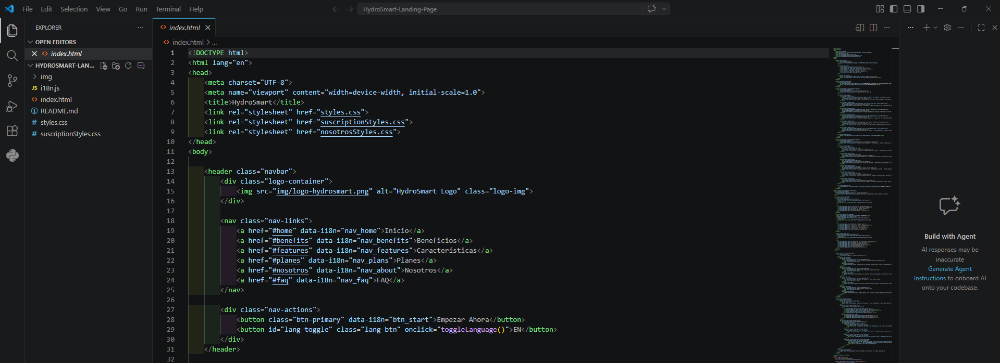
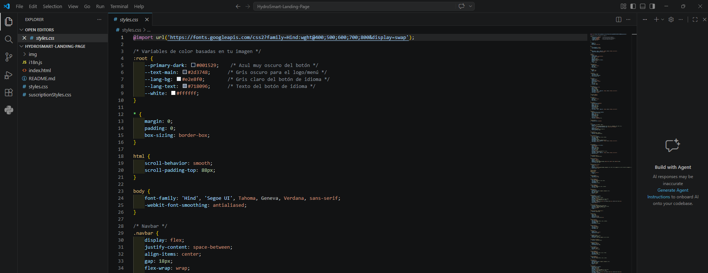
---

### 5.2.1.5. Execution Evidence for Sprint Review.

Durante este primer Sprint, el equipo avanzó la implementación del Business Website, logrando una interfaz visualmente coherente y adaptable a diferentes dispositivos. A continuación se muestra la evidencia visual de las secciones desplegadas, mostrando la navegación completa del sitio.

1. Home – Presentación de la plataforma:

2. Sección Beneficios:

3. Sección Características:

4. Sección Planes:

#### 5.2.1.6. Services Documentation Evidence for Sprint Review.

El repositorio HydroSmart-LandingPage inició su estructura base en la rama main. El desarrollo continuó con la implementación del header, la sección hero y la sección de beneficios a través de las ramas feat/inicio y feat/benefits. Posteriormente, se integraron los planes de suscripción en la rama suscription y la sección de equipo en feat/nosotros. Finalmente, se utilizaron commits en la rama develop para detallar la información técnica de las características, así como para añadir la funcionalidad de FAQ y el pie de página

---

### 5.2.1.7. Software Deployment Evidence for Sprint Review.

El despliegue del Business Website se realizó utilizando GitHub Pages, aprovechando la integración directa con el repositorio del proyecto. Esta configuración permite que el sitio sea accesible públicamente y se actualice automáticamente con cada cambio en la rama principal.

**URL:** https://upc-pre-1asi0729-2610-12010-hydrosmart.github.io/HydroSmart-Landing-Page/

### 5.2.1.8. Team Collaboration Insights during Sprint.

Durante el Sprint 1, nuestra colaboración se centró principalmente en la realización del documento y funcionalidad básica de la landing page. El equipo utilizó GitHub Projects para la gestión de tareas, asegurando que cada sección (Hero, About, Pricing) fuera desarrollada correctamente y a tiempo. 

**Aspectos positivos:**
- Trabajo conjunto en el desarrollo frontend
- Organización para completar la documentación requerida
- Uso de GitHub para control de versiones

**Aspectos a mejorar:**
- Mejor distribución de tareas
- Mayor planificación del tiempo
- Incrementar la frecuencia de commits

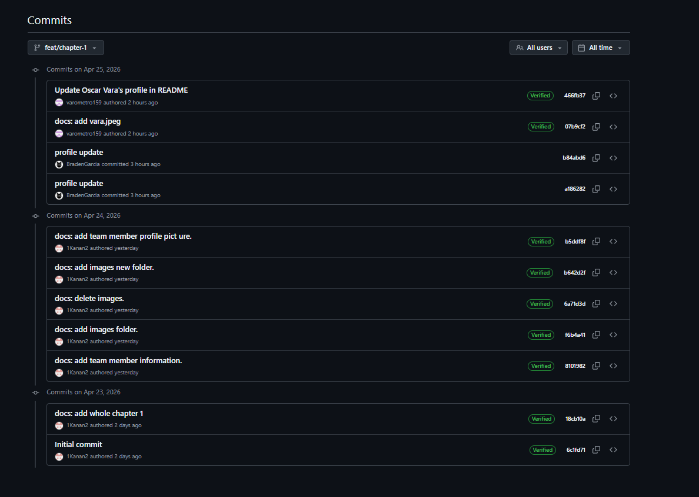

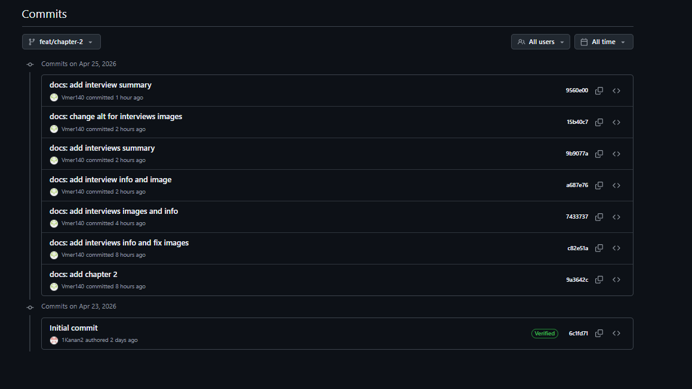

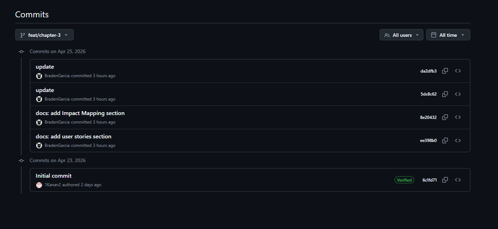

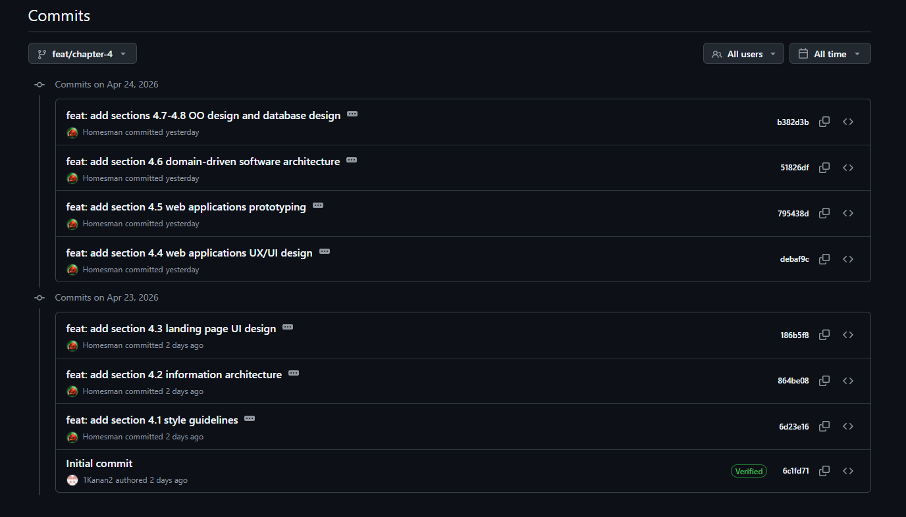

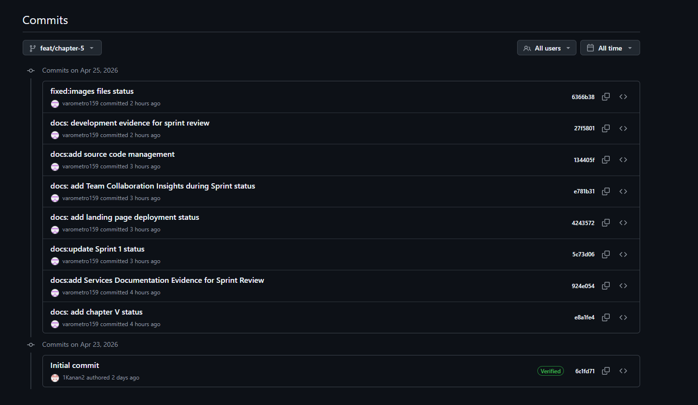

### 5.2.2. Sprint 2

#### 5.2.2.1. Sprint Planning 2

Durante el segundo Sprint se continuó con el desarrollo de la plataforma web AquaPulse, priorizando las funcionalidades y pantallas principales para propietarios y estudiantes que buscan alojamiento. En esta etapa se trabajó con información predefinida mediante datos hardcodeados y una base de datos simulada en db.json, permitiendo gestionar y visualizar la información de manera dinámica dentro del sistema. Asimismo, se mejoró la experiencia visual y la navegación de la aplicación, además de incorporar la internacionalización (i18n) para adaptar el contenido a distintos idiomas, logrando una versión más estable, uniforme y funcional de la plataforma.

<table>
<tr>
    <th colspan="5">Sprint 2</th>
    <th colspan="9">Sprint 2</th>
  </tr>
      <tr>
    <td colspan="13">Sprint Planning Background</td>
  </tr>
  <tr>
    <td colspan="5">Date</td>
    <td colspan="8">2026-05-03</td>
</tr>
  <tr>
    <td colspan="5">Time</td>
    <td colspan="8">5:30 PM</td>
  </tr>
  <tr>
    <td colspan="5">Location</td>
    <td colspan="8">Via Zoom</td>
<tr>
    <td colspan="5">Prepared By</td>
    <td colspan="8">Hancco Poma, Keyner Iván</td>
</tr>
<tr>
    <td colspan="5">Attendees (to a planning meeting)</td>
    <td colspan="8">Braden Raid Garcia Cerpa, Keyner Ivan Hancco Poma, Hernan Gabriel Huayta Fuentes, Victor Manuel Espino Rossi y Oscar Fernando Vara Velasquez</td>
</tr>

<tr>
    <td colspan="13">Sprint Goal & User Stories</td>
</tr>
<tr>
    <td colspan="5">Sprint 2 Goal</td>
    <td colspan="8">Desarrollar y consolidar la estructura principal de la aplicación web AquaPulse, proporcionando una interfaz completamente conectada con la base de datos simulada para las pantallas principales y la administración de información correspondiente a los perfiles de propietarios y estudiantes arrendatarios, incorporando además una configuración inicial de soporte multilenguaje mediante i18n.</td>
</tr>
<tr>
    <td colspan="5">Sprint 2 Velocity</td>
    <td colspan="8">31</td>
</tr>
<tr>
    <td colspan="5">Sum of Story Points</td>
    <td colspan="8">39</td>
</tr>
</table>

#### 5.2.2.2. Aspect Leaders and Collaborators

Con la finalidad de mejorar la colaboración en equipo a cada integrante se asignó un rol de líder por cada aspecto. Los aspectos están relacionados con los entregables.

| Team member (LastName, First Name) | GitHub UserName | Aspect 1: Consumption-Monitoring | Aspect 2: Rental Management | Aspect 3: Reports View | Aspect 4: Savings-Optimization | Aspect 5: INCIDENT-DETECTION |
|------------------------------------|-----------------|------------------------------------|------------------------------------------|------------------------|------------------------|-------------------------|
| Vara, Oscar                 | BradeGarcia    | C                                  | C                                        | C                      | C                      | L                       |
| Huayta, Hernán                     | Homesman       | C                                  | C                                        | C                      | C                      | L                       |
| Espino, Victor                | Vmer140       | C                                  | C                                        | C                      | L                      | C                       |
| Hancco, Keyner                     | 1Kanan2         | L                                  | C                                        | C                      | C                      | C                       |
| Garcia, Braden                     | varometro159       | C                                  | C                                        | L                      | C                      | C                       |

#### 5.2.2.3. Sprint Backlog 2

El presente Sprint Backlog se enfoca en consolidar las funcionalidades clave de la aplicación web AquaPulse, orientadas a la optimización del consumo de agua en el hogar. En este sprint, el objetivo principal es implementar características relacionadas con la visualización y análisis del consumo, así como la gestión de alertas y notificaciones, permitiendo a los usuarios interpretar su gasto de manera clara y tomar decisiones informadas.

Asimismo, se priorizó el desarrollo de componentes como el dashboard analítico, el historial de consumo, la proyección de gasto mensual y los sistemas de alertas ante consumos inusuales o posibles fugas. Estas funcionalidades fueron implementadas utilizando una fuente de datos simulada mediante db.json, lo que permitió trabajar con información dinámica sin requerir un backend desplegado, manteniendo una arquitectura preparada para futuras integraciones.

A continuación, se presenta la tabla de control del Sprint 2, donde se detallan las historias de usuario trabajadas, junto con sus respectivas tareas (Work Items), descripciones funcionales, estimaciones de tiempo, responsables asignados y el estado actual de cada actividad.

<table>
  <tr>
    <th colspan="7">Sprint 2 – Work Items / Tasks (AquaPulse)</th>
  </tr>
  <tr>
    <th>User Story ID</th>
    <th>Task ID</th>
    <th>Title</th>
    <th>Description</th>
    <th>Estimation</th>
    <th>Assigned To</th>
    <th>Status</th>
  </tr>

  <!-- EP02 -->
  <tr><td colspan="7"><b>EP02 – Visualización y Análisis de Consumo</b></td></tr>

  <tr><td>US05</td><td>UT01</td><td>Diseñar dashboard de consumo</td><td>Crear interfaz clara con indicadores visuales para interpretar el consumo de agua.</td><td>4h</td><td>Keyner Hancco</td><td>Done</td></tr>
  <tr><td></td><td>UT02</td><td>Implementar etiquetas y colores</td><td>Agregar ayudas visuales como colores, iconos y etiquetas explicativas.</td><td>3h</td><td>Victor Espino</td><td>Done</td></tr>

  <tr><td>US06</td><td>UT03</td><td>Visualizar historial de consumo</td><td>Desarrollar gráficos de consumo filtrados por períodos de tiempo.</td><td>4h</td><td>Hernan Huayta</td><td>Done</td></tr>
  <tr><td></td><td>UT04</td><td>Manejo de historial vacío</td><td>Mostrar mensaje cuando no existan datos históricos disponibles.</td><td>2h</td><td>Hernan Huayta</td><td>Done</td></tr>

  <tr><td>US07</td><td>UT05</td><td>Proyección de gasto mensual</td><td>Calcular y mostrar estimación del consumo mensual en soles.</td><td>4h</td><td>Keyner Hancco</td><td>Done</td></tr>
  <tr><td></td><td>UT06</td><td>Validar datos insuficientes</td><td>Indicar al usuario cuando no hay suficiente información para generar proyección.</td><td>2h</td><td>Braden Garcia</td><td>Done</td></tr>

  <!-- EP03 -->
  <tr><td colspan="7"><b>EP03 – Alertas y Configuración</b></td></tr>

  <tr><td>US08</td><td>UT07</td><td>Implementar alertas de consumo</td><td>Detectar consumo elevado y generar notificaciones automáticas.</td><td>3h</td><td>Oscar Vara</td><td>Done</td></tr>
  <tr><td></td><td>UT08</td><td>Notificación de consumo normal</td><td>Validar que no se envíen alertas si el consumo está dentro del rango.</td><td>2h</td><td>Oscar Vara</td><td>Done</td></tr>

  <tr><td>US09</td><td>UT09</td><td>Detección de fugas</td><td>Identificar patrones anómalos de consumo continuo.</td><td>4h</td><td>Victor Espino</td><td>Done</td></tr>

  <tr><td>US10</td><td>UT10</td><td>Configuración de notificaciones</td><td>Permitir al usuario personalizar qué alertas desea recibir.</td><td>3h</td><td>Braden Garcia</td><td>Done</td></tr>

  <!-- EP06 -->
  <tr><td colspan="7"><b>EP06 – Análisis Comparativo</b></td></tr>

  <tr><td>US16</td><td>UT11</td><td>Comparativo semanal</td><td>Mostrar gráfico comparativo entre consumo de semanas.</td><td>4h</td><td>Hernan Huayta</td><td>Done</td></tr>

</table>

#### 5.2.2.4. Development Evidence for Sprint Review

En esta sección se demuestran los commits relacionados con los principales avances en la implementación.
Estos commits provienen del repositorio de la aplicación web de la organización de GitHub.

Enlace al repositorio de la aplicación web: https://github.com/upc-pre-1ASI0730-2610-HydroSmart/HydroSmart-Frontend

| Repository                                              | Branch             | Commit Id | Commint Message                                                                 | Commited on (Date) |
|---------------------------------------------------------|--------------------|-----------|---------------------------------------------------------------------------------|--------------------|
| upc-pre-1ASI0729-2610-12010-HydroSmart     | feat/main       | 1bfad23   | feat: initial angular project structure for HydroSmart                    | 13/05/2026         |
| upc-pre-1ASI0729-2610-12010-HydroSmart     | feat/main       | beec8dc   | feat: initial project structure on new repo      | 13/05/2026         |
| upc-pre-1ASI0729-2610-12010-HydroSmart     | feat/main | 048944e   | docs:consumption monitoring files.            | 13/05/2026         |
| upc-pre-1ASI0729-2610-12010-HydroSmart     | feat/rental-management | 8b1blfb   | feat: implement Rental-management bounded context | 13/05/2026 |
| upc-pre-1ASI0729-2610-12010-HydroSmart     | feat/savings-optimization      | 14e6f92   | feat: create domain folder and content                                      | 13/05/2026         |
| upc-pre-1ASI0729-2610-12010-HydroSmart     | feat/savings-optimization       | 00b03e0   | feat: add assembler and api for device                                          | 13/05/2026         |
| upc-pre-1ASI0729-2610-12010-HydroSmart     | feat/savings-optimization       | 7d88a71   | feat: create infrastructure folder and content                                 | 13/05/2026         |
| upc-pre-1ASI0729-2610-12010-HydroSmart     | feat/savings-optimization      | ae82c7c   | feat: create presentation folder and content                                   | 13/05/2026         |
| upc-pre-1ASI0729-2610-12010-HydroSmart     | feat/incident-detection      | e18003d   | docs:incident-dection bounded context                                             | 13/05/2026         |
| upc-pre-1ASI0729-2610-12010-HydroSmart     | feat/consumption-monitoring    | 2cd0683   | feat: implement comsuption monitoring bounded context                                             | 13/05/2026         |

#### 5.2.2.5. Execution Evidence for Sprint Review

Durante la ejecución del sprint se consiguieron completar satisfactoriamente todos los objetivos planteados, logrando implementar las funcionalidades clave del sistema de gestión AquaPulse y consolidando una base firme para la administración eficiente del consumo de agua en entornos domésticos. Entre las principales características desarrolladas se destacan las siguientes:

1. Configuración y edición del perfil de usuario, brindando la posibilidad de ajustar y adaptar la experiencia dentro de la aplicación según las preferencias individuales.

2. Consulta y exportación de reportes, incorporando opciones de filtrado por rangos de fechas y categorías, así como la capacidad de descargar la información recopilada en distintos formatos disponibles.

3. Administración de dispositivos, permitiendo gestionar de manera más ordenada e intuitiva los distintos equipos vinculados dentro del sistema.

4. Implementación de internacionalización (i18n), facilitando el uso de la plataforma en dos idiomas distintos para mejorar la accesibilidad de los usuarios.

5. Integración del soporte multilenguaje (i18n), reforzando la disponibilidad de la aplicación en más de un idioma y asegurando una interacción más inclusiva para diferentes tipos de usuarios.

**Login**

  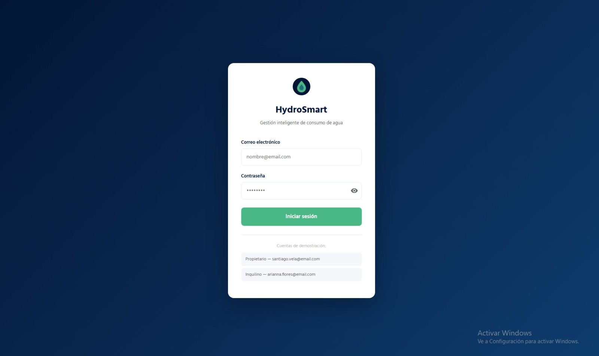

**Dashboard**

  

**Dashboard and Notifications**

  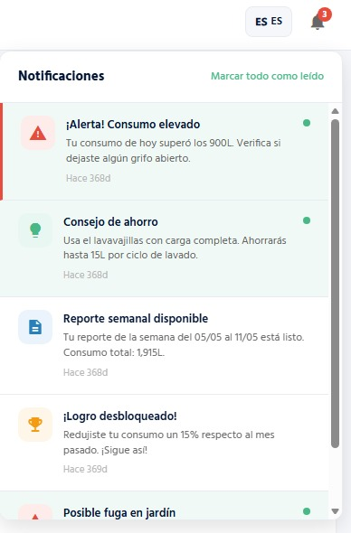

**Profile**

  

**Devices**

  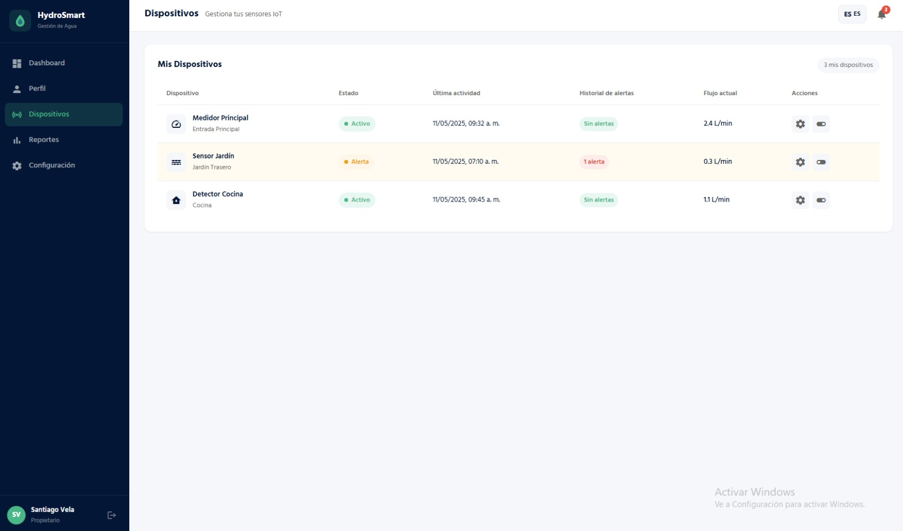

**Reports**

  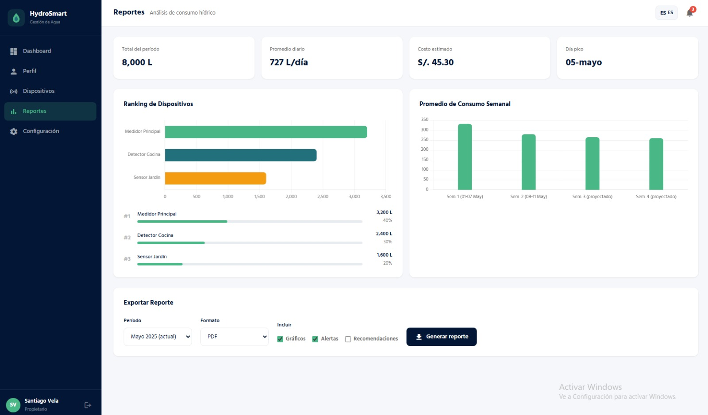

**Settings**

  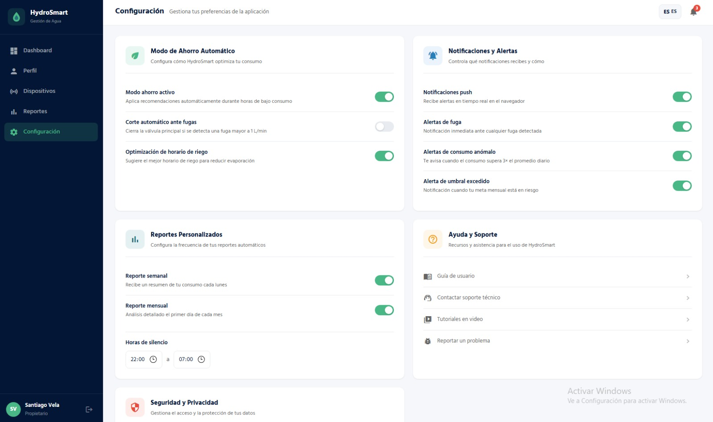

**Internacionalización** (El boton del header se encarga de cambiar idioma)

  

#### 5.2.2.6. Services Documentation Evidence for Sprint Review

Durante el Sprint 2 del proyecto AquaPulse, el desarrollo se enfocó en la implementación funcional de la aplicación web, integrando la interfaz de usuario con una fuente de datos local basada en un archivo db.json. Este enfoque permitió simular el comportamiento de una API, facilitando el manejo de información dinámica sin necesidad de contar con un backend desplegado.

**Estado actual:**

- Se desarrollaron e integraron las principales vistas de la plataforma (Dashboard, Profile, Settings, Devices, Reports y Settings), asegurando una experiencia visual uniforme, una navegación fluida y una correcta interacción con los datos simulados.

- La gestión de datos se realiza mediante un archivo db.json, el cual define las colecciones utilizadas en la aplicación y permite replicar operaciones tipo CRUD (crear, leer, actualizar y eliminar) a través de herramientas locales como json-server.

- Aún no se ha implementado una capa backend con controladores, servicios ni lógica de negocio avanzada; no obstante, la arquitectura actual se encuentra preparada para incorporar estos elementos en futuras fases del proyecto.

- Se habilitaron funcionalidades interactivas relevantes, como la edición de información del usuario, la actualización de datos simulados y la visualización de contenido dinámico dentro de la aplicación.

- Además, se reforzó la internacionalización (i18n), logrando una interfaz moderna, comprensible y adaptable a distintos idiomas, mejorando así la experiencia del usuario.

En este sprint 2, el enfoque principal estuvo en las épicas relacionadas con la construcción del frontend y la simulación de una API mediante db.json, lo que permitió emular la interacción con un sistema backend real. Este avance permitió consolidar una versión funcional de AquaPulse, orientada a la optimización del consumo de agua, facilitando la gestión dinámica de datos y dejando una base preparada para la futura implementación de un backend con mayor complejidad y persistencia real.

#### 5.2.2.7. Software Deployment Evidence for Sprint Review

El despliegue del Frontend de AquaPulse se realizó utilizando Netlify, aprovechando su integración directa con el repositorio del proyecto alojado en GitHub. Esta configuración permite que el sitio sea accesible públicamente y se actualice automáticamente con cada cambio realizado en la rama principal, facilitando un flujo de despliegue continuo y eficiente.

  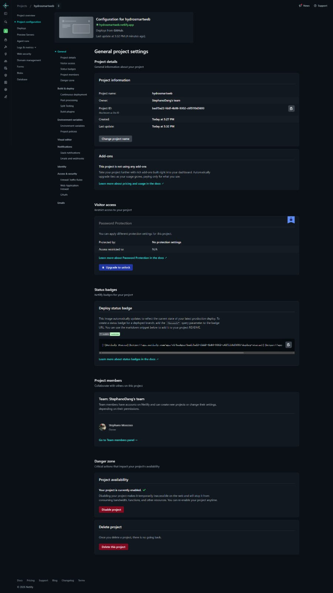

**URL:https://hydrosmartweb.netlify.app/#/dashboard**

#### 5.2.2.8. Team Collaboration Insights during Sprint
Durante el Sprint 2, nuestra colaboración se centró principalmente en la actualización del documento y frontend de AquaPulse. El equipo utilizó GitHub Projects para la gestión de tareas, asegurando que cada sección fuera desarrollado correctamente y a tiempo.

### Gráfico de Contribuciones del equipo

### Contribuciones al desarrollo del Frontend

### Contribuciones al desarrollo del Documento:

### 5.2.3. Sprint 3

Durante el Sprint 3 se llevó a cabo la construcción del **backend real** de la plataforma HydroSmart, dejando atrás la simulación de datos basada en `db.json` que se utilizó en el Sprint 2. El equipo desarrolló una **API REST en Spring Boot (Java 21) conectada a una base de datos MySQL**, organizada bajo una arquitectura **Domain-Driven Design (DDD)** dividida en bounded contexts (IAM, Consumption, Incident, Property y Savings). Se implementó autenticación y autorización mediante **JWT** con control de roles (`BUILDING_ADMIN` y `TENANT`), y se documentaron todos los endpoints con **OpenAPI/Swagger**.

En paralelo, se actualizó la **aplicación web en Angular** para **consumir el backend real** en reemplazo de la fuente de datos simulada, incorporando un interceptor HTTP que adjunta el token JWT, guards de ruta por autenticación y por rol, y servicios HTTP por bounded context. Como resultado, se obtuvo una versión integrada de extremo a extremo (frontend ↔ backend ↔ base de datos) que permite iniciar sesión, visualizar el consumo de agua, gestionar dispositivos/sensores, administrar unidades e inquilinos, revisar alertas y consultar metas de ahorro y reportes mensuales.

#### 5.2.3.1. Sprint Planning 3.

En esta sección se especifican los aspectos principales del Sprint Planning Meeting del Sprint 3. La reunión tuvo como objetivo definir el alcance de la migración hacia un backend real con persistencia en MySQL, repartir los bounded contexts entre los integrantes y planificar la integración del frontend Angular con la nueva API.

| **Sprint #** | Sprint 3 |
|---|---|
| **Sprint Planning Background** | |
| **Fecha** | 10/06/2026 |
| **Hora** | 6:00 PM |
| **Ubicación** | Reunión virtual vía Zoom |
| **Preparado por** | Hancco Poma, Keyner Iván |
| **Participantes (reunión de planificación)** | - Oscar Fernando Vara Velasquez   - Victor Manuel Espino Rossi   - Hernán Gabriel Huayta Fuentes   - Braden Raid García Cerpa   - Keyner Iván Hancco Poma |
| **Sprint 2 Review Summary** | En el Sprint 2 se consolidó la estructura principal del frontend de AquaPulse/HydroSmart en Angular, con las pantallas de Dashboard, Profile, Settings, Devices y Reports funcionando sobre una base de datos simulada (`db.json`) y soporte multilenguaje (i18n EN/ES). Se logró una versión visual estable y navegable, pero el Product Owner y el equipo identificaron como principal limitación la ausencia de un backend real: los datos no se persistían y no existía autenticación ni control de acceso. El feedback fue avanzar hacia una API real con seguridad y persistencia. |
| **Sprint 2 Retrospective Summary** | El equipo valoró positivamente la organización por bounded contexts y el uso de ramas por funcionalidad, que facilitó el trabajo en paralelo durante el Sprint 2. Como oportunidades de mejora se señalaron: estandarizar los mensajes de commit (algunos quedaron como `docs:`/`chore:` poco descriptivos), reducir la duplicación de datos hardcodeados y preparar la arquitectura para sustituir el mock por servicios HTTP reales. Estas mejoras se incorporaron en la planificación del Sprint 3. |
| **Sprint 3 Goal** | *Our focus is on* entregar un backend REST real y seguro para HydroSmart, conectado a MySQL, que reemplace la simulación de datos del sprint anterior.   *We believe it delivers* persistencia real de la información, autenticación con roles y una API documentada a los administradores de edificio y a los inquilinos de la plataforma, además de una base sólida sobre la cual el equipo de desarrollo pueda seguir construyendo.   *This will be confirmed when* un usuario puede iniciar sesión con credenciales reales, la aplicación Angular muestra y actualiza datos provenientes del backend (sensores, lecturas de consumo, unidades, inquilinos, alertas, metas de ahorro y reportes) sin usar datos simulados, y todos los endpoints son verificables desde Swagger UI. |
| **Sprint 3 Velocity** | 31 Story Points |
| **Sum of Story Points** | 40 |

#### 5.2.3.2. Aspect Leaders and Collaborators.

Para cada aspecto se designó un **Líder (L)**, responsable de la dirección técnica e implementación principal, y **Colaboradores (C)**, encargados de apoyar en el desarrollo, la integración y la validación. La distribución se corresponde directamente con la rama de trabajo y los commits realizados por cada integrante en el repositorio de backend.

La Matriz LACX (Leadership and Collaboration Matrix) permite visualizar la distribución de responsabilidades, garantizando la trazabilidad y la efectividad del trabajo colaborativo del Sprint 3.

| Team Member (LastName, FirstName) | GitHub Username | IAM / Auth | Consumption | Incident | Property | Savings | Frontend Integration |
|---|---|---|---|---|---|---|---|
| Vara, Oscar | varometro159 | **L** | C | C | C | C | **L** |
| Espino, Victor | Vmer140 | C | **L** | C | C | C | C |
| Huayta, Hernán | Homesman | C | C | **L** | C | C | C |
| Hancco, Keyner | 1Kanan2 | C | C | C | **L** | C | C |
| García, Braden | BradenGarcia | C | C | C | C | **L** | C |

#### 5.2.3.3. Sprint Backlog 3
 
El presente Sprint Backlog se enfoca en construir el backend real de la plataforma HydroSmart y conectarlo con la aplicación web, reemplazando la fuente de datos simulada (`db.json`) utilizada en el Sprint 2. En este sprint, el objetivo principal es implementar una API REST en Spring Boot conectada a una base de datos MySQL, organizada bajo una arquitectura Domain-Driven Design (DDD) en bounded contexts, con autenticación y autorización mediante JWT y control de acceso por roles.
 
Asimismo, se priorizó el desarrollo, por cada bounded context, del modelo de dominio (aggregates y value objects), la lógica de negocio (command services), la persistencia en MySQL mediante JPA y la exposición de endpoints REST documentados con OpenAPI/Swagger. Finalmente, se integró la interfaz Angular para consumir la API real mediante servicios HTTP, un interceptor que adjunta el token JWT y guards de ruta por autenticación y rol, logrando una versión funcional de extremo a extremo.
 
A continuación, se presenta la tabla de control del Sprint 3, donde se detallan las historias de usuario trabajadas, junto con sus respectivas tareas (Work Items), descripciones funcionales, estimaciones de tiempo, responsables asignados y el estado actual de cada actividad.
 
<table>
 <tr>
 <th colspan="7">Sprint 3 – Work Items / Tasks (HydroSmart)</th>
 </tr>
 <tr>
 <th>User Story ID</th>
 <th>Task ID</th>
 <th>Title</th>
 <th>Description</th>
 <th>Estimation</th>
 <th>Assigned To</th>
 <th>Status</th>
 </tr>
 <!-- EP01 -->
 <tr><td colspan="7"><b>EP01 – Autenticación y Seguridad (IAM)</b></td></tr>
 <tr><td>US01</td><td>UT01</td><td>Configurar esqueleto del backend</td><td>Crear la estructura base en Spring Boot con arquitectura DDD, además de la configuración de seguridad y CORS.</td><td>4h</td><td>Oscar Vara</td><td>Done</td></tr>
 <tr><td></td><td>UT02</td><td>Implementar login con JWT</td><td>Desarrollar el endpoint POST /api/auth/login con la generación del token JWT.</td><td>3h</td><td>Oscar Vara</td><td>Done</td></tr>
 <tr><td></td><td>UT03</td><td>Gestionar usuarios y roles</td><td>Modelar el aggregate User con roles BUILDING_ADMIN/TENANT y exponer el endpoint GET /api/auth/me.</td><td>3h</td><td>Oscar Vara</td><td>Done</td></tr>
 <tr><td></td><td>UT04</td><td>Configurar filtro y utilidades JWT</td><td>Implementar JwtAuthFilter, JwtUtil y UserDetailsServiceImpl para validar el token en cada petición.</td><td>3h</td><td>Oscar Vara</td><td>Done</td></tr>
 <!-- EP02 -->
 <tr><td colspan="7"><b>EP02 – Monitoreo y Análisis de Consumo (Consumption)</b></td></tr>
 <tr><td>US05</td><td>UT05</td><td>Modelar dominio de consumo</td><td>Crear los aggregates Sensor y ConsumptionReading con sus value objects y persistencia JPA.</td><td>4h</td><td>Victor Espino</td><td>Done</td></tr>
 <tr><td></td><td>UT06</td><td>Implementar endpoints de sensores</td><td>Desarrollar el CRUD de sensores, la actualización de estado y de preferencias.</td><td>4h</td><td>Victor Espino</td><td>Done</td></tr>
 <tr><td>US06</td><td>UT07</td><td>Implementar endpoints de lecturas</td><td>Exponer lecturas por sensor y por edificio con filtro por rango de fechas.</td><td>3h</td><td>Victor Espino</td><td>Done</td></tr>
 <tr><td></td><td>UT08</td><td>Generar resumen de consumo</td><td>Implementar la lógica de buildSummary para alimentar el dashboard.</td><td>3h</td><td>Victor Espino</td><td>Done</td></tr>
 <!-- EP03 -->
 <tr><td colspan="7"><b>EP03 – Detección de Incidentes y Alertas (Incident)</b></td></tr>
 <tr><td>US08</td><td>UT09</td><td>Modelar dominio de incidentes</td><td>Crear el aggregate Alert y los value objects del bounded context Incident.</td><td>3h</td><td>Hernán Huayta</td><td>Done</td></tr>
 <tr><td></td><td>UT10</td><td>Implementar endpoints de alertas</td><td>Listar alertas por edificio/unidad, con filtro opcional por estado.</td><td>3h</td><td>Hernán Huayta</td><td>Done</td></tr>
 <tr><td>US09</td><td>UT11</td><td>Resolver alertas</td><td>Endpoint para marcar una alerta como resuelta (acceso BUILDING_ADMIN).</td><td>2h</td><td>Hernán Huayta</td><td>Done</td></tr>
 <!-- EP04 -->
 <tr><td colspan="7"><b>EP04 – Gestión de Propiedades e Inquilinos (Property)</b></td></tr>
 <tr><td>US17</td><td>UT12</td><td>Modelar dominio de propiedad</td><td>Crear los aggregates Building y Unit con su persistencia JPA.</td><td>4h</td><td>Keyner Hancco</td><td>Done</td></tr>
 <tr><td></td><td>UT13</td><td>Implementar endpoints de edificios y unidades</td><td>Exponer la consulta de edificios/unidades y sus resúmenes de consumo.</td><td>3h</td><td>Keyner Hancco</td><td>Done</td></tr>
 <tr><td>US18</td><td>UT14</td><td>Gestionar inquilinos</td><td>Endpoints para asignar inquilino a una unidad, consultarlo y removerlo.</td><td>3h</td><td>Keyner Hancco</td><td>Done</td></tr>
 <!-- EP05 -->
 <tr><td colspan="7"><b>EP05 – Optimización y Reportes de Ahorro (Savings)</b></td></tr>
 <tr><td>US07</td><td>UT15</td><td>Modelar dominio de ahorro</td><td>Crear el aggregate SavingGoal y su persistencia.</td><td>3h</td><td>Braden García</td><td>Done</td></tr>
 <tr><td></td><td>UT16</td><td>Implementar meta de ahorro activa</td><td>Endpoint GET /api/saving-goals/active por edificio.</td><td>2h</td><td>Braden García</td><td>Done</td></tr>
 <tr><td>US19</td><td>UT17</td><td>Generar reporte mensual</td><td>Endpoint GET /api/reports/monthly por edificio y periodo.</td><td>3h</td><td>Braden García</td><td>Done</td></tr>
 <!-- EP06 -->
 <tr><td colspan="7"><b>EP06 – Integración Frontend–Backend</b></td></tr>
 <tr><td>US20</td><td>UT18</td><td>Conectar servicios HTTP</td><td>Reemplazar db.json por HttpClient consumiendo la API real en cada bounded context.</td><td>4h</td><td>Oscar Vara</td><td>Done</td></tr>
 <tr><td></td><td>UT19</td><td>Implementar interceptor y guards</td><td>Configurar authInterceptor (Bearer token), authGuard y roleGuard para el control de acceso.</td><td>3h</td><td>Oscar Vara</td><td>Done</td></tr>
 <tr><td></td><td>UT20</td><td>Corregir filtrado por unidad</td><td>Fixes de filtrado de datos por unidad y alineación de IDs entre frontend y backend.</td><td>3h</td><td>Oscar Vara</td><td>Done</td></tr>
</table>

A continuación, la tabla de control de estado del Sprint 3, con las User Stories, sus tareas (Work Items), descripciones, estimaciones, responsables y estado.

| User Story ID | User Story Title | Task Id | Task Title | Description | Estimation (Hours) | Assigned To | Status |
|---|---|---|---|---|---|---|---|
| US-IAM01 | Autenticación de usuarios | T01 | Configurar esqueleto del proyecto | Crear estructura base Spring Boot + DDD, configuración de seguridad y CORS. | 4 | Oscar Vara | Done |
| US-IAM01 | | T02 | Implementar login con JWT | Endpoint `POST /api/auth/login` con generación de token JWT. | 3 | Oscar Vara | Done |
| US-IAM01 | | T03 | Gestión de usuarios y roles | Aggregate `User`, roles `BUILDING_ADMIN`/`TENANT` y endpoint `GET /api/auth/me`. | 3 | Oscar Vara | Done |
| US-IAM01 | | T04 | Filtro y utilidades JWT | `JwtAuthFilter`, `JwtUtil` y `UserDetailsServiceImpl` para validar tokens. | 3 | Oscar Vara | Done |
| US-CON01 | Monitoreo del consumo de agua | T05 | Modelar dominio de consumo | Aggregates `Sensor` y `ConsumptionReading` con sus value objects. | 4 | Victor Espino | Done |
| US-CON01 | | T06 | Endpoints de sensores | CRUD de sensores, actualización de estado y preferencias. | 4 | Victor Espino | Done |
| US-CON02 | Historial y lecturas de consumo | T07 | Endpoints de lecturas | Lecturas por sensor y por edificio con filtro por rango de fechas. | 3 | Victor Espino | Done |
| US-CON02 | | T08 | Resumen de consumo | Lógica de `buildSummary` para el dashboard. | 3 | Victor Espino | Done |
| US-INC01 | Detección de incidentes y alertas | T09 | Modelar dominio de incidentes | Aggregate `Alert` y value objects del bounded context Incident. | 3 | Hernán Huayta | Done |
| US-INC01 | | T10 | Endpoints de alertas | Listado de alertas por edificio/unidad y resolución de alertas. | 3 | Hernán Huayta | Done |
| US-PRO01 | Gestión de edificios y unidades | T11 | Modelar dominio de propiedad | Aggregates `Building` y `Unit` con persistencia JPA. | 4 | Keyner Hancco | Done |
| US-PRO01 | | T12 | Endpoints de unidades y resúmenes | Consulta de edificios/unidades y resúmenes de consumo. | 3 | Keyner Hancco | Done |
| US-PRO02 | Gestión de inquilinos | T13 | Asignar/quitar inquilino | Endpoints para asignar inquilino a una unidad y removerlo. | 3 | Keyner Hancco | Done |
| US-SAV01 | Metas de ahorro | T14 | Modelar dominio de ahorro | Aggregate `SavingGoal` y su persistencia. | 3 | Braden García | Done |
| US-SAV01 | | T15 | Endpoint de meta activa | `GET /api/saving-goals/active` por edificio. | 2 | Braden García | Done |
| US-SAV02 | Reportes mensuales | T16 | Endpoint de reporte mensual | `GET /api/reports/monthly` por edificio y periodo. | 3 | Braden García | Done |
| US-INT01 | Integración Frontend–Backend | T17 | Servicios HTTP por contexto | Reemplazar `db.json` por `HttpClient` consumiendo la API real. | 4 | Oscar Vara | Done |
| US-INT01 | | T18 | Interceptor y guards | `authInterceptor` (Bearer token), `authGuard` y `roleGuard`. | 3 | Oscar Vara | Done |
| US-INT01 | | T19 | Fixes de filtrado por unidad | Correcciones de filtrado de datos por unidad y alineación de IDs. | 3 | Oscar Vara | Done |

#### 5.2.3.4. Development Evidence for Sprint Review.

En esta sección se presentan los commits relacionados con los principales avances de implementación del Sprint 3. El backend se organizó con una rama por bounded context (`Consumption`, `feature/incident-context`, `feature/property`, `savings`), mientras que el esqueleto del proyecto y el contexto de IAM se consolidaron en `main`. En el frontend, el trabajo del Sprint 3 corresponde a la conexión de la aplicación Angular con el backend real.

**Repositorio Backend:** https://github.com/upc-pre-1ASI0729-2610-12010-HydroSmart/HydroSmart-backend

| Repository | Branch | Commit Id | Commit Message | Author | Committed on (Date) |
|---|---|---|---|---|---|
| HydroSmart-backend | main | 345914d | feat: skeleton + IAM bounded context (auth, JWT, users) | Oscar Vara | 20/06/2026 |
| HydroSmart-backend | Consumption | 9c36e74 | chore: scaffold consumption bounded context structure | Victor Espino | 20/06/2026 |
| HydroSmart-backend | Consumption | b520525 | feat: consumption bounded context | Victor Espino | 20/06/2026 |
| HydroSmart-backend | feature/incident-context | fdc9c33 | feat: incident bounded context (alerts) | Hernán Huayta | 20/06/2026 |
| HydroSmart-backend | feature/property | ca9ff73 | feat: property bounded context (buildings, units) | Keyner Hancco | 20/06/2026 |
| HydroSmart-backend | savings | cb5709a | feat: savings bounded context | Braden García | 20/06/2026 |

**Repositorio Frontend:** https://github.com/upc-pre-1ASI0729-2610-12010-HydroSmart/HydroSmart-front

| Repository | Branch | Commit Id | Commit Message | Author | Committed on (Date) |
|---|---|---|---|---|---|
| HydroSmart-front | main | 0f72a4c | feat: frontend completo conectado al backend con fixes de filtrado por unidad | Oscar Vara | 20/06/2026 |
| HydroSmart-front | main | 86b2cda | merge: reemplazar frontend con versión actualizada conectada al backend | Oscar Vara | 20/06/2026 |
| HydroSmart-front | main | 0d5a8f4 | chore: actualizar configuración de gitignore | Oscar Vara | 20/06/2026 |
| HydroSmart-front | main | ee1e189 | chore: actualizar configuración de gitignore | Oscar Vara | 20/06/2026 |

#### 5.2.3.5. Execution Evidence for Sprint Review.

Durante el Sprint 3, el equipo logró integrar la aplicación HydroSmart de extremo a extremo, con la interfaz Angular consumiendo datos reales desde la API REST en Spring Boot conectada a MySQL. La aplicación arranca en `http://localhost:4200` (frontend) y consume el backend en `http://localhost:8080/api`. Se implementaron y validaron las siguientes vistas y flujos:

- **Login (`/login`):** Inicio de sesión con credenciales reales; el backend valida y devuelve un JWT que se almacena en `sessionStorage` y se adjunta automáticamente en cada petición.
- **Dashboard (`/dashboard`):** Visualización del consumo de agua mediante gráficos (Chart.js), con datos provenientes del bounded context de Consumption.
- **Devices (`/devices`):** Gestión de sensores/dispositivos (listado, creación y actualización de estado y preferencias).
- **Units (`/units`, solo `BUILDING_ADMIN`):** Administración de unidades del edificio y asignación/remoción de inquilinos.
- **Reports (`/reports`):** Consulta de reportes y lecturas de consumo por rango de fechas.
- **Settings (`/settings`, solo `BUILDING_ADMIN`):** Configuración asociada a metas de ahorro.
- **Profile (`/profile`):** Información del usuario autenticado (obtenida desde `GET /api/auth/me`).
- **Notifications:** Visualización de alertas/incidentes generados por el bounded context de Incident.

El control de acceso se aplica con `authGuard` (rutas que requieren sesión) y `roleGuard` (rutas exclusivas de `BUILDING_ADMIN`, como Units y Settings), de modo que un inquilino (`TENANT`) y un administrador ven experiencias diferenciadas.

**Credenciales de prueba (sembradas por `DataSeeder`):**
- Administrador de edificio: `admin@begonias.com.pe` / `admin123` (rol `BUILDING_ADMIN`)
- Inquilino: cuentas con contraseña `tenant123` (rol `TENANT`)

**Capturas de las vistas implementadas:**

`⚠️ FALTANTE: insertar los screenshots de cada vista en ejecución (consumiendo el backend real). Sugeridas:`
- ``
- ``
- ``
- ``
- ``
- ``
- ``

**Video de demostración:**

`⚠️ FALTANTE: insertar el enlace al video que ilustre y explique la navegación y el funcionamiento del Sprint 3 (login → dashboard → gestión de unidades/sensores → alertas → reportes), mostrando los datos provenientes del backend.`

#### 5.2.3.6. Services Documentation Evidence for Sprint Review.

Durante el Sprint 3 se construyó e implementó el backend de HydroSmart con **Spring Boot 3.5.x (Java 21)**, persistencia en **MySQL** mediante **Spring Data JPA**, seguridad con **Spring Security + JWT** (jjwt) y documentación de la API con **springdoc-openapi (Swagger UI)**.

**Estado actual:**
- Se desarrolló el backend bajo arquitectura DDD con cinco bounded contexts (IAM, Consumption, Incident, Property, Savings) y un módulo `shared` para configuración, seguridad y utilidades transversales.
- Se implementó autenticación y autorización con JWT y control de acceso por roles (`BUILDING_ADMIN`, `TENANT`) usando `@PreAuthorize`.
- Se expusieron los endpoints REST principales para usuarios, sensores, lecturas de consumo, edificios, unidades, inquilinos, alertas, metas de ahorro y reportes.
- La API quedó documentada y probada con **Swagger UI** (`/swagger-ui.html`; especificación en `/api-docs`), validando las operaciones contra datos sembrados por `DataSeeder`.

**URL local de la documentación (Swagger UI):** `http://localhost:8080/swagger-ui.html`

A continuación, la relación de endpoints documentados por bounded context.

**Endpoints de Authentication (IAM)**

| Endpoint | Acción | Verbo HTTP | Parámetros |
|---|---|---|---|
| /api/auth/login | Iniciar sesión | POST | body: email, password |
| /api/auth/me | Obtener usuario autenticado | GET | header: Authorization (Bearer JWT) |

**Endpoints de Consumption**

| Endpoint | Acción | Verbo HTTP | Parámetros |
|---|---|---|---|
| /api/sensors | Listar sensores | GET | query: buildingId o unitId |
| /api/sensors | Crear sensor (BUILDING_ADMIN) | POST | body: name, type, location, unitId |
| /api/sensors/{id}/preferences | Actualizar preferencias (BUILDING_ADMIN) | PUT | path: id; body: preferences |
| /api/sensors/{id}/status | Actualizar estado (BUILDING_ADMIN) | PUT | path: id; body: status |
| /api/sensors/{id}/readings | Lecturas por sensor | GET | path: id; query: from, to (opcional) |
| /api/buildings/{id}/readings | Lecturas por edificio (BUILDING_ADMIN) | GET | path: id; query: from, to (opcional) |

**Endpoints de Incident**

| Endpoint | Acción | Verbo HTTP | Parámetros |
|---|---|---|---|
| /api/alerts | Listar alertas | GET | query: buildingId o unitId, status (opcional) |
| /api/alerts/{id}/resolve | Resolver alerta (BUILDING_ADMIN) | PUT | path: id |

**Endpoints de Property**

| Endpoint | Acción | Verbo HTTP | Parámetros |
|---|---|---|---|
| /api/buildings/{id} | Obtener edificio (BUILDING_ADMIN) | GET | path: id |
| /api/buildings/{id}/summary | Resumen de consumo del edificio (BUILDING_ADMIN) | GET | path: id |
| /api/units | Listar unidades (BUILDING_ADMIN) | GET | query: buildingId |
| /api/units/{id} | Obtener unidad | GET | path: id |
| /api/units/{id}/summary | Resumen de consumo de la unidad | GET | path: id |
| /api/units/{id}/tenant | Obtener inquilino de la unidad (BUILDING_ADMIN) | GET | path: id |
| /api/units/{id}/assign-tenant | Asignar inquilino (BUILDING_ADMIN) | POST | path: id; body: name, lastName, email, phone, password |
| /api/units/{id}/tenant | Remover inquilino (BUILDING_ADMIN) | DELETE | path: id |

**Endpoints de Savings**

| Endpoint | Acción | Verbo HTTP | Parámetros |
|---|---|---|---|
| /api/saving-goals/active | Obtener meta de ahorro activa | GET | query: buildingId |
| /api/reports/monthly | Obtener reporte mensual (BUILDING_ADMIN) | GET | query: buildingId, period |

**Capturas de la documentación (Swagger UI):**

`⚠️ FALTANTE: insertar capturas de la interacción con Swagger UI usando datos de muestra (p. ej. login obteniendo el token, ejecución de GET /api/sensors, GET /api/units, etc.). Ej.: , `

**Commits relacionados con la documentación de Web Services:** la documentación se generó automáticamente con springdoc-openapi a partir de la implementación de cada bounded context; los commits asociados son los listados en la sección 5.2.3.4 (repositorio HydroSmart-backend).

#### 5.2.3.7. Software Deployment Evidence for Sprint Review.

Durante el Sprint 3 el equipo configuró el entorno de ejecución **local e integrado** del sistema completo: backend Spring Boot + base de datos MySQL + frontend Angular.

- **Base de datos:** MySQL local (`hydrosmart_db`), creada automáticamente con `createDatabaseIfNotExist=true` y poblada en cada arranque por `DataSeeder` con usuarios, edificios, unidades, sensores, lecturas, alertas y metas de ahorro de muestra.
- **Backend:** Aplicación Spring Boot ejecutándose en `http://localhost:8080`, con CORS configurado para el frontend, seguridad JWT y Swagger UI disponible en `/swagger-ui.html`.
- **Frontend:** Aplicación Angular ejecutándose en `http://localhost:4200` (`ng serve`), apuntando al backend mediante `environment.apiUrl = 'http://localhost:8080/api'`.

> Estado del despliegue en la nube: en este Sprint la integración se validó en entorno **local**. **Aún no se configuró un despliegue en proveedor cloud** para el backend ni una base de datos administrada. Como trabajo siguiente se recomienda desplegar el backend (p. ej. Render/Railway) con una instancia MySQL administrada, actualizar `environment.production` con la URL pública de la API y redeplegar el frontend (Netlify) apuntando a dicha API.

`⚠️ FALTANTE: si se realizó algún despliegue en la nube, insertar capturas y URLs (proveedor, configuración del servicio, base de datos administrada, variables de entorno). Si solo se ejecutó en local, incluir capturas del backend corriendo (consola/Swagger) y del frontend conectado. Ej.: `

#### 5.2.3.8. Team Collaboration Insights during Sprint.

Durante el Sprint 3, la colaboración del equipo se centró en la construcción del backend REST y su integración con la aplicación web. El trabajo se gestionó mediante **GitHub**, utilizando **una rama por bounded context** en el repositorio de backend y commits estandarizados con convención `feat:`/`chore:`, lo que permitió desarrollar en paralelo y mantener la trazabilidad por responsable.

Resumen de contribuciones por integrante (según commits del Sprint 3):

- **Oscar Vara (varometro159):** Esqueleto del proyecto, configuración de seguridad/CORS y bounded context de **IAM** (autenticación, JWT, usuarios y roles). Adicionalmente, lideró la **integración del frontend Angular con el backend**, reemplazando `db.json` por servicios HTTP reales, e implementando el interceptor de autenticación y los fixes de filtrado por unidad.
- **Victor Espino (Vmer140):** Bounded context de **Consumption** (aggregates `Sensor` y `ConsumptionReading`, endpoints de sensores, lecturas y resúmenes de consumo).
- **Hernán Huayta (Homesman):** Bounded context de **Incident** (aggregate `Alert`, listado y resolución de alertas).
- **Keyner Hancco (1Kanan2):** Bounded context de **Property** (aggregates `Building` y `Unit`, endpoints de edificios, unidades, resúmenes y gestión de inquilinos).
- **Braden García (BradenGarcia):** Bounded context de **Savings** (aggregate `SavingGoal`, meta de ahorro activa y reporte mensual).

**Analíticos de colaboración de GitHub:**

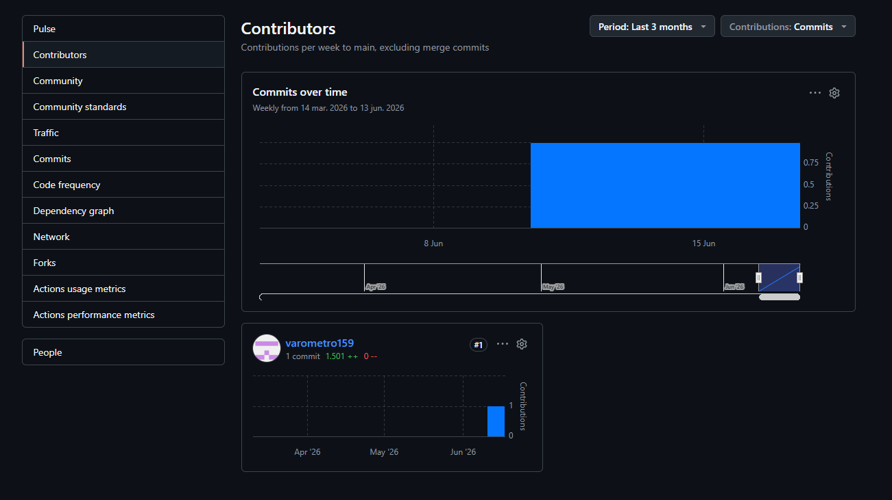

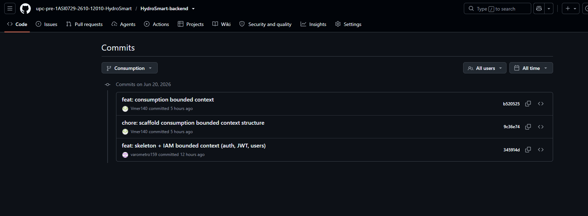

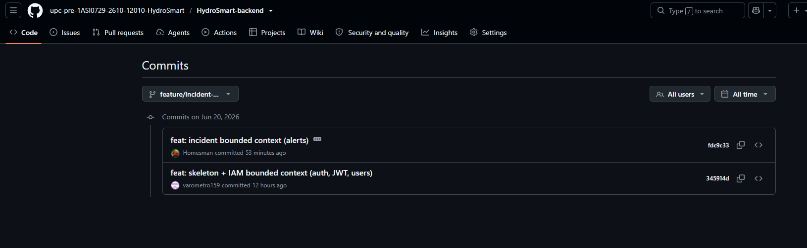

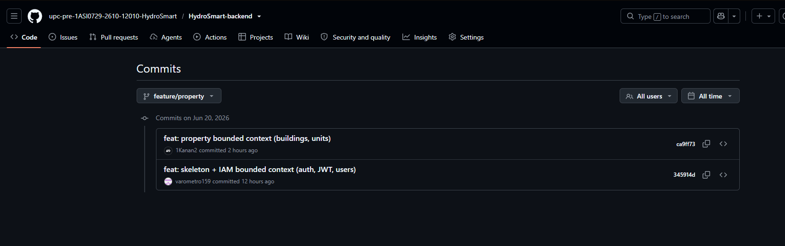

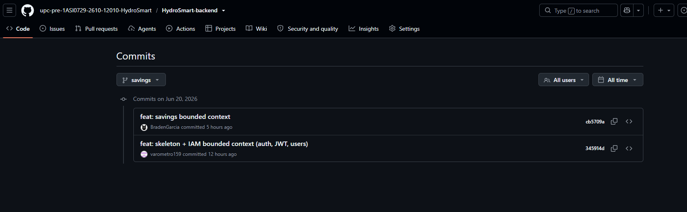

    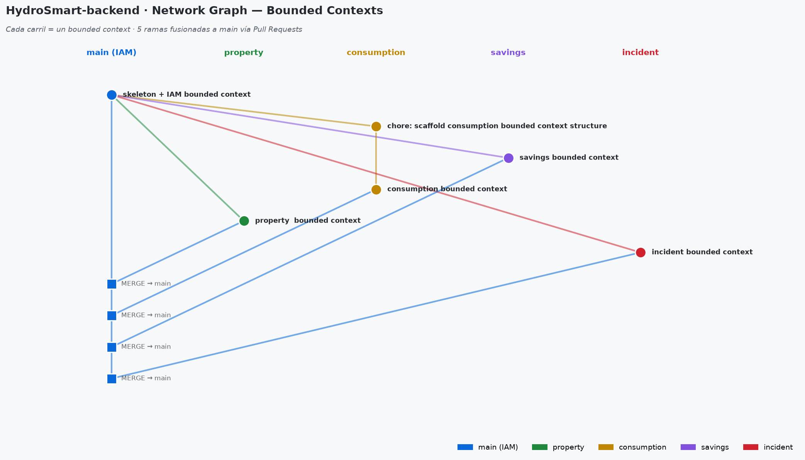

*Network graph mostrando las ramas por bounded context: cada carril representa un bounded context (iam, property, consumption, savings, incident) y los nodos cuadrados indican los merges a `main` vía Pull Request.*

> Recomendación para completar las evidencias: dado que las ramas de bounded context aún no están integradas a `main`, la vista de *Contributors* del backend puede mostrar pocos autores hasta que se realicen los merges. Conviene consolidar las ramas vía Pull Requests antes de generar las capturas de analíticos, de modo que la contribución de todos los integrantes quede reflejada en la rama principal.

## 5.3. Validation Interviews

### 5.3.3. Evaluaciones según heurísticas

UX Heuristics & Principles Evaluation
Usability – Inclusive Design – Information Architecture

**CARRERA:** Ingeniería de Software

**CURSO:** Desarrollo de Aplicaciones Open Source

**NRC:** 12010

**PROFESOR:** Ivan Robles Fernández

**SITE o APP A EVALUAR:** AquaPulse (HydroSmart)

**TAREAS A EVALUAR:**
El alcance de esta evaluación incluye la revisión de la usabilidad de las siguientes tareas:

Segmento Objetivo #1: Propietarios de viviendas con áreas verdes
- Visualizar el consumo de agua en tiempo real desde el dashboard.
- Gestionar los dispositivos de medición instalados en el hogar.
- Consultar el historial de consumo y los reportes generados.
- Configurar las preferencias de notificaciones y privacidad.

Segmento Objetivo #2: Estudiantes y jóvenes arrendatarios
- Visualizar el consumo compartido del hogar desde el dashboard.
- Editar la información del perfil de usuario.
- Consultar las alertas y notificaciones de consumo inusual.
- Acceder a las metas de ahorro y recomendaciones.

No están incluidas en esta versión de la evaluación las siguientes tareas:

- Registro e inicio de sesión (gestión de autenticación).
- Administración de propiedades e inquilinos por parte del arrendador.
- Generación y exportación de reportes personalizados.

**ESCALA DE SEVERIDAD:**
Los errores serán puntuados tomando en cuenta la siguiente escala de severidad

| Nivel | Descripción |
|---|---|
| 1 | Problema superficial: puede ser fácilmente superado por el usuario o ocurre con muy poca frecuencia. No necesita ser arreglado a no ser que exista disponibilidad de tiempo. |
| 2 | Problema menor: puede ocurrir un poco más frecuentemente o es un poco más difícil de superar para el usuario. Se le debería asignar una prioridad baja resolverlo de cara al siguiente reléase. |
| 3 | Problema mayor: ocurre frecuentemente o los usuarios no son capaces de resolverlos. Es importante que sean corregidos y se les debe asignar una prioridad alta. |
| 4 | Problema muy grave: un error de gran impacto que impide al usuario continuar con el uso de la herramienta. Es imperativo que sea corregido antes del lanzamiento. |

**TABLA RESUMEN:**

| # | Problema | Escala de severidad | Heurística/Principio violada(o) |
|---|---|---|---|
| 1 | Las tarjetas de resumen del dashboard no permiten acceder al detalle del consumo. | 3 | Information Architecture: Is it usable? |
| 2 | No existe un acceso directo a los dispositivos desde el dashboard. | 3 | Information Architecture: Is it usable? |
| 3 | Las notificaciones de consumo inusual no enlazan con la sección afectada. | 3 | Information Architecture: Is it findable? |
| 4 | Los campos del perfil no validan el tipo de dato ingresado. | 4 | Prevención de errores. |
| 5 | El sistema de medición de unidades de consumo no es consistente entre vistas. | 2 | Consistencia y estándares. |
| 6 | No existe ayuda contextual para interpretar las métricas y gráficos. | 2 | Ayuda y documentación. |

**DESCRIPCIÓN DE PROBLEMAS:**

**PROBLEMA #1:** Las tarjetas de resumen del dashboard no permiten acceder al detalle del consumo.

**SEVERIDAD:** 3
**HEURÍSTICA VIOLADA:** Information Architecture: Is it usable?

**Problema:**
En la pantalla del dashboard, se presentan tarjetas con métricas clave como el consumo total, el consumo promedio y el comparativo respecto al periodo anterior. El diseño visual de estas tarjetas invita al usuario a hacer clic esperando ver un desglose detallado, sin embargo, al hacerlo no se redirige al usuario a la vista de reportes ni se muestra información adicional, obligándolo a navegar manualmente por el menú lateral.

    

**Recomendación:**
Convertir las tarjetas de métricas en elementos interactivos que, al hacer clic, redirijan al usuario directamente a la sección de reportes con el filtro correspondiente aplicado.

---

**PROBLEMA #2:** No existe un acceso directo a los dispositivos desde el dashboard.

**SEVERIDAD:** 3
**HEURÍSTICA VIOLADA:** Information Architecture: Is it usable?

**Problema:**
En la pantalla del dashboard se muestra un resumen del estado de los dispositivos conectados (por ejemplo, medidores activos e inactivos), pero no existe un enlace o botón que permita acceder de forma directa a la pantalla de gestión de dispositivos. El usuario debe regresar al menú lateral y buscar manualmente la opción “Devices”, lo que incrementa el número de pasos para completar la tarea.

    

**Recomendación:**
Añadir un botón de acceso rápido o un enlace dentro de la tarjeta de dispositivos del dashboard que lleve directamente a la vista de gestión de dispositivos.

---

**PROBLEMA #3:** Las notificaciones de consumo inusual no enlazan con la sección afectada.

**SEVERIDAD:** 3
**HEURÍSTICA VIOLADA:** Information Architecture: Is it findable?

**Problema:**
Cuando el sistema detecta un consumo inusual o una posible fuga, se genera una notificación en el panel de alertas. Sin embargo, al seleccionar la notificación, esta no redirige al usuario a la pantalla de reportes o al dispositivo relacionado, por lo que el usuario debe buscar manualmente el origen del problema, lo que retrasa la atención de la alerta.

    

**Recomendación:**
Incluir un enlace dentro de cada notificación que lleve directamente al detalle del dispositivo o reporte relacionado con la alerta detectada.

---

**PROBLEMA #4:** Los campos del perfil no validan el tipo de dato ingresado.

**SEVERIDAD:** 4
**HEURÍSTICA VIOLADA:** Prevención de errores.

**Problema:**
En la pantalla de edición de perfil, campos como el número de teléfono o el correo electrónico aceptan cualquier tipo de dato sin realizar una validación previa. No se muestran advertencias ni se impide el guardado de información con formato incorrecto, lo que puede generar inconsistencias en los datos del usuario y dificultar futuras comunicaciones o procesos de recuperación de cuenta.

    

**Recomendación:**
Implementar validación en tiempo real de los campos (formato de correo, longitud y tipo numérico del teléfono) e impedir el guardado mientras los datos no cumplan con el formato esperado, mostrando mensajes de error claros.

---

**PROBLEMA #5:** El sistema de medición de unidades de consumo no es consistente entre vistas.

**SEVERIDAD:** 2
**HEURÍSTICA VIOLADA:** Consistencia y estándares.

**Problema:**
En el dashboard el consumo se presenta en litros, mientras que en la pantalla de reportes algunas métricas se muestran en metros cúbicos (m³) sin una conversión explícita. Esta inconsistencia puede confundir al usuario al comparar valores entre distintas vistas y dificulta la interpretación del ahorro real.

    

**Recomendación:**
Estandarizar la unidad de medida en todas las vistas o incluir un conversor visible que permita al usuario alternar entre litros y metros cúbicos de forma consistente.

---

**PROBLEMA #6:** No existe ayuda contextual para interpretar las métricas y gráficos.

**SEVERIDAD:** 2
**HEURÍSTICA VIOLADA:** Ayuda y documentación.

**Problema:**
En las pantallas de dashboard y reportes se presentan métricas y gráficos (como el comparativo de consumo o el porcentaje de ahorro) sin una explicación de qué significan ni cómo se calculan. Para usuarios menos familiarizados con la tecnología, esto dificulta la comprensión del valor entregado por la aplicación y reduce la utilidad percibida de la información.

    

**Recomendación:**
Añadir tooltips o iconos de ayuda junto a cada métrica y gráfico, y contemplar una sección de ayuda o FAQ accesible desde el menú de configuración.

---

# Conclusiones y Recomendaciones

## Conclusiones

- **La gestión del agua en el hogar necesita urgentemente digitalizarse:**  
  A través del proceso de needfinding y el análisis de la problemática, se confirmó que la mayoría de usuarios residenciales en Perú todavía depende de medidores analógicos y facturas mensuales para enterarse de cuánta agua consumen. Esto hace que detectar una fuga o un consumo excesivo tome semanas, cuando el daño económico ya está hecho. HydroSmart responde directamente a esa brecha, transformando datos de consumo en información útil y en tiempo real.

- **Dos segmentos distintos, una misma necesidad de control:**  
 Las entrevistas y el análisis de usuarios confirmaron la existencia de dos perfiles claramente diferenciados: los propietarios de viviendas con áreas verdes, que buscan controlar el riego y evitar pérdidas por fugas; y los estudiantes o jóvenes arrendatarios, que necesitan herramientas accesibles para no llevarse sorpresas en sus recibos. Ambos segmentos mostraron disposición para adoptar soluciones digitales, siempre que sean simples y visualmente claras.

- **HydroSmart se diferencia por ser accesible y pensada para el contexto latinoamericano:**  
 A diferencia de competidores como Hydrao, que requiere inversión en hardware físico, o Dropcountr, que opera en un contexto anglosajón, HydroSmart apuesta por un modelo completamente digital y freemium, eliminando barreras de entrada para los segmentos B y C del mercado peruano. Esto la posiciona como una solución más realista para la realidad económica local.

- **El impacto económico y ambiental es cuantificable:**  
 Los datos recopilados durante el needfinding muestran que una fuga no detectada puede desperdiciar hasta 150,000 litros de agua al mes, y que el riego ineficiente en jardines genera un gasto hasta 50% mayor al necesario. Con HydroSmart, los usuarios pueden reducir al menos un 20% su factura de agua en los primeros tres meses de uso, lo cual representa un beneficio concreto y medible que justifica la adopción de la plataforma.

- **La arquitectura del producto está bien definida para escalar:**  
  El diseño basado en eventos (Big Picture EventStorming) y el uso del Impact Mapping permitieron identificar claramente los comportamientos esperados de cada segmento y las funcionalidades necesarias para generarlos. Esto le da al equipo una hoja de ruta estructurada que facilita el desarrollo iterativo sin perder de vista los objetivos de negocio.

- **El modelo de negocio freemium es viable para el mercado objetivo:**  
  La estrategia de ofrecer una versión gratuita con funcionalidades básicas y una suscripción de pago con características avanzadas se alinea con las características del mercado peruano, donde el precio es una barrera real pero los usuarios están dispuestos a pagar cuando perciben valor tangible, como el ahorro en la factura mensual o la prevención de pérdidas económicas.

- **Los objetivos de negocio son alcanzables y están bien planteados:**  
  Las metas definidas, alcanzar 800 usuarios activos en 6 meses y aumentar la retención en un 25% en 9 meses, son ambiciosas pero realistas si se acompañan de una buena estrategia de onboarding, contenido educativo y alianzas institucionales. El Impact Mapping desarrollado conecta correctamente esos objetivos con acciones concretas dentro del producto.

- **La implementación del frontend permitió materializar la propuesta de valor de HydroSmart en una solución funcional:**
Durante este sprint se logró transformar los requerimientos funcionales y los diseños previamente definidos en una aplicación web interactiva, permitiendo que la propuesta planteada deje de ser únicamente conceptual y se convierta en una plataforma navegable, accesible y orientada a resolver una necesidad real relacionada con el consumo responsable del agua.

- **El uso de tecnologías modernas facilitó un desarrollo escalable y mantenible:**
La utilización de Vue.js como framework principal y Vite como herramienta de construcción permitió implementar una arquitectura basada en componentes reutilizables, favoreciendo la organización del código, la escalabilidad del sistema y la facilidad para incorporar nuevas funcionalidades en futuras etapas del proyecto.

- **La simulación de datos permitió validar el comportamiento funcional del sistema:**
El uso de una base de datos simulada mediante archivos locales permitió probar de forma efectiva la interacción entre la interfaz y los datos dinámicos, validando procesos clave como visualización, edición y actualización de información, además de preparar técnicamente la plataforma para una futura integración con un backend real.

- **Esta entrega establece una base sólida para la evolución futura del sistema:**
Con el frontend implementado y funcional, HydroSmart cuenta ahora con una base tecnológica estable sobre la cual podrán integrarse nuevas capas de desarrollo, como servicios backend, conexión con dispositivos IoT y funcionalidades avanzadas de análisis predictivo, fortaleciendo así la visión de largo plazo del proyecto.

## Recomendaciones

- **Priorizar las alertas inteligentes en los primeros sprints:**  
  Dado que tanto propietarios como estudiantes mencionaron la detección tardía de problemas como su principal frustración, se recomienda que las alertas automáticas de consumo excesivo y posibles fugas sean de las primeras funcionalidades en implementarse. Son el diferencial más valioso de HydroSmart frente a las soluciones actuales.

- **Diseñar un onboarding simple y motivador:**  
  Para que los usuarios de ambos segmentos adopten la app con facilidad, se sugiere implementar un proceso de bienvenida paso a paso que explique cómo interpretar los datos de consumo, cómo configurar metas de ahorro y cómo activar las notificaciones. Un usuario que entiende la app desde el primer día tiene muchas más probabilidades de quedarse.

- **Buscar alianza con SEDAPAL lo antes posible:**  
  Una integración con los datos reales de consumo de SEDAPAL le daría a HydroSmart una ventaja competitiva enorme y difícil de replicar por competidores extranjeros. Se recomienda iniciar conversaciones con esta entidad desde etapas tempranas del proyecto, incluso si la integración técnica se realiza más adelante.

- **Invertir en contenido educativo sobre ahorro de agua:**  
Muchos usuarios aún no tienen una cultura de monitoreo del consumo hídrico, por lo que no buscan activamente una solución como HydroSmart. Publicar contenido en redes sociales, blogs o videos cortos sobre el impacto económico de las fugas y el riego ineficiente puede generar conciencia y atraer usuarios orgánicamente, posicionando a la startup como referente en el tema.

- **Realizar pruebas de usabilidad con usuarios reales cada dos sprints:**  
Ambos segmentos priorizaron la simplicidad como factor clave para adoptar la solución. Para asegurarse de que la interfaz sigue siendo intuitiva conforme se agregan nuevas funcionalidades, se recomienda hacer sesiones cortas de prueba con usuarios reales con regularidad, identificando puntos de confusión antes de que se conviertan en razones para dejar de usar la app.

- **Explorar versiones diferenciadas por segmento:**  
Dado que los propietarios y los estudiantes tienen necesidades distintas, podría evaluarse la posibilidad de ofrecer flujos de experiencia personalizados según el perfil del usuario al momento del registro. Esto haría que cada persona sienta que la app fue diseñada específicamente para su situación, lo cual aumenta el valor percibido.

- **Planificar la expansión regional desde ahora:**  
Aunque el enfoque inicial debe estar en Lima, donde se concentra la mayor parte del mercado potencial, se recomienda documentar desde ya las decisiones de diseño y desarrollo considerando una futura expansión a otras ciudades del Perú y eventualmente a países como Ecuador, Colombia o Bolivia, que comparten condiciones de mercado similares.

- **Medir el impacto real en los usuarios desde el inicio:**  
Aunque el enfoque inicial debe estar en Lima, donde se concentra la mayor parte del mercado potencial, se recomienda documentar desde ya las decisiones de diseño y desarrollo considerando una futura expansión a otras ciudades del Perú y eventualmente a países como Ecuador, Colombia o Bolivia, que comparten condiciones de mercado similares.

# Bibliografía

- Superintendencia Nacional de Servicios de Saneamiento (SUNASS). (2022). *Fugas de agua en instalaciones domiciliarias: impacto económico y ambiental en el usuario residencial*. SUNASS. Recuperado de https://www.sunass.gob.pe/
- Servicio de Agua Potable y Alcantarillado de Lima (SEDAPAL). (2025). *Sitio web oficial de SEDAPAL*. Recuperado el 5 de abril de 2025, de https://www.sedapal.com.pe/
- Instituto Nacional de Estadística e Informática (INEI). (2023). *Perú: Formas de acceso al agua y saneamiento básico*. INEI. Recuperado de https://m.inei.gob.pe/media/MenuRecursivo/boletines/boletin_agua_2023.pdf
- Banco Mundial. (2023). *Agua: Panorama general*. Recuperado de https://www.bancomundial.org/es/topic/water/overview
- Dropcountr. (2025). *Sitio web oficial de Dropcountr*. Recuperado el 5 de abril de 2025, de https://dropcountr.com/
- Hydrao. (2025). *Smart shower head – water consumption monitoring*. Recuperado el 5 de abril de 2025, de https://www.hydrao.com/
- Superintendencia Nacional de Servicios de Saneamiento (SUNASS). (2023). *Yakúmetro: simulador de consumo de agua potable y alcantarillado*. Recuperado de https://yakumetro.sunass.gob.pe/
- Evans, E. (2003). *Domain-Driven Design: Tackling Complexity in the Heart of Software*. Addison-Wesley.
- Microsoft. (2024). *ASP.NET Core Documentation*. Microsoft Learn. Recuperado de https://learn.microsoft.com/aspnet/core
- Nielsen, J. (1994). *10 Usability Heuristics for User Interface Design*. Nielsen Norman Group. Recuperado de https://www.nngroup.com/articles/ten-usability-heuristics/
- Patton, J. (2014). *User Story Mapping: Discover the Whole Story, Build the Right Product*. O'Reilly Media.
- Schwaber, K., & Sutherland, J. (2020). *The Scrum Guide: The Definitive Guide to Scrum: The Rules of the Game*. Scrum.org. Recuperado de https://scrumguides.org/scrum-guide.html
- You, E. (2024). *Vue.js - The Progressive JavaScript Framework*. Recuperado de https://vuejs.org/guide/introduction.html
  
