

<h3>Universidad Peruana de Ciencias Aplicadas</h3>
<h4>Facultad de Ingeniería</h4>
<h4>Carrera de Ingeniería de Software</h4>
<h4>Periodo 202601</h4>
<h4>1ASI0729 Desarrollo de Aplicaciones Open Source</h4>
<h4>NRC: 12010</h4>
<h4>Docente: Ivan Robles Fernández</h4>
<h4>Informe del Trabajo Final</h4>
<h4>Startup: HydroSmart</h4>
<h4>Producto: AquaPulse</h4>

 

<h2 style="text-align: center;">Team members:</h2>

<table style="margin: 0 auto; text-align: center;">
  <thead>
    <tr>
      <th>Código</th>
      <th>Nombre</th>
    </tr>
  </thead>
  <tbody>
    <tr>
      <td>U202415618</td>
      <td>Braden Raid Garcia Cerpa</td>
    </tr>
    <tr>
      <td>U20221C726</td>
      <td>Keyner Ivan Hancco Poma</td>
    </tr>
    <tr>
      <td>U202411622</td>
      <td>Oscar Fernando Vara Velásquez</td>
    </tr>
    <tr>
      <td>U202411567</td>
      <td>Victor Manuel Espino Rossi</td>
    </tr>
    <tr>
      <td>U202320776</td>
      <td>Hernan Gabriel Huayta Fuentes</td>
    </tr>
  </tbody>
</table>

 
<h4 style="text-align: center;">Abril 2026</h4>

## Registro de Versiones del Informe

| Version | Fecha | Autor | Descripcion de Modificacion |
|--------|------|------|-----------------------------|
| 0.1 | 09/04/2026 | Equipo | Se actualizó el README incorporando el perfil de la solución, antecedentes, problemática, misión, visión y perfiles del equipo. |
| 0.2 | 10/04/2026 | Equipo | Se desarrolló el Capítulo 1, incluyendo Lean UX Problem Statements, Assumptions, Hypothesis Statements, segmentos objetivos y Lean UX Canvas. |
| 0.3 | 11/04/2026 | Equipo | Se añadieron business assumptions y se consolidó la documentación Lean UX. |
| 0.4 | 12/04/2026 | BradenGarcia | Se diseñaron y documentaron las entrevistas. |
| 0.5 | 13/04/2026 | varometro159 | Se añadieron entrevistas del segundo segmento objetivo. |
| 0.6 | 14/04/2026 | BradenGarcia | Se incorporaron y corrigieron entrevistas. |
| 0.7 | 15/04/2026 | BradenGarcia | Se añadieron user personas, needfinding y evidencias. |
| 0.8 | 17/04/2026 | Equipo | Se desarrolló el análisis de entrevistas, Ubiquitous Language y EventStorming. |
| 0.9 | 18/04/2026 | Homesman | Se añadieron resúmenes de entrevistas y User Journey Mapping. |
| 1.0 | 24/04/2026 | Homesman / Equipo | Se incorporaron Empathy Mapping e imágenes. |
| 1.1 | 17/04/2026 | Vmer140 | Se inició el Capítulo 3 con la definición de Epics, User Stories y Technical Stories. |
| 1.2 | 17/04/2026 | BradenGarcia | Se desarrolló el Impact Mapping. |
| 1.3 | 18/04/2026 | 1Kanan2 | Se agregó el Product Backlog completo. |
| 1.4 | 19/04/2026 | Vmer140 | Se inició el Capítulo 4 con Navigation Systems, Searching Systems y diseño de Landing Page (wireframes y mockups). |
| 1.5 | 19/04/2026 | BradenGarcia | Se desarrollaron sistemas de organización, arquitectura de información y guías de estilo. |
| 1.6 | 19/04/2026 | varometro159 | Se añadieron EventStorming de diseño y diagramas C4. |
| 1.7 | 21/04/2026 | Homesman | Se desarrolló el diseño orientado a objetos y base de datos. |
| 1.8 | 22/04/2026 | Vmer140 / Equipo | Se desarrolló el diseño UX/UI de la aplicación web, incluyendo estructura general. |
| 1.9 | 23/04/2026 | 1Kanan2 | Se añadieron wireflows, mockups y actualización del prototipo. |
| 2.0 | 22/04/2026 | varometro159 | Se inició el Capítulo 5 con Sprint Planning y evidencias. |
| 2.1 | 23/04/2026 | BradenGarcia | Se documentó la configuración del entorno y gestión del código. |
| 2.2 | 23/04/2026 | 1Kanan2 | Se añadieron conclusiones, recomendaciones y bibliografía. |
| 2.3 | 24/04/2026 | Homesman | Se agregaron evidencias de ejecución y despliegue. |
| 2.4 | 24/04/2026 | Vmer140 | Se documentó la implementación de la Landing Page, servicios y aplicaciones. |
| 2.5 | 24/04/2026 | Equipo | Se añadieron insights del equipo y cierre del proyecto. |

## Project Report Collaboration Insights

**Link de la organización:**
[https://github.com/upc-pre-1ASI0730-2610-HydroSmart](https://github.com/upc-pre-1ASI0729-2610-12010-HydroSmart)

**Link del Repositorio del Informe:** [https://github.com/upc-pre-1ASI0730-2610-HydroSmart/Report.git](https://github.com/upc-pre-1ASI0729-2610-12010-HydroSmart/Report)

### Reporte de Colaboración para la Entrega del AV1

**AV1 - Desarrollo del reporte y diseño de la landing page:**

En esta primera evaluación del proyecto HydroSmart, el trabajo se centró en establecer una base sólida tanto a nivel conceptual como de diseño, definiendo la propuesta de la startup y su aplicación AquaPulse. Se priorizó la identificación de las necesidades de los usuarios, específicamente propietarios de viviendas con áreas verdes y estudiantes que alquilan, quienes presentan dificultades para controlar su consumo de agua. A través de técnicas de análisis y levantamiento de información, se logró comprender la problemática y orientar el desarrollo de una solución alineada a estos contextos.

A partir de este análisis, se desarrollaron componentes clave del proyecto como la definición del problema, la propuesta de valor y el enfoque Lean UX, que permitió estructurar las ideas de manera centrada en el usuario. Asimismo, se complementó con la elaboración de user personas y la identificación de sus principales comportamientos, objetivos y frustraciones, lo que facilitó una mejor comprensión del escenario de uso. Este proceso también permitió organizar la información necesaria para sustentar el diseño de la solución.

En la fase de diseño, se establecieron lineamientos visuales para garantizar coherencia en la interfaz, junto con la definición de la arquitectura de información, incluyendo sistemas de organización, etiquetado y navegación. Se desarrollaron wireframes, mockups y flujos de usuario que representan las principales interacciones dentro de la plataforma. Como resultado tangible, se implementó la landing page del proyecto, evidenciando el avance alcanzado en esta etapa y dejando una base estructurada para las siguientes fases de desarrollo.

## Contributors

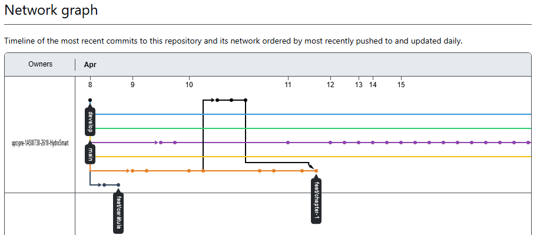  

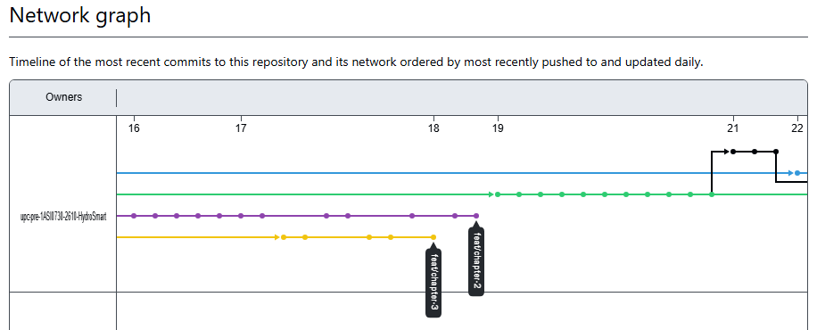  

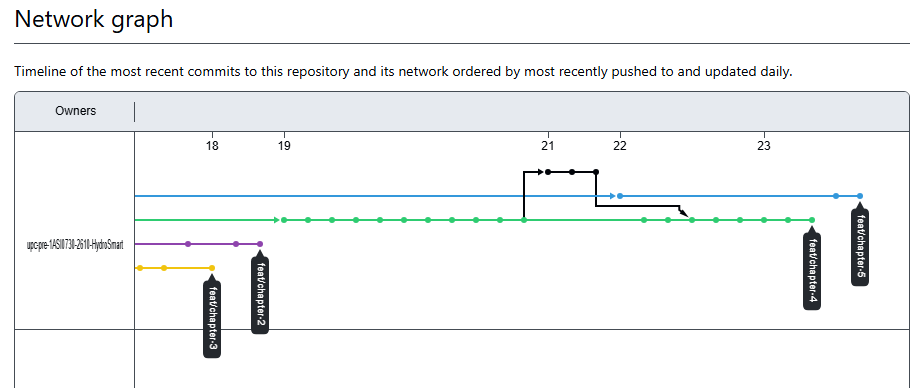  

**Braden Raid Garcia Cerpa**  
- **Lean UX y Definición Inicial.** Contribuyó en el desarrollo del proceso Lean UX, incluyendo la formulación de supuestos e hipótesis, estableciendo una base clara para el enfoque del proyecto.  
- **Investigación de Usuarios.** Participó en el registro de entrevistas y en la construcción de user stories, permitiendo comprender mejor las necesidades del usuario.  
- **Arquitectura de Información.** Aportó en la definición de sistemas de búsqueda y navegación, mejorando la estructura de la información.  
- **Diseño de Landing Page.** Desarrolló wireframes, mockups y el diseño visual de la landing page.  
- **Configuración Técnica.** Documentó guías de estilo de código y configuraciones iniciales para el despliegue del sistema.

**Hancco Poma, Keyner Ivan**  
- **Análisis Competitivo.** Realizó el análisis de competidores y propuso estrategias para fortalecer la propuesta de valor.  
- **Gestión del Producto.** Participó en la elaboración del product backlog y en la definición de funcionalidades.  
- **Diseño de Aplicación Web.** Desarrolló wireframes, wireflows, mockups y diagramas de flujo de usuario.  
- **Landing Page.** Contribuyó en la sección de FAQ, footer y estructura general.  
- **Documentación.** Elaboró conclusiones, recomendaciones y bibliografía del proyecto.

**Victor Manuel Espino Rossi**  
- **Lean UX Canvas y Segmentación.** Elaboró el Lean UX Canvas y definió los segmentos objetivos del proyecto.  
- **Investigación y Análisis.** Diseñó entrevistas, analizó resultados y desarrolló user personas y user task matrix.  
- **Impact Mapping.** Construyó el mapeo de impactos alineando objetivos del negocio con funcionalidades.  
- **Guías de Estilo y Arquitectura.** Definió lineamientos visuales, arquitectura de información, sistemas de organización y etiquetado.  
- **Diseño de Landing Page.** Participó en el diseño UI, wireframes y mockups.  
- **Configuración de Software.** Documentó aspectos de gestión, entorno y administración del código.

**Oscar Fernando Vara Velásquez**  
- **Definición del Problema.** Desarrolló la descripción de la startup, antecedentes y problemática.  
- **Análisis del Usuario.** Elaboró user journey mapping y empathy mapping para entender la experiencia del usuario.  
- **Diseño de Software.** Trabajó en diseño orientado a objetos, diagramas de clases y base de datos.  
- **Arquitectura Técnica.** Desarrolló diagramas y estructura de base de datos.  
- **Evidencias Técnicas.** Documentó evidencias de ejecución, servicios y despliegue del sistema.

**Hernan Gabriel Huayta Fuentes**  
- **Análisis de Competencia.** Identificó competidores y apoyó en el registro de entrevistas.  
- **Modelado del Dominio.** Participó en Big Picture Event Storming y lenguaje ubicuo.  
- **Arquitectura de Software.** Desarrolló diagramas C4: contexto, contenedores y componentes.  
- **Prototipado Web.** Contribuyó en el desarrollo de prototipos de la aplicación.  
- **Gestión Ágil.** Participó en sprint planning, backlog y organización del equipo.  
- **Evidencias de Desarrollo.** Documentó avances y evidencias para la revisión del sprint.

**Contribuciones Grupales**  
- **Investigación de Usuarios.** Desarrollo conjunto de entrevistas y análisis de necesidades.  
- **Diseño UX/UI.** Creación colaborativa de la landing page, incluyendo wireframes y mockups.  
- **Arquitectura de Información.** Definición de sistemas de organización, navegación y etiquetado.  
- **Modelado del Sistema.** Elaboración de diagramas y estructura inicial del sistema.  
- **Planificación del Proyecto.** Construcción del backlog, planificación del sprint y coordinación del equipo.

# Contenido

- [Student Outcome](#student-outcome)
- [Capítulo I: Introducción](#capitulo-i-introduccion)
    - [1.1. Startup Profile](#11-startup-profile)
        - [1.1.1. Descripción de la Startup](#111-descripción-de-la-startup)
        - [1.1.2. Perfiles de integrantes del equipo](#112-perfiles-de-integrantes-del-equipo)
    - [1.2. Solution Profile](#12-solution-profile)
        - [1.2.1. Antecedentes y problemática](#121-antecedentes-y-problemática)
        - [1.2.2. Lean UX Process](#122-lean-ux-process)
            - [1.2.2.1. Lean UX Problem Statements](#1221-lean-ux-problem-statements)
            - [1.2.2.2. Lean UX Assumptions](#1222-lean-ux-assumptions)
            - [1.2.2.3. Lean UX Hypothesis Statements](#1223-lean-ux-hypothesis-statements)
            - [1.2.2.4. Lean UX Canvas](#1224-lean-ux-canvas)
    - [1.3. Segmentos Objetivo](#13-segmentos-objetivo)

- [Capítulo II: Requirements Elicitation & Analysis](#capitulo-ii-requirements-elicitation--analysis)
    - [2.1. Competidores](#21-competidores)
        - [2.1.1. Análisis competitivo](#211-análisis-competitivo)
        - [2.1.2. Estrategias y tácticas frente a competidores](#212-estrategias-y-tácticas-frente-a-competidores)
    - [2.2. Entrevistas](#22-entrevistas)
        - [2.2.1. Diseño de entrevistas](#221-diseño-de-entrevistas)
        - [2.2.2. Registro de entrevistas](#222-registro-de-entrevistas)
        - [2.2.3. Análisis de entrevistas](#223-análisis-de-entrevistas)
    - [2.3. Needfinding](#23-needfinding)
        - [2.3.1. User Personas](#231-user-personas)
        - [2.3.2. User Task Matrix](#232-user-task-matrix)
        - [2.3.3. User Journey Mapping](#233-user-journey-mapping)
        - [2.3.4. Empathy Mapping](#234-empathy-mapping)
    - [2.4. Big Picture EventStorming](#24-big-picture-eventstorming)
    - [2.5. Ubiquitous Language](#25-ubiquitous-language)

- [Capítulo III: Requirements Specification](#capitulo-iii-requirements-specification)
    - [3.1. User Stories](#31-user-stories)
    - [3.2. Impact Mapping](#32-impact-mapping)
    - [3.3. Product Backlog](#33-product-backlog)

- [Capítulo IV: Product Design](#capitulo-iv-product-design)
    - [4.1. Style Guidelines](#41-style-guidelines)
        - [4.1.1. General Style Guidelines](#411-general-style-guidelines)
        - [4.1.2. Web Style Guidelines](#412-web-style-guidelines)
    - [4.2. Information Architecture](#42-information-architecture)
        - [4.2.1. Organization Systems](#421-organization-systems)
        - [4.2.2. Labeling Systems](#422-labeling-systems)
        - [4.2.3. SEO Tags and Meta Tags](#423-seo-tags-and-meta-tags)
        - [4.2.4. Searching Systems](#424-searching-systems)
        - [4.2.5. Navigation Systems](#425-navigation-systems)
    - [4.3. Landing Page UI Design](#43-landing-page-ui-design)
        - [4.3.1. Landing Page Wireframe](#431-landing-page-wireframe)
        - [4.3.2. Landing Page Mock-up](#432-landing-page-mock-up)
    - [4.4. Web Applications UX/UI Design](#44-web-applications-uxui-design)
        - [4.4.1. Web Applications Wireframes](#441-web-applications-wireframes)
        - [4.4.2. Web Applications Wireflow Diagrams](#442-web-applications-wireflow-diagrams)
        - [4.4.3. Web Applications Mock-ups](#443-web-applications-mock-ups)
        - [4.4.4. Web Applications User Flow Diagrams](#444-web-applications-user-flow-diagrams)
    - [4.5. Web Applications Prototyping](#45-web-applications-prototyping)
    - [4.6. Domain-Driven Software Architecture](#46-domain-driven-software-architecture)
        - [4.6.1. Design-Level EventStorming](#461-design-level-eventstorming)
        - [4.6.2. Software Architecture Context Diagram](#462-software-architecture-context-diagram)
        - [4.6.3. Software Architecture Container Diagrams](#463-software-architecture-container-diagrams)
        - [4.6.4. Software Architecture Components Diagrams](#464-software-architecture-components-diagrams)
    - [4.7. Software Object-Oriented Design](#47-software-object-oriented-design)
        - [4.7.1. Class Diagrams](#471-class-diagrams)
    - [4.8. Database Design](#48-database-design)
        - [4.8.1. Database Diagrams](#481-database-diagrams)

- [Capítulo V: Product Implementation, Validation & Deployment](#capitulo-v-product-implementation-validation--deployment)
    - [5.1. Software Configuration Management](#51-software-configuration-management)
        - [5.1.1. Software Development Environment Configuration](#511-software-development-environment-configuration)
        - [5.1.2. Source Code Management](#512-source-code-management)
        - [5.1.3. Source Code Style Guide & Conventions](#513-source-code-style-guide--conventions)
        - [5.1.4. Software Deployment Configuration](#514-software-deployment-configuration)
    - [5.2. Landing Page, Services & Applications Implementation](#52-landing-page-services--applications-implementation)
        - [5.2.1. Sprint 1](#521-sprint-n)
            - [5.2.1.1. Sprint Planning 1](#5211-sprint-planning-n)
            - [5.2.1.2. Aspect Leaders and Collaborators](#5212-aspect-leaders-and-collaborators)
            - [5.2.1.3. Sprint Backlog 1](#5213-sprint-backlog-n)
            - [5.2.1.4. Development Evidence for Sprint Review](#5214-development-evidence-for-sprint-review)
            - [5.2.1.5. Execution Evidence for Sprint Review](#5215-execution-evidence-for-sprint-review)
            - [5.2.1.6. Services Documentation Evidence for Sprint Review](#5216-services-documentation-evidence-for-sprint-review)
            - [5.2.1.7. Software Deployment Evidence for Sprint Review](#5217-software-deployment-evidence-for-sprint-review)
            - [5.2.1.8. Team Collaboration Insights during Sprint](#5218-team-collaboration-insights-during-sprint)

            - [5.2.2. Sprint 2](#522-sprint-n)
            - [5.2.2.1. Sprint Planning 2](#5221-sprint-planning-n)
            - [5.2.2.2. Aspect Leaders and Collaborators](#5212-aspect-leaders-and-collaborators)
            - [5.2.2.3. Sprint Backlog 2](#5223-sprint-backlog-n)
            - [5.2.2.4. Development Evidence for Sprint Review](#5224-development-evidence-for-sprint-review)
            - [5.2.2.5. Execution Evidence for Sprint Review](#5225-execution-evidence-for-sprint-review)
            - [5.2.2.6. Services Documentation Evidence for Sprint Review](#5226-services-documentation-evidence-for-sprint-review)
            - [5.2.2.7. Software Deployment Evidence for Sprint Review](#5227-software-deployment-evidence-for-sprint-review)
            - [5.2.2.8. Team Collaboration Insights during Sprint](#5228-team-collaboration-insights-during-sprint)

            - [5.2.3. Sprint 3](#523-sprint-3)
            - [5.2.3.1. Sprint Planning 3](#5231-sprint-planning-3)
            - [5.2.3.2. Aspect Leaders and Collaborators](#5232-aspect-leaders-and-collaborators)
            - [5.2.3.3. Sprint Backlog 3](#5233-sprint-backlog-3)
            - [5.2.3.4. Development Evidence for Sprint Review](#5234-development-evidence-for-sprint-review)
            - [5.2.3.5. Execution Evidence for Sprint Review](#5235-execution-evidence-for-sprint-review)
            - [5.2.3.6. Services Documentation Evidence for Sprint Review](#5236-services-documentation-evidence-for-sprint-review)
            - [5.2.3.7. Software Deployment Evidence for Sprint Review](#5237-software-deployment-evidence-for-sprint-review)
            - [5.2.3.8. Team Collaboration Insights during Sprint](#5238-team-collaboration-insights-during-sprint)

            - [5.3. Validation Interviews](#53-validation-interviews)
            - [5.3.1. Diseño de Entrevistas](#5221-diseno-de-entrevistas)
            - [5.3.2. Registro de Entrevistas](#5212-registro-de-entrevistas)
            - [5.3.3. Evaluaciones según heurísticas](#5212-evaluaciones-segun-heuristicas)
            - [5.4. Video About-the-Product](#54-video-about-the-product)

- [Conclusiones](#conclusiones)
    - [Conclusiones y recomendaciones](#conclusiones-y-recomendaciones)
- [Bibliografía](#bibliografía)
- [Anexos](#anexos)

## Student Outcome

| Criterio Especifico | Acciones Realizadas | Conclusiones |
|--------------------|--------------------|--------------|
| Trabaja en equipo para proporcionar liderazgo en forma conjunta | **Braden Raid Garcia Cerpa:**  **Acciones AV1:** Participé en la organización del equipo, apoyando en la definición de ideas clave y asegurando que todos mantuvieran una misma línea de trabajo. Coordiné tareas y apoyé en la toma de decisiones.   **Hancco Poma, Keyner Ivan:**  **Acciones AV1:** Colaboré en reuniones grupales y en la ejecución de tareas asignadas. Aporté ideas para mejorar el enfoque del landing y mantener el avance del equipo.   **Victor Manuel Espino Rossi:**  **Acciones AV1:** Contribuí en el diseño UX/UI y en la estructuración del contenido del landing. Apoyé en la coordinación del equipo y revisión de avances.   **Hernan Gabriel Huayta Fuentes:**  **Acciones AV1:** Participé en la planificación de tareas y en la organización del contenido. Apoyé en la comunicación del equipo para mantener coherencia.   **Oscar Fernando Vara Velásquez:**  **Acciones AV1:** Colaboré en la definición de ideas y en la organización del trabajo. Participé activamente en las coordinaciones grupales. | **Conclusión grupal AV1:** El equipo logró mantener un liderazgo compartido, donde cada integrante aportó desde su rol para avanzar de manera coordinada. La comunicación constante y la organización de tareas permitieron un desarrollo ordenado del landing. Este enfoque facilitó la toma de decisiones y aseguró coherencia en el resultado final. |
| Crea un entorno colaborativo e inclusivo, establece metas, planifica tareas y cumple objetivos. | **Braden Raid Garcia Cerpa:**  **Acciones AV1:** Apoyé en la definición de objetivos y en la organización de tareas, asegurando claridad en las responsabilidades de cada integrante.   **Hancco Poma, Keyner Ivan:**  **Acciones AV1:** Participé en tareas asignadas y reuniones, manteniendo un ambiente colaborativo y cumpliendo con los objetivos.   **Victor Manuel Espino Rossi:**  **Acciones AV1:** Establecí metas para el diseño UX/UI y planifiqué tareas del landing, asegurando el cumplimiento de objetivos.   **Hernan Gabriel Huayta Fuentes:**  **Acciones AV1:** Colaboré en la planificación de actividades y mantuve comunicación constante para un avance ordenado.   **Oscar Fernando Vara Velásquez:**  **Acciones AV1:** Participé en la organización del trabajo y en la planificación de tareas, contribuyendo al cumplimiento de metas. | **Conclusión grupal AV1:** Se logró un entorno colaborativo donde se definieron metas claras y se organizaron las tareas de manera eficiente. La participación activa permitió cumplir los objetivos establecidos, manteniendo un trabajo ordenado y alineado con lo requerido. |

# Capítulo I: Introducción

## 1.1. Startup Profile

### 1.1.1. Descripción de la Startup

## 1.1. Startup Profile

### 1.1.1. Descripción de la Startup

**HydroSmart** es una startup de base tecnológica dedicada al desarrollo de soluciones digitales orientadas a mejorar la eficiencia en el uso del agua dentro del entorno doméstico. Mediante su plataforma inteligente, la aplicación brinda a los usuarios la capacidad de supervisar su consumo hídrico en tiempo real, identificar fugas de forma anticipada y acceder a recomendaciones personalizadas que contribuyen a disminuir el desperdicio. La herramienta convierte la gestión de un recurso vital en un proceso digital, traduciendo información compleja en datos concretos y accionables para promover hogares más responsables ambiental y económicamente.

La plataforma ha sido concebida para responder a las necesidades particulares de distintos tipos de usuarios. De un lado, pone a disposición de los **propietarios con áreas verdes** un seguimiento detallado del riego y cuidado de sus jardines; de otro, facilita a los **arrendadores de departamentos con servicios incluidos** la supervisión del consumo de sus inquilinos para evitar pérdidas económicas. Del mismo modo, ofrece a los **jóvenes arrendatarios y estudiantes** una alternativa asequible para cuidar su economía mensual mediante alertas de consumo y objetivos de ahorro ajustados a sus posibilidades.

Con un compromiso genuino con la innovación y la sostenibilidad, **HydroSmart** aspira a posicionarse como referente en la digitalización del sector hídrico residencial en América Latina. Al integrar una interfaz moderna con tecnología de análisis preventivo, la startup no solo contribuye a reducir el importe de las facturas mensuales, sino que también impulsa una cultura de transparencia y responsabilidad ambiental, garantizando que cada litro de agua sea aprovechado al máximo en el hogar.

**Misión:**  
Promover la gestión inteligente del recurso hídrico en los hogares a través de soluciones tecnológicas accesibles que optimicen el consumo, reduzcan costos operativos y estimulen hábitos sostenibles que preserven el agua a largo plazo.

**Visión:**  
Consolidarse como la plataforma de referencia en eficiencia hídrica residencial en Latinoamérica, liderando la construcción de hogares inteligentes donde la tecnología y la conciencia ambiental se articulen para garantizar un uso responsable y transparente del agua.

### 1.1.2. Perfiles de integrantes del equipo
| Integrante                                                                        | Código Estudiante | Descripcion de Carrera | Conocimientos y Habilidades a apuntar |
|-----------------------------------------------------------------------------------|-------------------|------------------------|---------------------------------------|
|  Braden Garcia Cerpa       | U202415618       | Ingeniería de Software |  Proactivo, Excelente trabajando en equipo y dominio en lenguajes como python, HTML, CSS y JS        |
|    Keyner Ivan Hancco Poma           | U20221C726        | Ingeniería de Software | C++, Python, CSS, HTML, Figma, SQL, JS, Excelente en comunicación, organización y en el idioma inglés  |
|    Hernan Gabriel Huayta Fuentes | U202320776       | Ingeniería de Software | SQL, Postgres, Prisma, TS, JS, HTML, CSS, Desarrollador fullstack, orientado a desarrollo frontend con agil aprendizaje |
|    Victor Manuel Espino Rossi        | U202411567       | Ingeniería de Software |  Desarrollador proactivo con dominio en lenguajes como C++ y Python. Orientado a la creación de soluciones eficientes y excelente capacidad para el trabajo en equipo.                              |
|  Oscar Fernando Vara Velásquez             | U202411622        | Ingeniería de Software |  Enfocado en crear soluciones tecnológicas de acuerdo a las necesidades de los usuarios. Cuento una rápida adquisición de conocimientos y trabajo en equipo                  |

## 1.2. Solution Profile

### 1.2.1. Antecedentes y problemática
### Antecedentes

En el sector residencial y de gestión inmobiliaria, la ausencia de control sobre el uso del agua constituye un desafío tanto económico como ambiental de primer orden. El desconocimiento de los patrones de gasto y la identificación tardía de fugas invisibles generan un desperdicio considerable del recurso e incrementos injustificados en las facturas mensuales. De acuerdo con el Banco Mundial (2023), el agua no contabilizada en redes urbanas y domésticas puede representar hasta el 40% del total debido a fugas sin detectar y a la ausencia de sistemas de monitoreo, afectando directamente la economía familiar, en especial en regiones con escasez hídrica como América Latina.

Una situación particularmente crítica se presenta en viviendas con áreas verdes y en edificios donde el agua está incluida en el precio del alquiler. En el primer caso, el riego sin considerar la humedad real del suelo genera un consumo hasta un 50% mayor al necesario para el mantenimiento del jardín. En el segundo, los propietarios asumen el riesgo de inquilinos que, al no costear directamente el servicio, no tienen motivación para ahorrar, lo que reduce los márgenes de rentabilidad. Según la SUNASS (2022), un inodoro en mal estado o una fuga interna puede desperdiciar hasta 150,000 litros de agua al mes, un costo que la mayoría de los usuarios recién advierte cuando llega el recibo semanas más tarde.

En la actualidad, la gestión del agua en el hogar es principalmente reactiva y manual. Los usuarios dependen de medidores analógicos de difícil acceso y de una facturación mensual que no ofrece información sobre el momento ni el lugar del consumo. La carencia de herramientas digitales accesibles que integren alertas inmediatas y análisis de datos impide que tanto propietarios como estudiantes con presupuesto ajustado puedan optimizar su gasto, dejando un vacío tecnológico que HydroSmart aspira a cubrir para transformar el consumo pasivo en una gestión inteligente y sostenible.

### Problemática

Para comprender la necesidad del proyecto, se utilizó la técnica de las 5W's + 2H's:

### 5W's
### What (¿Cuál es el problema?):
Los usuarios residenciales carecen de visibilidad y control sobre su gasto hídrico en tiempo real, lo que deriva en facturas elevadas por fugas no identificadas, riego deficiente en áreas verdes y escasa conciencia sobre el consumo diario. Los propietarios que alquilan con servicios incluidos ven afectada su rentabilidad al no poder controlar el uso excesivo por parte de sus inquilinos.

### When (¿Cuándo ocurre el problema?):
El problema es constante, aunque se intensifica cuando existen fugas internas imperceptibles o durante periodos de riego intensivo. El usuario generalmente detecta el inconveniente semanas después, al recibir el recibo de pago, cuando el daño económico y el desperdicio del recurso ya resultan irreversibles.

### Where (¿Dónde ocurre el problema?):
En viviendas particulares con jardines, edificios de departamentos en alquiler y residencias estudiantiles donde el control hídrico es nulo o se limita a un medidor general administrado por la empresa proveedora del servicio.

### Who (¿A quién o quiénes afecta el problema?):
- **Propietarios de viviendas:** Que enfrentan elevados costos de mantenimiento por un riego poco eficiente.
- **Arrendadores:** Que ven disminuida su utilidad por el consumo sin control en unidades con servicios incluidos.
- **Estudiantes e inquilinos:** Que manejan presupuestos reducidos y necesitan minimizar sus gastos fijos.
- **El Medio Ambiente:** Por el agotamiento innecesario de fuentes de agua dulce.

### Why (¿Por qué sucede el problema?):
Porque la infraestructura de medición vigente es analógica y no proporciona retroalimentación inmediata al usuario. No existe una cultura de monitoreo preventivo, en parte por la ausencia de plataformas digitales que traduzcan el flujo hídrico en datos de costo y ahorro comprensibles para el usuario común.

### 2H's
### How (¿Cómo aparece el problema?):
El problema se evidencia a través del incremento gradual o repentino de las facturas de agua. Sin sistemas de alerta inteligente, un grifo con goteo o una tubería dañada pueden pasar inadvertidos durante varios meses. Además, la ausencia de objetivos de ahorro personalizados impide que los usuarios con recursos limitados identifiquen qué hábitos modificar para reducir su gasto de manera efectiva.

### How Much (¿Cuánto afecta el problema?):
El impacto económico es directo: una sola fuga sin detectar puede duplicar o triplicar el costo de la factura mensual. Para un propietario de departamentos, el consumo ineficiente de varios inquilinos puede representar pérdidas de cientos de dólares al año, mientras que a escala ecológica se desperdician miles de litros que agravan la crisis hídrica local.

### 1.2.2. Lean UX Process
#### 1.2.2.1. Lean UX Problem Statements.

El estado actual del monitoreo hídrico en viviendas con jardines depende de medidores analógicos y facturas mensuales que no detallan cuándo ni dónde se genera el gasto. Lo que los propietarios requieren es una forma de visualizar su consumo en tiempo real y recibir alertas ante situaciones anómalas. Hemos identificado que esta carencia produce un riego ineficiente que puede desperdiciar hasta un 50% más del agua realmente necesaria.

¿Cómo podríamos diseñar una solución que permita a los propietarios gestionar su consumo de forma anticipada y reducir sus costos mensuales?

El estado actual de la gestión hídrica en edificios con servicios incluidos no permite al arrendador supervisar el consumo individual por unidad. Lo que los arrendadores necesitan es visibilidad sobre el uso del agua en cada departamento para resguardar su rentabilidad. Hemos identificado que la falta de esta información genera pérdidas económicas significativas para el propietario.

¿Cómo podríamos ofrecer a los arrendadores herramientas de monitoreo por unidad que les permitan detectar consumos excesivos oportunamente?

El estado actual del acceso a información hídrica no provee a los jóvenes arrendatarios datos que les permitan modificar sus hábitos. Lo que los estudiantes necesitan es una herramienta accesible que muestre su gasto en tiempo real y les proponga metas de ahorro ajustadas a su presupuesto. Hemos identificado que sin esta información, las facturas elevadas los sorprenden afectando su economía mensual.

¿Cómo podríamos diseñar una experiencia que incentive a los jóvenes a adoptar hábitos de consumo responsable desde su dispositivo móvil?

#### 1.2.2.2. Lean UX Assumptions.
Assumptions Worksheet

- ¿Quién es el usuario?
  Contamos con dos perfiles de usuario: los propietarios (dueños de viviendas con áreas verdes y arrendadores con departamentos de servicios incluidos) y los inquilinos (estudiantes y jóvenes con presupuesto limitado).

- ¿Dónde encaja nuestro producto en su trabajo o vida?
  Nuestro producto servirá para supervisar y administrar el consumo de agua del hogar de manera sencilla, integrándose en la rutina diaria del usuario como una herramienta de control financiero y ambiental desde su smartphone.

- ¿Qué problemas resuelve nuestro producto?
  El producto aborda la falta de visibilidad en tiempo real sobre el consumo hídrico, la detección tardía de fugas y el descontrol del gasto que impacta directamente en la economía del hogar.

- ¿Cuándo y cómo es usado nuestro producto?
  Cuando el usuario desee revisar su consumo diario, recibir alertas ante fugas o anomalías, o establecer objetivos de ahorro personalizados desde su celular.

- ¿Qué características son importantes? Para el segmento propietarios: monitoreo por unidad, alertas de consumo elevado y reportes históricos. Para el segmento inquilinos: metas de ahorro ajustadas a su presupuesto y notificaciones en tiempo real.

- ¿Cómo debe verse nuestro producto y cómo comportarse? Nuestro producto deberá transmitir confianza y claridad, presentando información compleja de consumo de forma visual y sencilla. Debe lucir moderno, minimalista e intuitivo para cualquier tipo de usuario.

Business Assumptions:
- Creemos que los usuarios están dispuestos a pagar por una solución digital que les ayude a reducir su factura mensual de agua.
- Estas necesidades pueden atenderse con una plataforma inteligente que traduzca datos de consumo hídrico en información clara, alertas automáticas y metas de ahorro personalizadas.
- Creemos que el mercado peruano tiene suficiente penetración de smartphones para adoptar una aplicación de monitoreo hídrico.
- Creemos que HydroSmart puede generar ingresos a través de planes de suscripción mensuales o anuales.
- Nuestro mayor riesgo es que los usuarios no perciban el valor de pagar por monitorear su consumo al estar habituados a herramientas gratuitas o analógicas.
- Creemos que alianzas estratégicas con empresas prestadoras de servicios de agua como SEDAPAL pueden acelerar la adopción de la plataforma.

#### 1.2.2.3. Lean UX Hypothesis Statements

- Creemos que si ofrecemos a los propietarios de viviendas con áreas verdes un sistema de monitoreo en tiempo real con alertas de consumo elevado, entonces podrán reducir su gasto hídrico mensual. Sabremos que estamos en lo correcto cuando los usuarios reporten una disminución de al menos 20% en su factura de agua durante los primeros tres meses de uso.

- Creemos que si brindamos a los arrendadores una herramienta de monitoreo por unidad que les permita identificar consumos desmedidos de sus inquilinos, entonces podrán proteger su rentabilidad y reducir pérdidas económicas. Sabremos que estamos en lo correcto cuando los arrendadores reporten una mejora en el control de sus gastos hídricos y una disminución de conflictos con inquilinos por consumo excesivo.

- Creemos que si proporcionamos a los jóvenes arrendatarios objetivos de ahorro personalizados y alertas de consumo ajustadas a su presupuesto, entonces adoptarán hábitos de uso más responsables. Sabremos que estamos en lo correcto cuando los usuarios del segmento inquilinos logren mantenerse dentro de su meta de consumo mensual durante al menos dos meses consecutivos.

#### 1.2.2.4. Lean UX Canvas.

https://drive.google.com/file/d/1wwpBe4NPq4E3-tbdaST1Rjr0F1oCtPOZ/view?usp=sharing

## 1.3. Segmentos Objetivos.

|    | Segmento 1 | Segmento 2 |
|----|------------|------------|
| **Variables** | Propietarios de viviendas con áreas verdes | Estudiantes y jóvenes arrendatarios |
| **Geográfica** | Ubicados principalmente en zonas urbanas y suburbanas, en distritos residenciales con viviendas que cuentan con jardines o espacios al aire libre. | Ubicados en zonas urbanas próximas a universidades o centros laborales, en distritos con alta concentración de alquiler de habitaciones o departamentos. |
| **Demográfica** | Edad: 30-60 años; Género: Mixto; Educación: Secundaria completa o superior; Ingresos: Medio a alto; Estado civil: Familias o parejas con vivienda propia. | Edad: 18-30 años; Género: Mixto; Educación: Estudiantes universitarios o técnicos; Ingresos: Bajo a medio; Estado civil: Solteros. |
| **Psicológica** | Orientados al ahorro y al cuidado del hogar. Valoran la eficiencia, la sostenibilidad y el control de gastos. Muestran interés en soluciones prácticas que optimicen recursos y minimicen desperdicios. | Enfocados en el ahorro y el manejo de su presupuesto mensual. Buscan soluciones simples, accesibles e intuitivas. Tienen una actitud pragmática frente a la tecnología y valoran herramientas que les ayuden a evitar gastos imprevistos. |
| **Función de comportamiento** | Uso frecuente de servicios del hogar vinculados al mantenimiento (agua, riego, limpieza). Adoptan tecnología cuando es útil y fácil de operar. Buscan reducir costos y prevenir problemas como fugas o consumo excesivo. Se frustran por la falta de control y visibilidad sobre el gasto. | Uso cotidiano de aplicaciones móviles. Alta disposición a adoptar soluciones digitales si son intuitivas. Se frustran ante facturas inesperadas o información poco clara sobre su consumo. Su objetivo es controlar gastos, evitar excesos y mantenerse dentro de su presupuesto. |

# Capítulo II: Requirements Elicitation & Analysis

## 2.1. Competidores

### 1. Hydrao

Hydrao es una startup de origen francés que fabrica duchas inteligentes donde, mediante LED que cambian de color, indican el consumo de agua en litros en tiempo real. La aplicación móvil, que es gratuita, ofrece al usuario acceso a su historial de uso, visualización del progreso de ahorro de agua en sus hogares y establecer logros. Su uso de sistemas IoT la convierte en una referencia importante dentro del mercado de la optimización del agua en hogares.

Su modelo de negocio incluye una aplicación gratuita; sin embargo, esta funciona únicamente con su producto, el cual tiene un costo superior a los 70 euros.

### 2. Dropcountr

Dropcountr es una aplicación móvil y web estadounidense que ayuda a los usuarios a monitorear, gestionar y reducir su consumo de agua. A su vez, tiene integrado un sistema IoT por el cual interpreta datos de contadores inteligentes, lo que permite comparar el consumo con otros hogares, recibir alertas de posibles áreas en las que estén desperdiciando agua y establecer presupuestos a completar. Un factor diferenciador de Dropcountr es su conexión con proveedores de agua, que permite que sus usuarios puedan ver sus recibos, así como mantener una comunicación con los mismos.

En cuanto a costos, es una aplicación totalmente gratuita para los usuarios; sin embargo, solo está disponible para los usuarios de proveedores asociados con Dropcountr.

### 3. Yakumetro

Yakumetro es una iniciativa peruana hecha por Sunass. Esta es una plataforma web que funciona como simulador tarifario para calcular el consumo de agua y alcantarillado. Esta iniciativa destaca por la variedad de prestadores de servicio con los que se puede simular, así como el detalle del consumo, incluyendo el consumo promedio del lugar de residencia. Asimismo, resalta información importante como fugas y su equivalente en costo, y también consejos y demás.

Al ser una iniciativa de un organismo público, es totalmente gratuita.

### 2.1.1. Análisis Competitivo

<table>
  <tr>
    <th colspan="6">Competitive Analysis Landscape</th>
  </tr>
  <tr>
    <td colspan="2"><b>¿Por qué llevar a cabo este análisis?</b></td>
    <td colspan="4">El objetivo de este análisis es conocer mejor a los competidores que existen en el mercado de gestión inteligente del agua, entender qué están haciendo bien y mal, y así identificar en qué puntos HydroSmart puede diferenciarse. Esto es especialmente importante considerando que en Latinoamérica casi no hay soluciones digitales de este tipo consolidadas, lo que representa una gran oportunidad para la startup.</td>
  </tr>
  <tr>
    <td colspan="2"></td>
    <td><b>Su startup</b></td>
    <td><b>Competidor 1</b></td>
    <td><b>Competidor 2</b></td>
    <td><b>Competidor 3</b></td>
  </tr>
  <tr>
    <td colspan="2"></td>
    <td><b>HydroSmart</b> Perú / Latinoamérica</td>
    <td>
      <b>Hydrao</b>
      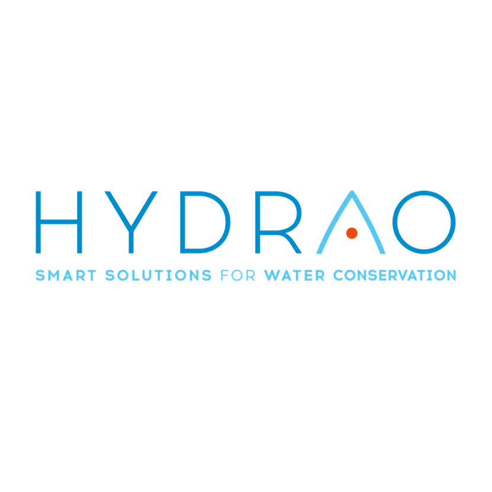
       Francia
    </td>
    <td>
      <b>Dropcountr</b>
      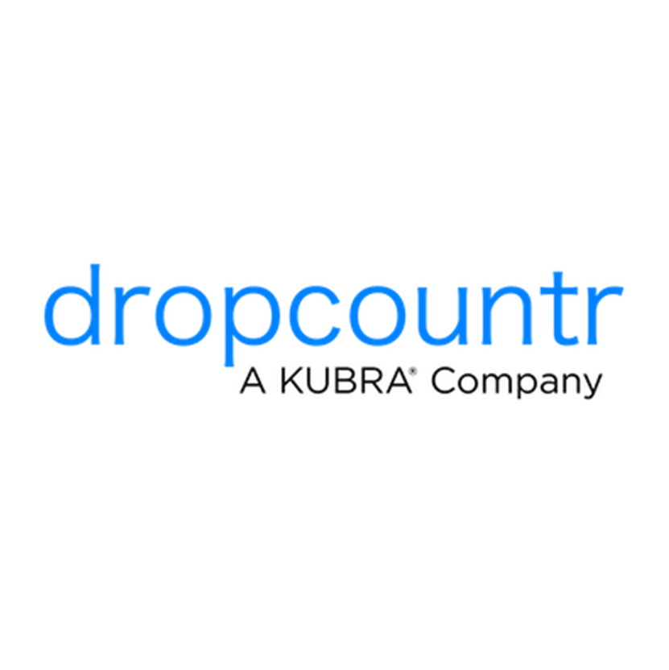
       EE.UU.
    </td>
    <td>
      <b>Yakumetro</b>
      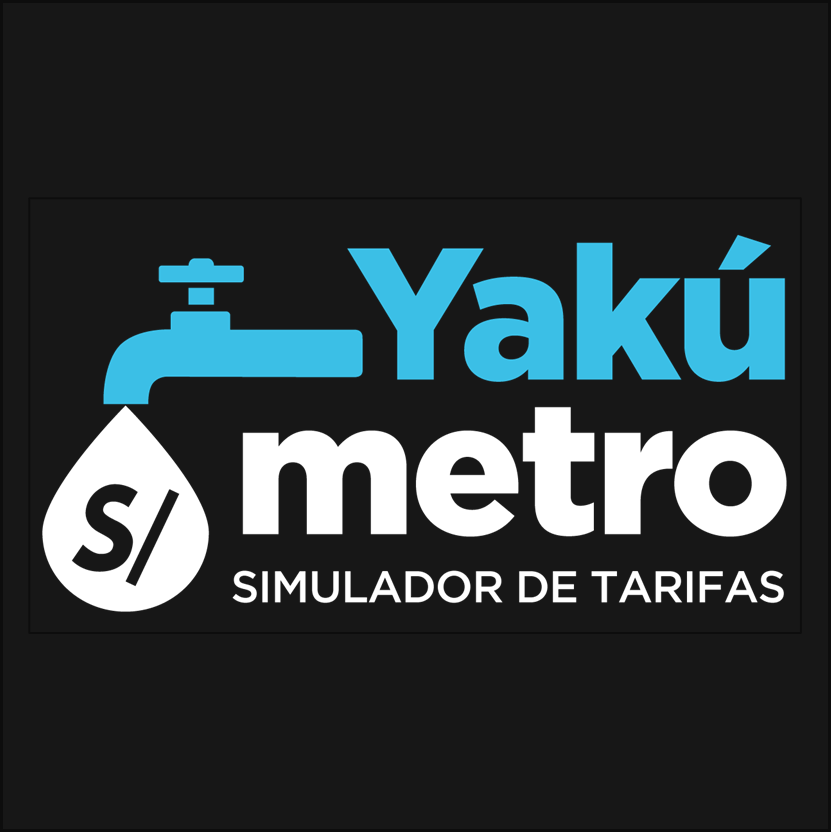
       Perú (SUNASS)
    </td>
  </tr>

  <!-- PERFIL -->
  <tr>
    <td rowspan="2"><b>Perfil</b></td>
    <td><b>Overview</b></td>
    <td>Startup peruana en etapa inicial que ofrece una plataforma digital (app móvil y web) para monitorear el consumo de agua en hogares. No necesita hardware físico, lo que la hace más accesible. Está pensada para propietarios, arrendadores y estudiantes que quieren controlar su gasto de agua sin complicaciones técnicas, con enfoque en Latinoamérica.</td>
    <td>Startup francesa que fabrica duchas inteligentes con LEDs que cambian de color para indicar en tiempo real cuántos litros de agua se consumen. Tiene una app móvil gratuita que complementa el producto físico con historial de uso, seguimiento del progreso de ahorro y logros desbloqueables.</td>
    <td>Aplicación móvil y web estadounidense que ayuda a los usuarios a monitorear y reducir su consumo de agua interpretando datos de contadores inteligentes. Permite comparar el consumo con otros hogares, recibir alertas de posibles fugas y gestionar presupuestos de consumo.</td>
    <td>Iniciativa peruana desarrollada por SUNASS que funciona como simulador tarifario web para calcular el consumo de agua y alcantarillado. Incluye información sobre fugas y su equivalente económico, consumo promedio del lugar de residencia y consejos de ahorro.</td>
  </tr>
  <tr>
    <td><b>Ventaja competitiva ¿Qué valor ofrece a los clientes?</b></td>
    <td>No requiere hardware, eliminando la barrera económica de entrada. Modelo freemium adaptado al contexto latinoamericano con metas de ahorro según el presupuesto del usuario. Módulo exclusivo para arrendadores con departamentos de agua incluida en el alquiler. Combina ahorro económico con conciencia ambiental de forma accesible.</td>
    <td>Retroalimentación visual e intuitiva en tiempo real mediante LEDs, sin necesidad de abrir ninguna app. Cualquier miembro del hogar puede entender su consumo en el momento. Es una forma gamificada y física de promover el ahorro hídrico en el punto exacto donde ocurre el desperdicio.</td>
    <td>Integración con proveedores de agua que permite ofrecer datos reales y detallados del consumo sin hardware adicional. El usuario tiene historial, alertas, presupuestos y comunicación con su empresa de agua en un solo lugar. Muy útil donde ya existen contadores inteligentes instalados.</td>
    <td>Accesibilidad y confianza institucional al estar respaldada por SUNASS. Permite simular tarifas con varios prestadores del Perú y muestra información relevante sobre fugas y consumo promedio local. Es una herramienta educativa útil para el ciudadano promedio.</td>
  </tr>

  <!-- PERFIL DE MARKETING -->
  <tr>
    <td rowspan="2"><b>Perfil de Marketing</b></td>
    <td><b>Mercado objetivo</b></td>
    <td>Usuarios residenciales urbanos en Latinoamérica, foco inicial en Perú. Tres perfiles principales: propietarios con jardines, arrendadores de departamentos con agua incluida en el alquiler, y estudiantes o jóvenes inquilinos con presupuesto ajustado. Segmentos B y C con acceso a smartphone. Secundariamente, municipalidades e instituciones.</td>
    <td>Hogares europeos conscientes del medio ambiente, dispuestos a invertir en tecnología para reducir su consumo. Perfil adulto con interés en sostenibilidad y capacidad adquisitiva suficiente para adquirir el producto físico (más de 70 euros). También apunta a hoteles y establecimientos que quieran mejorar su imagen ecológica.</td>
    <td>Usuarios residenciales en zonas de EE.UU. donde los proveedores de agua ya cuentan con contadores inteligentes y tienen alianza con la plataforma. El alcance está limitado geográficamente a las ciudades donde operan sus proveedores asociados. Perfil de usuario bastante amplio en cuanto a edad.</td>
    <td>Todos los ciudadanos del Perú que quieran simular su consumo y tarifa de agua. No tiene un perfil de usuario muy específico; está pensada para cualquier persona que quiera entender mejor su recibo o calcular cuánto podría gastar.</td>
  </tr>
  <tr>
    <td><b>Estrategias de marketing</b></td>
    <td>Marketing digital en redes sociales (Instagram, TikTok, YouTube) con contenido educativo sobre ahorro hídrico. Modelo freemium como palanca de crecimiento orgánico. Alianzas con administradores de edificios, inmobiliarias y Sedapal. Campañas con datos locales impactantes sobre el costo de una fuga en Lima. Programa de referidos entre arrendadores.</td>
    <td>Marketing apoyado en la propuesta visual y ecológica del producto. Usa canales digitales, ferias de tecnología y sostenibilidad, y tiendas especializadas en productos eco-friendly. El producto mismo funciona como su mejor argumento de venta por su impacto visual en redes sociales.</td>
    <td>Modelo B2B2C: los proveedores de agua ofrecen la plataforma a sus usuarios como servicio adicional, lo que permite llegar a grandes volúmenes sin invertir tanto en marketing directo. Complementado con marketing de contenido sobre sostenibilidad y ahorro económico.</td>
    <td>Al ser una iniciativa pública, no tiene estrategia de marketing comercial. Su difusión se da a través de los canales institucionales de SUNASS, notas de prensa y campañas de educación ambiental del Estado peruano.</td>
  </tr>

  <!-- PERFIL DE PRODUCTO -->
  <tr>
    <td rowspan="3"><b>Perfil de Producto</b></td>
    <td><b>Productos & Servicios</b></td>
    <td>App móvil (iOS y Android) con seis módulos: monitoreo en tiempo real, alertas ante consumo anómalo o fugas, metas de ahorro personalizadas, historial de consumo por períodos, panel de control para arrendadores con varias unidades, y recomendaciones de ahorro. Plataforma web complementaria.</td>
    <td>Ducha inteligente con LEDs que cambian de color según los litros consumidos (verde, azul, naranja, rojo). Se complementa con una app móvil gratuita que muestra historial de uso, progreso de ahorro y logros desbloqueables. La app solo funciona si se tiene el hardware físico.</td>
    <td>Plataforma web y app móvil gratuita que interpreta datos de contadores inteligentes. Ofrece comparativas de consumo con hogares similares, alertas de posible desperdicio, gestión de presupuestos y comunicación directa con el proveedor de agua. No requiere hardware adicional.</td>
    <td>Plataforma web gratuita que funciona como simulador tarifario. El usuario selecciona su prestador de servicio y simula su consumo de agua y alcantarillado. Incluye información sobre fugas, consumo promedio de la zona y consejos básicos de ahorro. Sin app móvil ni funciones en tiempo real.</td>
  </tr>
  <tr>
    <td><b>Precios & Costos</b></td>
    <td>Modelo freemium sin costo de hardware. Plan gratuito con funciones básicas. Plan Premium individual (~S/. 15–25/mes) con alertas avanzadas y análisis detallado. Plan Arrendador (~S/. 40–60/mes) para gestionar múltiples unidades. Costo de entrada prácticamente cero.</td>
    <td>App gratuita, pero depende del hardware. El producto físico (ducha inteligente) supera los 70 euros, lo que representa una barrera de entrada considerable. No tiene modelo de suscripción mensual.</td>
    <td>Totalmente gratuita para el usuario final. Los costos son asumidos por los proveedores de agua que contratan la plataforma. Para el usuario no hay ningún costo directo, lo que facilita mucho su adopción.</td>
    <td>Completamente gratuita al ser una herramienta pública de SUNASS. No tiene ningún costo asociado para el usuario ni modelo de monetización.</td>
  </tr>
  <tr>
    <td><b>Canales de distribución (Web y/o Móvil)</b></td>
    <td>Plataforma 100% digital. App disponible en App Store y Google Play. Web para gestión de arrendadores. Sin hardware ni visita técnica necesaria. Distribución directa sin intermediarios.</td>
    <td>App móvil gratuita en App Store y Google Play, condicionada a la compra del hardware. El producto físico se vende en tienda oficial online y tiendas especializadas en tecnología y productos ecológicos en Europa.</td>
    <td>App móvil (iOS y Android) y plataforma web. La distribución depende completamente de los acuerdos con proveedores de agua. No hay venta directa ni distribución en retail.</td>
    <td>Solo disponible como plataforma web, sin app móvil. Accesible desde cualquier navegador sin registro ni descarga. Distribuida únicamente a través de los canales oficiales de SUNASS.</td>
  </tr>

  <!-- ANÁLISIS SWOT -->
  <tr>
    <td rowspan="4"><b>Análisis SWOT</b></td>
    <td><b>Fortalezas</b></td>
    <td>No requiere hardware, costo de entrada casi cero. Modelo freemium que facilita la adopción masiva. Única solución pensada para el mercado latinoamericano con módulos para arrendadores y estudiantes. Bajo costo operativo sin inventario físico. Capacidad de adaptarse rápido al feedback de sus usuarios.</td>
    <td>Retroalimentación visual en tiempo real sin necesidad de abrir ninguna app. Enfoque claro y fácil de comunicar. Solución concreta en el punto donde ocurre el mayor desperdicio. Presencia consolidada en el mercado europeo en el segmento eco-friendly.</td>
    <td>Completamente gratuita para el usuario final. Integración con proveedores de agua que da acceso a datos reales sin hardware adicional. Función de comunicación directa con el proveedor, un diferenciador único. Modelo B2B2C escalable y sostenible.</td>
    <td>Respaldada por SUNASS, lo que le da credibilidad institucional inmediata. Totalmente gratuita y de fácil acceso desde cualquier navegador. Cubre múltiples prestadores del Perú con información local detallada sobre tarifas y consumo promedio.</td>
  </tr>
  <tr>
    <td><b>Debilidades</b></td>
    <td>Startup nueva sin historial comprobado. Depende de medidores analógicos existentes, lo que puede limitar la precisión del monitoreo. Recursos financieros y de equipo limitados. Sin alianzas aseguradas con Sedapal. Cultura de pago por apps de servicios básicos aún incipiente en Perú.</td>
    <td>La app no funciona sin el hardware, elevando el costo total de la solución. Solo monitorea la ducha, no toda la instalación del hogar. Presencia concentrada en Europa con poca penetración en otros mercados.</td>
    <td>Dependencia total de los proveedores de agua asociados: si el proveedor local no tiene alianza con Dropcountr, el usuario no puede usarla. Escalabilidad geográfica muy limitada. Sin funciones de recomendaciones personalizadas más allá de alertas básicas.</td>
    <td>Es un simulador estático, sin monitoreo en tiempo real ni alertas. Sin app móvil ni funciones interactivas avanzadas. Su evolución tecnológica es lenta al depender de SUNASS. No está diseñada para gestión activa del consumo, solo para consulta y simulación.</td>
  </tr>
  <tr>
    <td><b>Oportunidades</b></td>
    <td>Mercado latinoamericano de gestión hídrica digital prácticamente vacío de competidores. Creciente conciencia ambiental en jóvenes urbanos. ODS 6 de la ONU presiona por eficiencia hídrica. Posibles alianzas con Sedapal y municipalidades. Expansión del acceso a smartphones en la región e interés creciente de inversionistas de impacto.</td>
    <td>Expansión a mercados fuera de Europa donde crece la conciencia ambiental, como Latinoamérica o Asia-Pacífico. Posibilidad de desarrollar más módulos de monitoreo más allá de la ducha. Regulación medioambiental europea cada vez más exigente.</td>
    <td>A medida que más proveedores implementen contadores inteligentes, su mercado potencial crece. Posible expansión a Latinoamérica con alianzas locales como Sedapal. Podría agregar funciones de recomendación personalizada para aumentar el valor percibido.</td>
    <td>Podría evolucionar hacia una plataforma más completa con funciones en tiempo real si recibe más financiamiento o establece alianzas tecnológicas. Su base institucional le da ventaja para convertirse en el estándar digital de gestión hídrica en Perú.</td>
  </tr>
  <tr>
    <td><b>Amenazas</b></td>
    <td>Competidores con más recursos podrían entrar al mercado latinoamericano. Baja cultura de pago recurrente por apps en Perú. Infraestructura deficiente de medidores en zonas periféricas. Yakumetro, al ser gratuita y pública, podría restar usuarios que buscan solo información básica. Riesgo de baja retención si los usuarios no adoptan el hábito de uso regular.</td>
    <td>El alto costo del hardware puede frenar su adopción frente a soluciones digitales gratuitas. Competidores puramente digitales como HydroSmart o Dropcountr representan una alternativa más accesible para el grueso del mercado.</td>
    <td>Si los proveedores de agua desarrollan sus propias apps de monitoreo, Dropcountr podría perder su posición. Cambios en las políticas de datos de los proveedores asociados podrían afectar su acceso a la información. En mercados sin contadores inteligentes, simplemente no puede operar.</td>
    <td>Al depender de un organismo público, está sujeta a cambios presupuestarios o de gestión que podrían dejarla desactualizada. Startups privadas con más recursos tecnológicos podrían ofrecer herramientas más completas que la hagan obsoleta rápidamente.</td>
  </tr>
</table>

## 2.1.2. Estrategias y tácticas frente a competidores.

HydroSmart cuenta con una ventaja clara frente a sus competidores más cercanos: es la única solución completamente digital, sin hardware, diseñada específicamente para el contexto latinoamericano. Frente a Hydrao, que requiere invertir más de 70 euros solo en el producto físico, HydroSmart elimina esa barrera por completo con su modelo freemium, lo que lo hace mucho más accesible para los segmentos B y C del mercado peruano.

Frente a Dropcountr, la táctica debe ser anticiparse: desarrollar alianzas tempranas con Sedapal y otros proveedores de agua del Perú antes de que un competidor externo lo haga. Si HydroSmart logra integrarse con los datos de consumo de Sedapal, replicaría la propuesta más fuerte de Dropcountr pero con el contexto local que ninguna app extranjera puede ofrecer de forma natural.

Respecto a Yakumetro, que es gratuita y tiene respaldo institucional, la estrategia no es competir directamente sino diferenciarse en profundidad: Yakumetro es un simulador estático, mientras que HydroSmart ofrece gestión activa, alertas en tiempo real y metas personalizadas. La táctica es comunicar claramente esa diferencia y posicionarse como el siguiente paso natural para un usuario que ya conoce Yakumetro pero quiere algo más completo.

La táctica central de HydroSmart debe ser crecer mediante comunidad y contenido educativo, convirtiendo a los usuarios satisfechos en embajadores de la app, mientras construye las alianzas institucionales que le den acceso a datos reales de consumo y le otorguen credibilidad frente a un mercado que aún no conoce este tipo de soluciones.

## 2.2. Entrevistas

Con el objetivo de conocer cómo los usuarios gestionan actualmente su consumo de agua y qué dificultades enfrentan, se llevaron a cabo entrevistas dirigidas a dos grupos principales: propietarios de viviendas con áreas verdes y estudiantes que alquilan. Para cada segmento se diseñaron preguntas abiertas que permitieran entender sus hábitos, nivel de control sobre el gasto y su interés en utilizar soluciones tecnológicas para optimizar el uso del agua.

La información recopilada fue revisada y organizada para identificar comportamientos recurrentes, problemas comunes y necesidades no cubiertas. Este análisis permitió obtener una visión más clara sobre cómo los usuarios toman decisiones respecto al consumo de agua y qué factores influyen en su disposición a adoptar nuevas herramientas.

A partir de estos hallazgos, se pudieron establecer criterios clave para el desarrollo de AquaPulse, asegurando que la solución responda a situaciones reales, facilite el control del consumo y aporte valor tanto en el ahorro económico como en la gestión eficiente del recurso hídrico.

### 2.2.1. Diseño de entrevistas 
En esta sección se define la información a recolectar de los segmentos objetivo. 

**Entrevistas Segmento 1: Propietarios de viviendas con áreas verdes**
1. ¿Podría contarnos un poco sobre su ocupación y su tipo de vivienda actual?
2. ¿Cuenta con jardín o áreas verdes en su hogar? ¿Cómo gestiona actualmente el riego?
3. ¿Qué tan importante es para usted el control del consumo de agua en su hogar?
4. ¿Con qué frecuencia revisa su recibo de agua y qué decisiones toma a partir de él?
5. ¿Ha tenido problemas con fugas o consumos elevados de agua? ¿Cómo los detectó?
6. ¿Cuáles son las mayores frustraciones que tiene respecto al consumo de agua en su vivienda?
7. ¿Ha utilizado alguna herramienta o tecnología para monitorear su consumo de agua?
8. ¿Qué aspectos considera más importantes para optimizar el uso del agua en su hogar?
9. Si existiera una aplicación que le permita ver su consumo en tiempo real, ¿cómo cree que la usaría?
10. ¿Le resultaría útil recibir alertas cuando su consumo de agua sea inusualmente alto?
11. ¿Qué tipo de información le gustaría ver en una aplicación de este tipo?
12. ¿Qué lo motivaría a usar una herramienta para controlar su consumo de agua de manera constante?
13. ¿Qué preocupaciones tendría al usar una solución tecnológica para gestionar el agua en su hogar?
14. ¿Estaría dispuesto a pagar por una solución que le ayude a reducir su consumo de agua? ¿Por qué?

**Entrevistas Segmento 2: Estudiantes que alquilan**
1. ¿Podría compartirnos su edad, a qué se dedica y su situación actual de vivienda?
2. ¿Cómo maneja su presupuesto mensual, especialmente en servicios como agua?
3. ¿Qué tan consciente es de su consumo de agua en el día a día?
4. ¿Ha tenido alguna sorpresa con el recibo de agua? ¿Cómo reaccionó?
5. ¿Cuáles son sus principales frustraciones respecto al gasto de agua?
6. ¿Qué tan seguido piensa en ahorrar agua o reducir su consumo?
7. ¿Ha intentado cambiar sus hábitos para gastar menos agua? ¿Cómo?
8. Si pudiera ver su consumo de agua en tiempo real desde su celular, ¿cree que cambiaría algo en su rutina?
9. ¿Le ayudaría recibir alertas cuando esté gastando más agua de lo normal?
10. ¿Qué tipo de información le gustaría ver en una app de consumo de agua?
11. ¿Cómo debería ser una aplicación para que realmente la uses (simple, rápida, etc.)?
12. ¿Qué cosas te harían dejar de usar una app de este tipo?
13. ¿Qué tan dispuesto estarías a cambiar tus hábitos para ahorrar dinero en agua?
14. ¿Estarías dispuesto a pagar por una app que te ayude a controlar tu consumo y ahorrar dinero? ¿Por qué?

### 2.2.2. Registro de entrevistas

**Entrevistas Segmento 1: Propietarios de viviendas con áreas verdes**

**Entrevista 1:**

  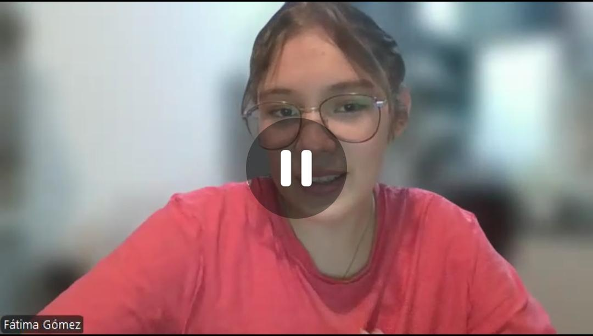

RESUMEN

Fátima Gómez, analista de marketing, busca mayor control sobre el consumo de agua en su hogar debido a su actual dependencia del recibo mensual, lo que le impide detectar fugas o excesos a tiempo. Para solucionar esto, desea una aplicación móvil que ofrezca historiales comparativos y alertas en tiempo real para gestionar el gasto familiar de forma proactiva. Aunque le preocupa la privacidad de sus datos de ocupación, está dispuesta a pagar una suscripción siempre y cuando la herramienta le genere un ahorro mensual que supere el costo del servicio.
| **Detalle**          | **Información**                                                                 |
|----------------------|---------------------------------------------------------------------------------|
| **Entrevistador**    | Braden Garcia                                                     |
| **Entrevistado**     | Fátima Gómez                                  |
| **Edad**             | 19                                                    |
| **Inicio entrevista**| 0:00                                                    |
| **Duración**         | 03:43                                                   |
| **Enlace**           | https://upcedupe-my.sharepoint.com/:v:/g/personal/u202415618_upc_edu_pe/IQDWdCwR_8ONQb8iIb144XwMAVWZFxfej5rM2dNfA9EtmTs?nav=eyJyZWZlcnJhbEluZm8iOnsicmVmZXJyYWxBcHAiOiJPbmVEcml2ZUZvckJ1c2luZXNzIiwicmVmZXJyYWxBcHBQbGF0Zm9ybSI6IldlYiIsInJlZmVycmFsTW9kZSI6InZpZXciLCJyZWZlcnJhbFZpZXciOiJNeUZpbGVzTGlua0NvcHkifX0&e=406t1m|  

**Entrevista 2:**

  

RESUMEN

El entrevistado es un propietario de vivienda familiar en Lima que cuenta con jardín y gestiona el riego de forma manual. Tiene una preocupación moderada por el consumo de agua, principalmente por el costo económico, aunque no realiza un seguimiento constante. Su control es reactivo, ya que revisa el consumo únicamente al recibir el recibo mensual. Ha tenido problemas como fugas detectadas tardíamente, lo que le genera frustración por la falta de información en tiempo real. Muestra interés en una solución tecnológica que le permita monitorear su consumo, recibir alertas y optimizar el uso del agua, siempre que sea sencilla y efectiva.

| **Detalle**          | **Información**                                                                 |
|----------------------|---------------------------------------------------------------------------------|
| **Entrevistador**    | Hernan Huayta                                                     |
| **Entrevistado**     | Juan Quispe                                 |
| **Edad**             | 25                                             |
| **Inicio entrevista**| 0:00                                                  |
| **Duración**         | 5:14                                                   |
| **Enlace**           | https://upcedupe-my.sharepoint.com/:v:/g/personal/u202320776_upc_edu_pe/IQBp6NKtSfYSRYAGmUctzGjaAffqbdpl18xiMpeR5DKJDog?nav=eyJyZWZlcnJhbEluZm8iOnsicmVmZXJyYWxBcHAiOiJPbmVEcml2ZUZvckJ1c2luZXNzIiwicmVmZXJyYWxBcHBQbGF0Zm9ybSI6IldlYiIsInJlZmVycmFsTW9kZSI6InZpZXciLCJyZWZlcnJhbFZpZXciOiJNeUZpbGVzTGlua0NvcHkifX0&e=FGrCjh

**Entrevistas Segmento 2: Estudiantes que alquilan**

**Entrevista 1:**

  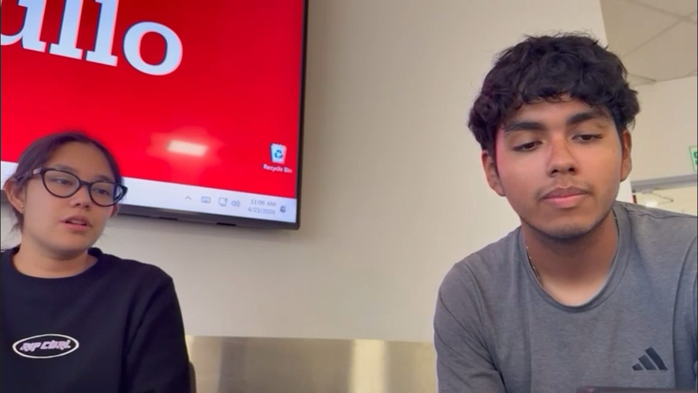

RESUMEN

Alexandra Zavala, una estudiante de 19 años que alquila un departamento, busca reducir su consumo de agua por motivos económicos y ambientales, especialmente tras haber enfrentado cobros elevados debido a fugas. Para evitar gastos innecesarios, le interesaría utilizar una aplicación móvil sencilla y sin anuncios invasivos que le ofrezca gráficos de su historial (diario, semanal y mensual) junto con alertas de exceso en tiempo real. Se muestra dispuesta a cambiar sus hábitos diarios y consideraría pagar una suscripción por esta herramienta, siempre y cuando el precio sea accesible y le ayude efectivamente a regular su consumo.

| **Detalle**          | **Información**                                                                 |
|----------------------|---------------------------------------------------------------------------------|
| **Entrevistador**    | Victor Espino                                                     |
| **Entrevistado**     | Alexandra Zavala                                  |
| **Edad**             | 19                                                    |
| **Inicio entrevista**| 00:00:00                                                      |
| **Duración**         | 03:58                                                   |
| **Enlace**           | https://upcedupe-my.sharepoint.com/:v:/g/personal/u202411567_upc_edu_pe/IQC-lfDnAXNYQayQ13s-IvOOAbHzHw5F41nXe-Z8NDOrLPo?nav=eyJyZWZlcnJhbEluZm8iOnsicmVmZXJyYWxBcHAiOiJPbmVEcml2ZUZvckJ1c2luZXNzIiwicmVmZXJyYWxBcHBQbGF0Zm9ybSI6IldlYiIsInJlZmVycmFsTW9kZSI6InZpZXciLCJyZWZlcnJhbFZpZXciOiJNeUZpbGVzTGlua0NvcHkifX0&e=Q6BKSl|  

**Entrevista 2:**

  

RESUMEN

Stephano, un estudiante de la UPC que comparte un cuarto alquilado, busca optimizar constantemente sus gastos básicos. Aunque considera que su uso del agua es eficiente, ha enfrentado cobros imprevistos en su recibo debido a descuidos cotidianos. Por ello, ve un gran potencial en la aplicación HydroSmart para monitorear su consumo diario y obtener estimaciones del pago a fin de mes. Estaría dispuesto a pagar una suscripción siempre y cuando la plataforma ofrezca una interfaz minimalista, presente los datos de forma clara y demuestre ayudarle efectivamente a ahorrar dinero en sus recibos mensuales.

| **Detalle**          | **Información**                                                                 |
|----------------------|---------------------------------------------------------------------------------|
| **Entrevistador**    | Keyner Hancco                                                     |
| **Entrevistado**     |  Stephano Espinoza                                |
| **Edad**             |  21                                            |
| **Inicio entrevista**|  0:00                                                 |
| **Duración**         |   09:47                                                |
| **Enlace**           | https://upcedupe-my.sharepoint.com/:v:/g/personal/u20221c726_upc_edu_pe/IQCV9VJV8AVoTpuKwD4uFo4fASp7kxdyQFDHsLbIHLqPJBY?nav=eyJyZWZlcnJhbEluZm8iOnsicmVmZXJyYWxBcHAiOiJPbmVEcml2ZUZvckJ1c2luZXNzIiwicmVmZXJyYWxBcHBQbGF0Zm9ybSI6IldlYiIsInJlZmVycmFsTW9kZSI6InZpZXciLCJyZWZlcnJhbFZpZXciOiJNeUZpbGVzTGlua0NvcHkifX0&e=3Fwdu9

**Entrevista 3:**

  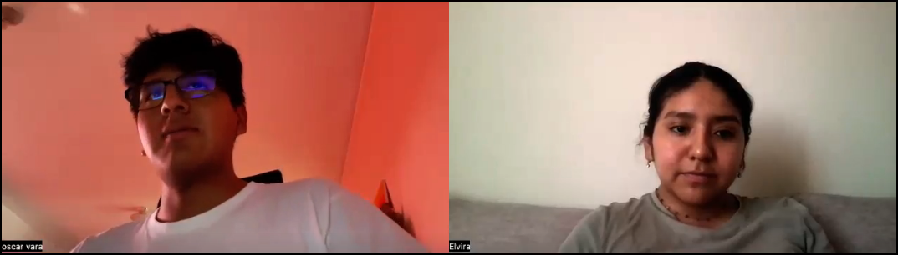

RESUMEN

Elvira, una estudiante de 23 años que vive sola, mantiene un consumo de agua responsable y estable. Aunque actualmente no siente la necesidad de cambiar sus hábitos, afirma que utilizaría una aplicación para monitorear su gasto hídrico en tiempo real, motivada principalmente por la conciencia ambiental antes que por el ahorro económico. Estaría interesada en conocer también su huella hídrica indirecta y consideraría pagar una suscripción si la herramienta demuestra un valor real para ayudarla a reducir su impacto ecológico.

| **Detalle**          | **Información**                                                                 |
|----------------------|---------------------------------------------------------------------------------|
| **Entrevistador**    |    Oscar Vara                                                  |
| **Entrevistada**     |    Elvira                              |
| **Edad**             |     23                                         |
| **Inicio entrevista**|    0:00                                               |
| **Duración**         |    06:36                                               |
| **Enlace**           | https://upcedupe-my.sharepoint.com/:v:/g/personal/u202411622_upc_edu_pe/IQClOMXTv562R7N2LHbRebP2AcrMhdqXm0VdzajUEJujgKI?e=i8AkwG&nav=eyJyZWZlcnJhbEluZm8iOnsicmVmZXJyYWxBcHAiOiJTdHJlYW1XZWJBcHAiLCJyZWZlcnJhbFZpZXciOiJTaGFyZURpYWxvZy1MaW5rIiwicmVmZXJyYWxBcHBQbGF0Zm9ybSI6IldlYiIsInJlZmVycmFsTW9kZSI6InZpZXcifX0%3D

### 2.2.3. Análisis de entrevistas

| Segmento | Características                                                                                                                                                                                                                                  | Objetivos comunes | Características subjetivas comunes |
|----------|--------------------------------------------------------------------------------------------------------------------------------------------------------------------------------------------------------------------------------------------------|------------------|-----------------------------------|
| Segmento #1: Propietarios de viviendas con áreas verdes | Sexo: Mixto Edad: 30-60 años Dispositivos: Smartphone, laptop, dispositivos inteligentes Programas: Redes sociales profesional.  Canales de información: Plataformas digitales y apps Canales de uso: Gestión del hogar y consumo | Controlar el consumo de agua  Optimizar el riego de áreas verdes  Prevenir fugas y desperdicios  Reducir costos de servicios  Implementar tecnología en el hogar  Mejorar eficiencia de recursos | Motivación: Tener control del consumo y evitar gastos innecesarios.  Frustración: No detectar fugas a tiempo y falta de información clara. |
| Segmento #2: Estudiantes que alquilan | Sexo: Mixto Edad: 18-28 años Dispositivos: Smartphone, laptop Programas: Apps móviles y redes sociales Canales de información: Redes sociales y entorno digital Canales de uso: Organización de gastos y convivencia              | Reducir gastos del hogar  Tener control del consumo de agua  Evitar conflictos entre roommates  Adoptar hábitos de ahorro  Usar soluciones simples  Mantener comodidad | Motivación: Ahorrar dinero y mejorar la convivencia.  Frustración: No saber en qué se gasta el agua y falta de control. |

## 2.3. Needfinding

El proceso de needfinding se centró en comprender a profundidad las necesidades, hábitos y dificultades de dos segmentos clave: los propietarios de viviendas con áreas verdes, representados por Santiago Vela, y los estudiantes que alquilan, representados por Arianna Flores. A partir de entrevistas cualitativas, se lograron identificar tanto comportamientos compartidos como diferencias importantes entre ambos grupos, especialmente en la forma en que gestionan y perciben el consumo de agua dentro de sus hogares.

Por un lado, los propietarios buscan mayor control, monitoreo y prevención de problemas como fugas o consumos excesivos, mientras que los estudiantes priorizan soluciones simples que se adapten a su estilo de vida y les permitan reducir gastos sin complicaciones. En conjunto, los hallazgos evidencian una oportunidad clara para desarrollar herramientas tecnológicas que faciliten el seguimiento del consumo de agua, promuevan hábitos más eficientes y se ajusten a las distintas dinámicas de cada tipo de usuario. Este análisis permitió establecer una base sólida para diseñar una solución alineada con las verdaderas necesidades y expectativas de ambos segmentos.

### 2.3.1. User Personas

En esta etapa se construyeron perfiles ficticios, conocidos como User Personas, que sintetizan las características más relevantes de los usuarios a partir del análisis de las entrevistas realizadas. Esta herramienta permite convertir la información recolectada en representaciones claras y útiles, que orientan el proceso de diseño y apoyan la toma de decisiones sobre funcionalidades y experiencia de uso. Para el desarrollo del proyecto, se definieron dos perfiles principales: uno enfocado en propietarios de viviendas con áreas verdes y otro en estudiantes que alquilan.

Anexo Diagrama User Persona: https://drive.google.com/drive/folders/1g8x4MvTkakZxi8A5aEAyUPbTgnLntpWk?usp=drive_link

**Segmento 1: Propietarios de viviendas con áreas verdes**

  

**Segmento 2: Estudiantes que alquilan**

  

### 2.3.2. User Task Matrix

El análisis de las entrevistas permitió organizar las principales actividades de los usuarios en una matriz comparativa que refleja cómo interactúan con el consumo de agua en su día a día. En esta se detallan las tareas más comunes de cada segmento, junto con qué tan seguido las realizan y la relevancia que tienen para ellos. Esta visión facilita entender diferencias y coincidencias entre los perfiles, y sirve como base para tomar decisiones más acertadas durante el diseño, enfocándose en lo que realmente aporta valor a la experiencia del usuario.

| No. | Task | Santiago Vela |  | Arianna Flores |  |
|-----|------|---------------|--------------|----------------|--------------|
|     |      | Frequency     | Importance   | Frequency      | Importance   |
| 1   | Revisar el consumo de agua en el recibo | Monthly | High | Monthly        | Medium |
| 2   | Controlar el uso de agua en actividades diarias | Weekly | High | Occasionally   | Medium |
| 3   | Detectar posibles fugas en el hogar | Weekly | High | Occasionally   | High |
| 4   | Gestionar el riego de áreas verdes | Frequent | High | Rarely         | Low |
| 5   | Identificar momentos de mayor consumo | Weekly | High | Occasionally   | Medium |
| 6   | Aplicar prácticas de ahorro de agua | Frequent | High | Occasionally   | Medium |
| 7   | Establecer objetivos de ahorro | Sometimes | High | Occasionally   | Medium |
| 8   | Comparar consumo entre meses | Sometimes | Medium | Frequent         | Medium |
| 9   | Supervisar el uso del agua en el hogar compartido | Frequent | High | Frequent       | High |
| 10  | Buscar herramientas o soluciones para optimizar consumo | Occasionally | High | Occasionally   | High |

### 2.3.3. User Journey Mapping

**User Journey Segmento 1: Propietarios de viviendas con áreas verdes:**

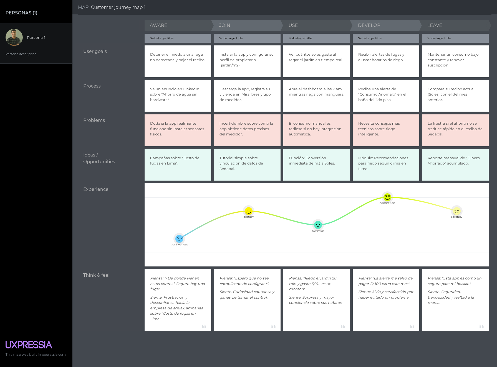

**User Journey Segmento 2: Estudiantes que alquilan:**

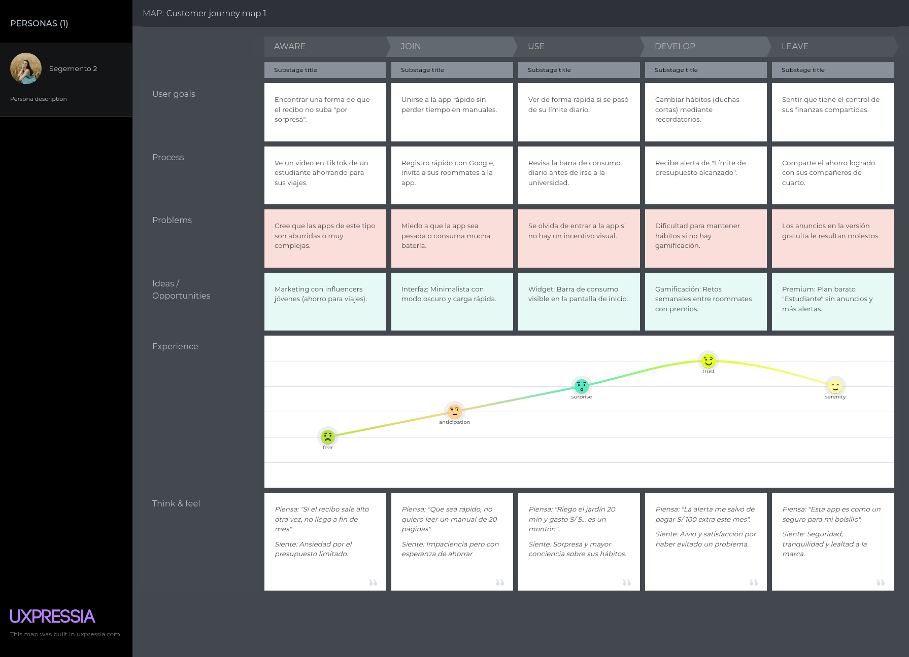

### 2.3.4. Empathy Mapping.

**Segmento 1: Propietarios de viviendas con áreas verdes**

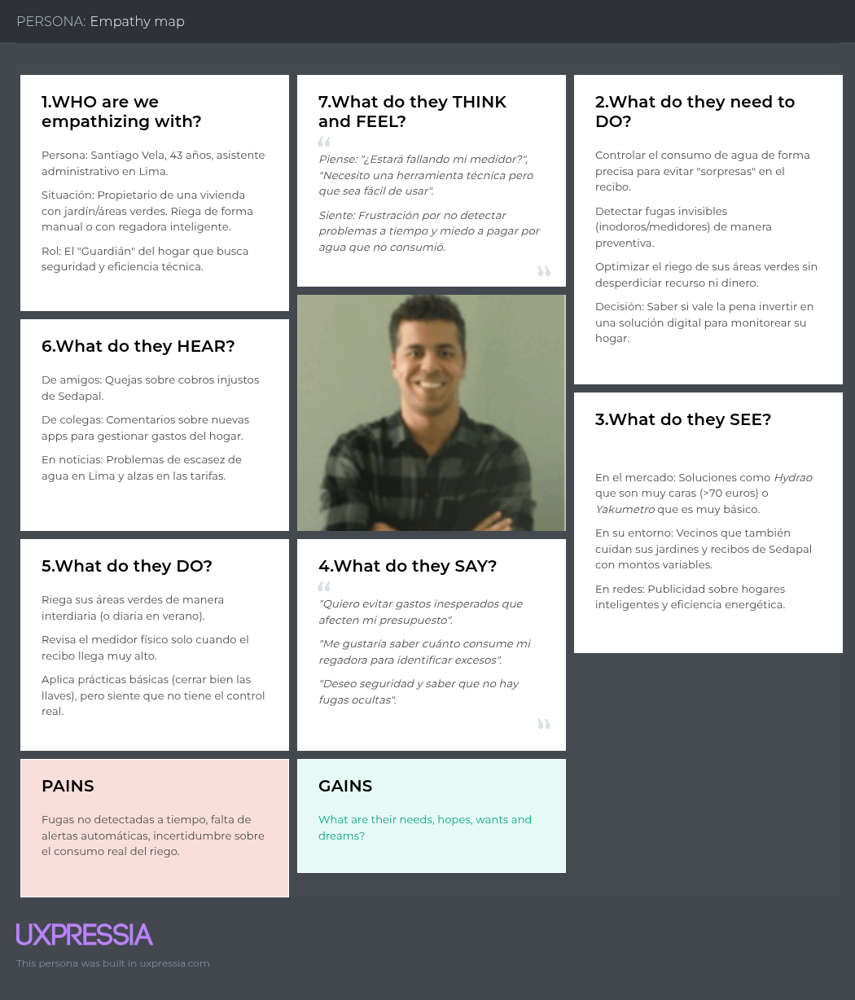

**Segmento 2: Estudiantes que alquilan**

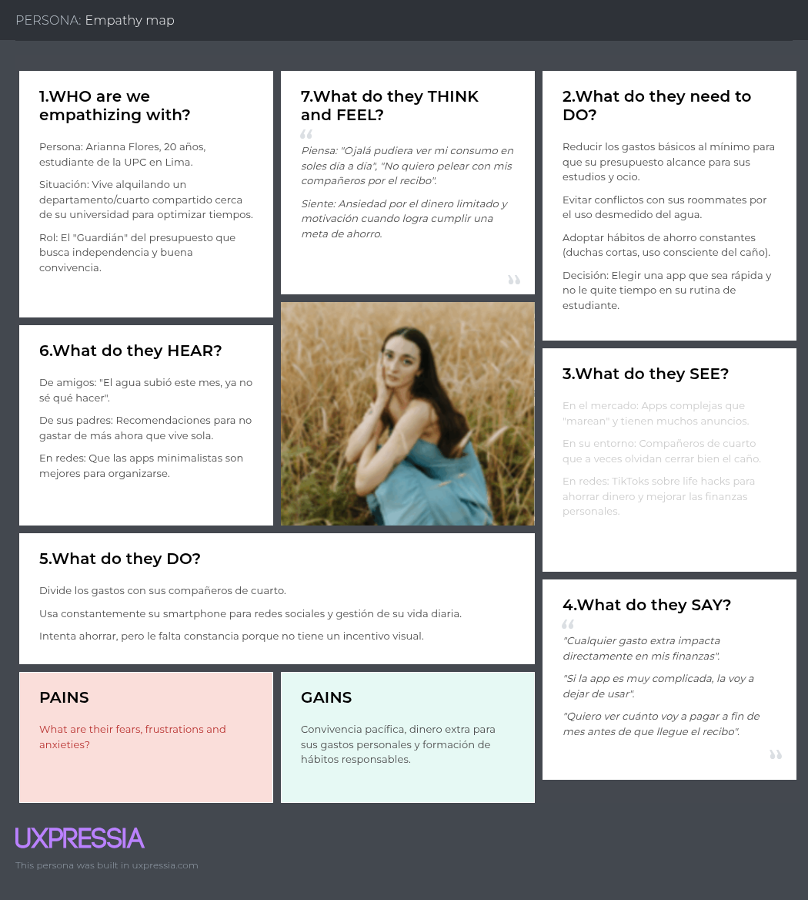

## 2.4. Big Picture EventStorming

Para el desarrollo del Big Picture EventStorming de HydroSmart, se utilizó una herramienta colaborativa que es Miro, la cual permitió organizar de manera visual los eventos, actores y flujos del sistema enfocado en la gestión inteligente del consumo de agua en entornos residenciales.

Para ello se definió una leyenda:

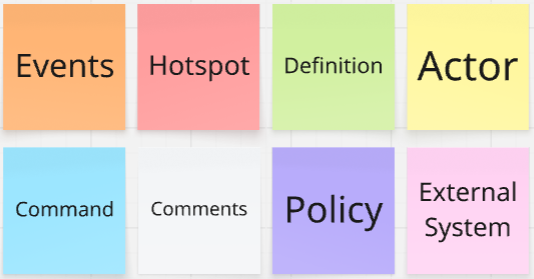

- **Domain Events:** Representa hechos del sistema ya ocurridos.
- **Hotspot:** Punto de duda o mejora dentro del flujo.
- **Definition:** Conceptos clave del dominio.
- **Actor:** Usuario o sistema que ejecuta acciones.
- **Command:** Acción que se desea ejecutar.
- **Policy:** Regla que conecta eventos con acciones.
- **External System:** Sistemas externos como proveedores de agua.

**Big Picture EventStorming 1:**

Para el desarrollo del primer EventStorming se identificaron los domain events relacionados con el registro y acceso del usuario a la plataforma, como la validación correcta de los datos, la creación del usuario y el inicio de sesión. Primero se reconocen los pasos que ejecuta el actor principal (propietario o inquilino), como registrarse en la aplicación, ingresar sus datos personales y autenticar sus credenciales para acceder al sistema. También se muestran las validaciones realizadas por HydroSmart. Finalmente, se plantean preguntas para mejorar el flujo, como qué datos mínimos solicitar al usuario y cómo validar correctamente la información. 

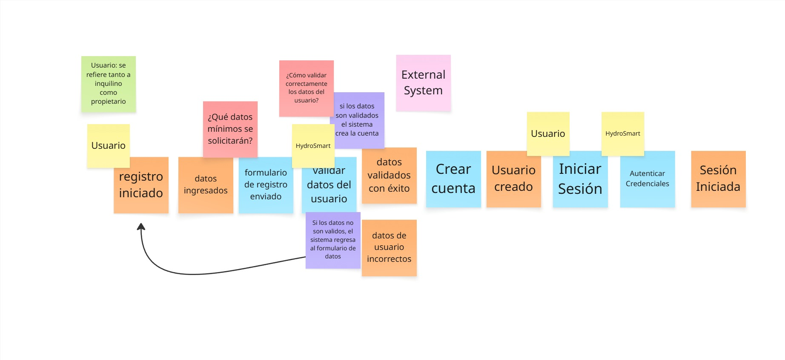

**Big Picture EventStorming 2:**

Para el desarrollo de este segundo EventStorming se identificaron los domain events relacionados con el monitoreo y visualización del consumo de agua, además de la generación de reportes y configuración de parámetros. Al igual que en el anterior se reconocen los pasos que ejecuta el actor principal para acceder al panel y a estos reportes. También se muestran las acciones de Hydrosmart como el procesamiento de información. Finalmente se plantean preguntas para mejorar el flujo, como qué métricas mostrar en pantalla.

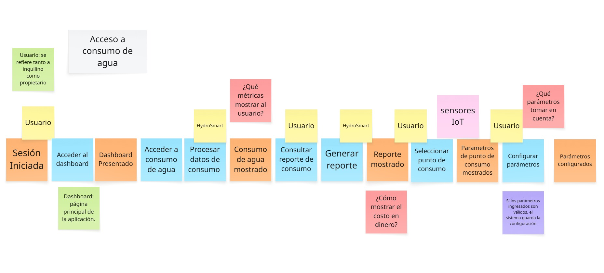

**Big Picture EventStorming 3:**

Este tercer EventStorming se trató la detección de anomalías y generación de alertas. Se reconocieron los domain events relacionados junto con la presentación de sugerencias. Se reconocen los pasos que sigue el sistema, como analizar los patrones de consumo, comparar el comportamiento actual con umbrales definidos y la generación de notificaciones. Finalmente, se plantean hotspots acerca de cómo definir con precisión una falla o cada cuánto se realizan los análisis. 

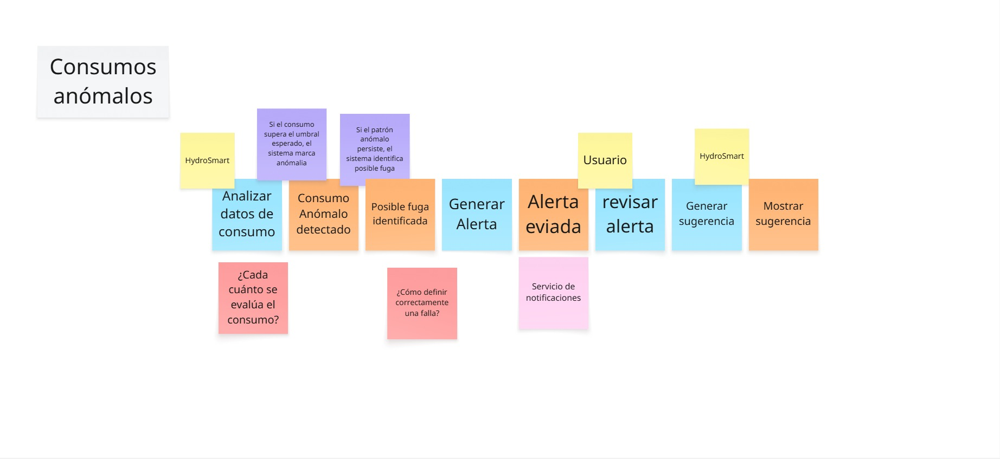

**Big Picture EventStorming 4:**

Para el desarrollo del cuarto EventStorming se identificaron los eventos de dominio relacionados con el historial de consumo, la configuración de metas de ahorro y la generación de recomendaciones automáticas. Se reconocieron las acciones del usuario como actor principal como acceder a la sección, revisar el consumo y definir una meta. En cuanto a las acciones del sistema se consideró, el análisis de datos previos, el cálculo del progreso de ahorro y las sugerencias personalizadas. Finalmente, se plantean preguntas para mejorar el flujo, como cómo definir metas realistas y cómo mostrar el avance de forma clara.

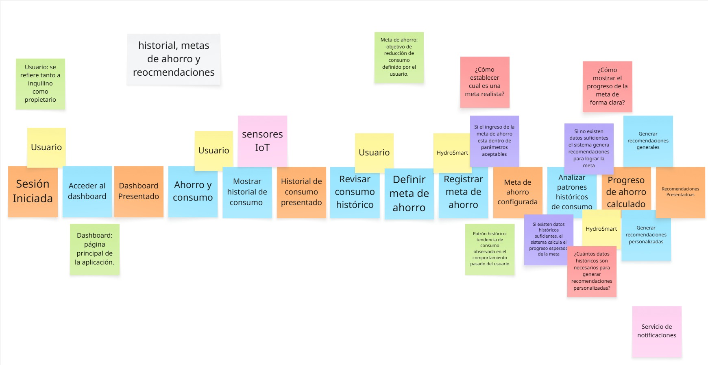

**Conclusión**

El Big Picture EventStorming permitió establecer de manera clara el funcionamiento de HydroSmart, identificando los principales comportamientos, eventos, las reglas y los actores involucrados. 

Asimismo ayudó a detectar ciertos puntos que no están del todo claros que deberán ser resueltos en etapas posteriores del desarrollo, para asegurar que la solución esté alineada con las necesidades reales de los usuarios.

## 2.5. Ubiquitous Language

| Ubiquitous Term       | Definición del Dominio Funcional                                                                                                  |
|-----------------------|-----------------------------------------------------------------------------------------------------------------------------------|
| User                  | Persona que utiliza la plataforma HydroSmart para monitorear y gestionar su consumo de agua.                                      |
| Property Owner        | Propietario de una vivienda que usa HydroSmart para controlar el consumo de agua en su hogar.                                     |
| Tenant                | Inquilino que utiliza la plataforma para supervisar su consumo de agua.                                                           |
| Dashboard             | Interfaz principal de la plataforma donde el usuario puede visualizar su consumo, reportes, alertas, historial y recomendaciones. |
| Water Consumption     | Cantidad de agua utilizada por el usuario en una cantidad de tiempo determinado.                                                  |
| Consumption History   | Registro histórico del consumo de agua del usuario mostrado por periodos.                                                         |
| Saving Goal           | Meta de ahorro definida por el usuario para reducir su consumo de agua.                                                           |
| Saving Progress       | Avance del usuario respecto a la meta de ahorro establecida.                                                                      |
| Report                | Resumen del consumo de agua mostrado de forma detallada.                                                                          |
| Alert                 | Notificación emitida por el sistema cuando se detecta un consumo inusual, una posible fuga y otra situación relevante.            |
| Anomalous Consumption | Consumo de agua que esta fuera del patrón normal registrado.                                                                      |
| Recomendation         | Sugerencia genera automáticamente para ayudar al usuario a optimizar su consumo de agua.                                          |
| Parameter             | Valor configurable dentro del sistema para personalizar elementos.                                                                |
| Device                | Sensor asociado al monitoreo del consumo de agua.                                                                                 |
| Authentication        | Proceso de validación de credenciales para permitir el acceso del usuario a la aplicación.                                        |
| Notification          | Mensaje enviado al usuario para informarle sobre eventos importante detectados por el sistema.                                    |
