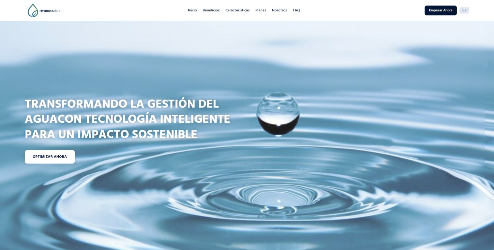
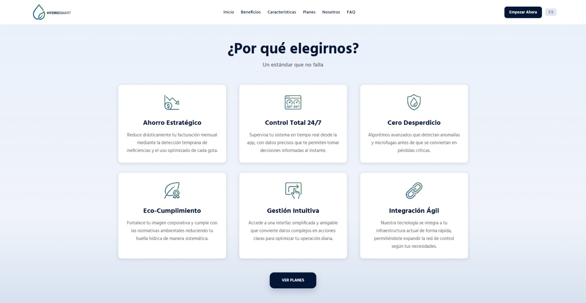
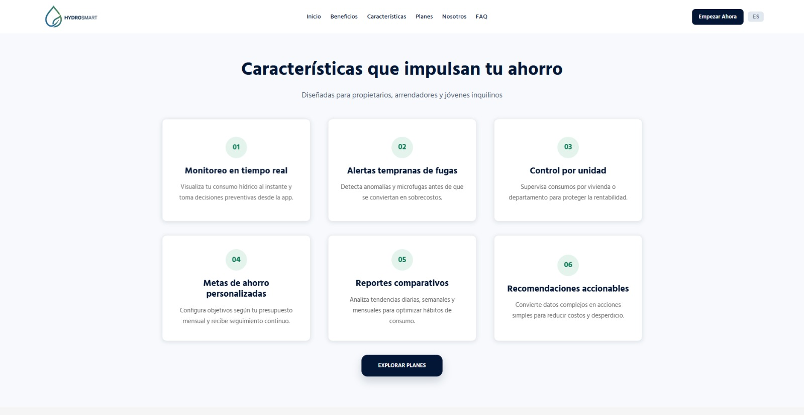
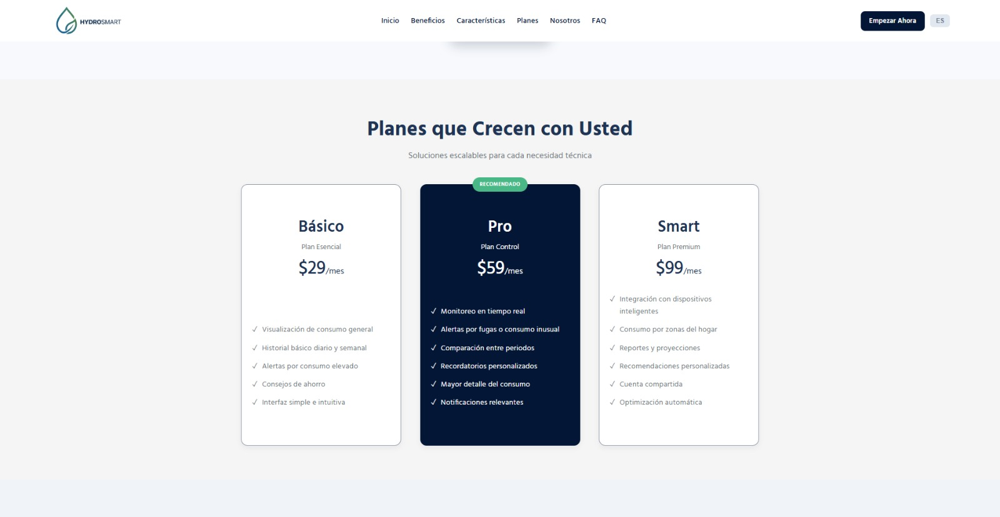
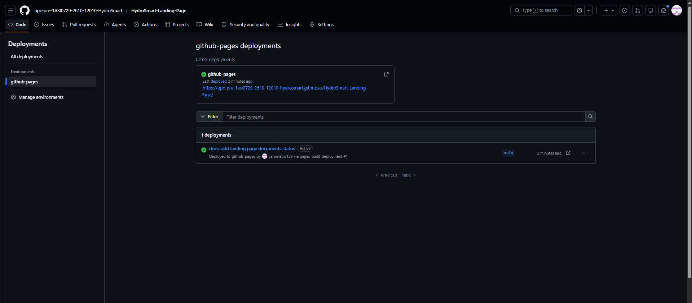

# Capitulo V: Product Implementation, Validation and Deployment 

## 5.1. Software Configuration Management

### 5.1.1. Software Development Environment Configuration

| Producto | Propósito en el proyecto | Categoría | Ruta de descarga / acceso | Descripción |
|----------|------------------------|-----------|---------------------------|-------------|
| JetBrains WebStorm | Desarrollo web moderno utilizando tecnologías como Vue y TypeScript. | Software Development | https://www.jetbrains.com/webstorm/ | IDE especializado en desarrollo frontend y backend con soporte para JavaScript, TypeScript y frameworks modernos como Vue.js. |
| JetBrains Rider | Desarrollo del backend en .NET y lógica del sistema. | Software Development | https://www.jetbrains.com/rider/ | IDE multiplataforma enfocado en desarrollo con .NET, con herramientas avanzadas para depuración, pruebas y productividad. |
| UXPressia | Representación gráfica de la experiencia del usuario. | Product UX/UI Design | https://uxpressia.com/ | Plataforma para crear journey maps y perfiles de usuario, permitiendo analizar visualmente la experiencia dentro del sistema. |
| Structurizr | Diseño y documentación de arquitecturas basadas en el modelo C4. | Product UX/UI Design | https://structurizr.com/ | Herramienta para modelar arquitecturas de software mediante el enfoque C4, facilitando la comprensión de sistemas complejos. |
| Lucidchart | Planificación estructurada del software mediante diagramas. | Product UX/UI Design | https://www.lucidchart.com/ | Aplicación para crear diagramas de flujo, arquitectura y procesos, mejorando la organización visual del proyecto. |
| Figma | Diseño de interfaces y prototipos de usuario. | Product UX/UI Design | https://www.figma.com/ | Herramienta colaborativa en la nube para diseñar interfaces UI/UX, prototipos interactivos y sistemas de diseño. |
| Visual Paradigm | Modelado UML y diseño de sistemas. | Product UX/UI Design | https://www.visual-paradigm.com/ | Plataforma para crear diagramas UML, BPMN y otros modelos, útil para análisis y diseño de software. |
| GitHub | Gestión de código fuente y trabajo colaborativo. | Collaboration & Version Control Tools | https://github.com/ | Plataforma para alojar repositorios, gestionar versiones y colaborar en el desarrollo de software. |
| Git CLI (Git) | Manejo local del control de versiones. | Version Control | https://git-scm.com/ | Sistema distribuido que permite gestionar cambios en el código, trabajar con ramas y sincronizar con repositorios remotos como GitHub. |

### 5.1.2. Source Code Management

En el proyecto HydroSmart, la gestión del código fuente se plantea como un componente clave para asegurar el orden, la trazabilidad y el crecimiento controlado de la solución. A través del uso de herramientas como sistemas de control de versiones, se busca mantener un registro claro de los cambios realizados en el desarrollo, facilitando la organización del proyecto y la posibilidad de retroceder a versiones anteriores en caso sea necesario.

En esta etapa inicial, el control del código se enfoca principalmente en el desarrollo del landing page, permitiendo gestionar de manera estructurada las modificaciones en el diseño y contenido. Este enfoque resulta fundamental para mantener consistencia en la propuesta visual y asegurar una base sólida para futuras implementaciones.

A medida que el proyecto evolucione hacia el desarrollo completo de la aplicación (frontend y backend), la gestión del código permitirá trabajar de forma más eficiente, facilitar la colaboración y asegurar la calidad del producto final. De esta manera, HydroSmart establece desde el inicio buenas prácticas que acompañarán el crecimiento progresivo de la solución.

Finalmente, el equipo dispone de un repositorio alterno, denominado upc-pre-1ASI0730-2610-HydroSmart (https://github.com/upc-pre-1ASI0729-2610-12010-HydroSmart), en el cual se administran versiones en etapa de prueba y entornos experimentales con un enfoque principalmente académico. Este espacio permite trabajar de manera segura en prototipos, realizar validaciones funcionales y explorar nuevas ideas antes de incorporarlas al sistema principal. Gracias a esta separación, se pueden evaluar mejoras en un entorno controlado, reduciendo posibles impactos negativos y asegurando la estabilidad de la plataforma base.

### 5.1.3. Source Code Style Guide & Conventions

El uso de un estilo de código unificado es clave para asegurar la mantenibilidad y la colaboración efectiva en el desarrollo de HydroSmart. Para ello, el equipo ha adoptado convenciones de codificación que promueven la claridad y consistencia en cada módulo de la plataforma, tomando como referencia estándares reconocidos de la industria. Toda la nomenclatura se aplica en inglés.

#### HTML y CSS

Se siguen la Google HTML/CSS Style Guide y las convenciones de W3Schools. Se utiliza minúsculas para etiquetas y atributos, indentación de 2 espacios, comillas dobles para valores de atributos y el atributo alt en todas las imágenes. Para CSS se emplea kebab-case en nombres de clases, variables CSS para colores y tipografías del Design System, y comentarios para separar secciones del archivo.

#### JavaScript y Vue

En JavaScript se siguen la Google JavaScript Style Guide y MDN JavaScript Guidelines, utilizando camelCase para variables y funciones, y const/let en lugar de var. Para Vue se sigue la Vue Style Guide oficial, nombrando los componentes en PascalCase y los archivos en kebab-case. Se aplica internacionalización mediante i18n, gestionando archivos de traducción para español e inglés.

#### Gherkin

Para los criterios de aceptación se siguen las Gherkin Conventions for Readable Specifications, utilizando la estructura Given-When-Then con escenarios redactados en inglés y en tercera persona presente.

### 5.1.4. Software Deployment Configuration

Para el despliegue de los productos digitales de HydroSmart, el equipo ha configurado GitHub Pages como plataforma de publicación para la Landing Page. Este servicio permite alojar sitios web estáticos directamente desde un repositorio de GitHub.
El proceso de despliegue sigue los siguientes pasos:

1. Los cambios se desarrollan en ramas feature siguiendo el flujo GitFlow establecido.
2. Una vez aprobados mediante Pull Request, los cambios se fusionan a la rama `develop`.
3. Cuando el equipo determina que el conjunto de cambios está listo para publicarse, se realiza el merge de `develop` a `main`.
4. GitHub Pages detecta automáticamente los cambios en la rama `main` y publica la nueva versión de la Landing Page.

La URL de despliegue de la Landing Page es la proporcionada por GitHub Pages asociada al repositorio de la organización. Para los Web Services y la Frontend Web Application, la configuración de despliegue se definirá en sprints posteriores conforme avance la implementación.

## 5.2. Landing Page, Services & Applications Implementation.

### 5.2.1. Sprint 1
Durante el Sprint 1 se planifico y se definió la implementación de la primera versión del landing page de HydroSmart. En este se establecio la propuesta de valor además de información necesaria para convencer al cliente. El trabajo planificado incluyó tanto la orgnización de la estructura y diseño visual, cómo funcionalidades esenciales como la internacionalización y sistema responsivo. 

#### 5.2.1.1. Sprint Planning n.

| Sprint #                          | Sprint 1                                                                                                                                                                                                                                                                                                               |
|-----------------------------------|------------------------------------------------------------------------------------------------------------------------------------------------------------------------------------------------------------------------------------------------------------------------------------------------------------------------|
| **Sprint Planning Background**    |                                                                                                                                                                                                                                                                                                                        |
| **Date**                          | 2026-04-19                                                                                                                                                                                                                                                                                                             |
| **Time**                          | 8:00 PM                                                                                                                                                                                                                                                                                                                |
| **Location**                      | Reunion virutal (Google Meet)                                                                                                                                                                                                                                                                                          |
| **Prepared By**                   | Keyner Ivan Hancco Poma                                                                                                                                                                                                                                                                                              |
| **Attendees to Planning Meeting** | - Braden Raid Garcia Cerpa   - Keyner Ivan Hancco Poma  - Hernan Gabriel Huayta Fuentes  - Victor Manuel Espino Rossi  - Oscar Fernando Vara Velasquez                                                                                                                                                         |
| **Sprint 1 Goal**                 | La meta para este sprint es que la landing page MVP DE HydroSmart sea atractiva, informativa, responsiva e internacionalizada. Creemos que esto aportará confianza y afianzará a nuestros usuarios. Esto se confirmará cuando los usuraios puedan navegar y registrarse satisfactoriamente mediante la landing page. |
| **Sprint 1 Velocity**             | 8 story points                                                                                                                                                                                                                                                                                                         |
| **Sum of Story Points**           | 8                                                                                                                                                                                                                                                                                                                      |

### 5.2.1.2. Aspect Leaders and Collaborators
| Team Member                      | GitHub Username | Header | Hero + Beneficios | Características | Planes | Nosotros | FAQ+ Footer |
|----------------------------------|-----------------|--------|-------------------|-----------------|--------|----------|-------------|
| Braden Raid Garcia Cerpa       | BradeGarcia        | L      | L                 | C               | C      | C        | C           |
| Hernan Gabriel Huayta Fuentes   | Homesman         | C      | C                 | L               | C      | C        | C           |
| Victor Manuel Espino Rossi | Vmer140        | C      | C                 | C               | L      | C        | C           |
| Hancco Poma, Keyner Ivan         | 1Kanan2         | C      | C                 | C               | C      | C        | L           |
| Oscar Fernando Vara Velasquez     | varometro159         | C      | C                 | C               | C      | L        | C           |

### 5.2.1.3. Sprint Backlog 1
El Sprint 1 se enfocó en el desarrollo e implementación del Landing Page MVP de HydroSmart, desplegado en un entorno web, utilizando HTML, CSS y JavaScript.

El objetivo principal fue entregar una solución mínima viable que permita a los usuarios comprender claramente la propuesta de valor de la plataforma, junto con una interfaz adaptable a distintos dispositivos y capaz de soportar otro idioma mediante un enfoque de internacionalización.

<table border="1" cellspacing="0" cellpadding="8" style="border-collapse: collapse; width: 100%; text-align: center; font-family: Arial, sans-serif;">
  <thead>
    <tr>
      <th colspan="2">Sprint #</th>
      <th colspan="6">Sprint 1</th>
    </tr>
    <tr>
      <th colspan="2">User Story</th>
      <th colspan="5">Work-Item / Task</th>
      <th rowspan="2">Status (To-do / In-Process / To-Review / Done)</th>
    </tr>
    <tr>
      <th>Id</th>
      <th>Title</th>
      <th>Id</th>
      <th>Title</th>
      <th>Description</th>
      <th>Estimation (Hours)</th>
      <th>Assigned To</th>
    </tr>
  </thead>
  <tbody>
    <tr>a
      <td >US18</td>
      <td>Visualización de propuesta de valor</td>
      <td>T01</td>
      <td>Diseño de Hero</td>
      <td>Implementar la sección principal con título, mensaje de valor y llamada inicial de HydroSmart.</td>
      <td>3</td>
      <td>Garcia Cerpa, Braden Raid</td>
      <td>Done</td>
    </tr>
    <tr>
      <td>US18</td>
      <td>Visualización de propuesta de valor</td>
      <td>T02</td>
      <td>Implementación de beneficios clave</td>
      <td>Agregar los beneficios principales del producto dentro de la sección Hero para reforzar la propuesta de valor.</td>
      <td>2</td>
      <td>Espino Rossi, Victor Manuel</td>
      <td>Done</td>
    </tr>
<tr>
      <td>US19</td>
      <td>Visualización de funcionalidades</td>
      <td>T03</td>
      <td>Diseño de sección de características</td>
      <td>Construir la sección visual donde se presentan las funcionalidades principales de HydroSmart.</td>
      <td>3</td>
      <td>Huayta Fuentes, Hernan Manuel</td>
      <td>Done</td>
    </tr>
<tr>
      <td>US20</td>
      <td>Visualización de segmentos objetivo</td>
      <td>T05</td>
      <td>Diseño de sección de segmentos</td>
      <td>Implementar la sección que muestra los perfiles objetivo de la plataforma y sus beneficios asociados.</td>
      <td>3</td>
      <td>Vara Velasquez, Oscar Fernando</td>
      <td>Done</td>
    </tr>
    <tr>
      <td>US20</td>
      <td>Visualización de segmentos objetivo</td>
      <td>T06</td>
      <td>Integración de FAQ relacionado</td>
      <td>Agregar preguntas frecuentes vinculadas a los segmentos objetivo para reforzar la comprensión del usuario.</td>
      <td>2</td>
      <td>Hancco Poma, Keyner Ivan</td>
      <td>Done</td>
    </tr>
    <tr>
      <td>US21</td>
      <td>Navegación por secciones</td>
      <td>T07</td>
      <td>Implementación de header</td>
      <td>Desarrollar el encabezado principal con enlaces a las secciones de la landing page.</td>
      <td>2</td>
      <td>Garcia Cerpa, Braden Raid</td>
      <td>Done</td>
    </tr>
    <tr>
      <td>US21</td>
      <td>Navegación por secciones</td>
      <td>T09</td>
      <td>Integración de footer navegable</td>
      <td>Agregar enlaces de navegación en el footer para reforzar el acceso a las secciones principales.</td>
      <td>2</td>
      <td>Hancco Poma, Keyner Ivan</td>
      <td>Done</td>
    </tr><tr>
      <td>US22</td>
      <td>Acceso al registro desde la landing page</td>
      <td>T10</td>
      <td>Implementación de CTA principal</td>
      <td>Agregar botón principal de registro en la sección Hero para redirigir al usuario al proceso de registro.</td>
      <td>2</td>
      <td>Espino Rossi, Victor Manuel</td>
      <td>Done</td>
    </tr>
    <tr>
      <td>US22</td>
      <td>Acceso al registro desde la landing page</td>
      <td>T11</td>
      <td>Implementación de sección de planes</td>
      <td>Agregar acciones en la sección de planes para facilitar el acceso al registro.</td>
      <td>2</td>
      <td>Huayta Fuentes, Hernan Manuel</td>
      <td>Done</td>
    </tr>
    <tr>
      <td>US23</td>
      <td>Visualización en dispositivos móviles</td>
      <td>T12</td>
      <td>Adaptación responsive de Hero y Header</td>
      <td>Ajustar la visualización del encabezado y la sección principal para pantallas móviles.</td>
      <td>3</td>
      <td>Garcia Cerpa, Braden Raid</td>
      <td>Done</td>
    </tr>
    <tr>
      <td>US23</td>
      <td>Visualización en dispositivos móviles</td>
      <td>T13</td>
      <td>Adaptación responsive de características</td>
      <td>Optimizar la disposición de la sección de funcionalidades para dispositivos móviles.</td>
      <td>2</td>
      <td>Vara Velasquez, Oscar Fernando</td>
      <td>Done</td>
    </tr>
    <tr>
      <td>US23</td>
      <td>Visualización en dispositivos móviles</td>
      <td>T14</td>
      <td>Adaptación responsive de planes</td>
      <td>Modificar la sección de planes para asegurar correcta legibilidad e interacción en móviles.</td>
      <td>2</td>
      <td>Espino Rossi, Victor Manuel</td>
      <td>Done</td>
    </tr>
    <tr>
      <td>US23</td>
      <td>Visualización en dispositivos móviles</td>
      <td>T15</td>
      <td>Adaptación responsive de FAQ y Footer</td>
      <td>Ajustar la sección de preguntas frecuentes y el pie de página para visualización móvil.</td>
      <td>2</td>
      <td>Hancco Poma, Keyner Ivan</td>
      <td>Done</td>
    </tr>
    <tr>
      <td>US23</td>
      <td>Visualización en dispositivos móviles</td>
      <td>T16</td>
      <td>Adaptación responsive de Nosotros</td>
      <td>Optimizar la sección Nosotros y segmentos objetivo para correcta visualización en dispositivos móviles.</td>
      <td>2</td>
      <td>Huayta Fuentes, Hernan Manuel</td>
      <td>Done</td>
    </tr>
    <tr>
      <td>US18-US23</td>
      <td>Internacionalización de la landing page</td>
      <td>T18</td>
      <td>Integración de textos traducibles</td>
      <td>Adaptar las secciones principales para consumir contenido en más de un idioma.</td>
      <td>2</td>
      <td>Todos los colaboradores</td>
      <td>Done</td>
    </tr>
    <tr>
      <td>US18-US23</td>
      <td>Pruebas y ajustes finales</td>
      <td>T19</td>
      <td>Validación funcional del sprint</td>
      <td>Verificar navegación, responsive, textos, enlaces y consistencia visual antes del despliegue.</td>
      <td>3</td>
      <td>Todos los colaboradores</td>
      <td>Done</td>
    </tr>
  </tbody>
</table>

### 5.2.1.4. Development Evidence for Sprint Review

Durante el Sprint 1 se desarrolló la Landing Page basada en los diseños definidos previamente.

**Incluye:**
- Estructura HTML de la página
- Estilos CSS para el diseño visual
- Componentes básicos de la interfaz
- Capturas de código

---

### 5.2.1.5. Execution Evidence for Sprint Review.

Durante este primer Sprint, el equipo avanzó la implementación del Business Website, logrando una interfaz visualmente coherente y adaptable a diferentes dispositivos. A continuación se muestra la evidencia visual de las secciones desplegadas, mostrando la navegación completa del sitio.

1. Home – Presentación de la plataforma:

2. Sección Beneficios:

3. Sección Características:

4. Sección Planes:

#### 5.2.1.6. Services Documentation Evidence for Sprint Review.

El repositorio HydroSmart-LandingPage inició su estructura base en la rama main. El desarrollo continuó con la implementación del header, la sección hero y la sección de beneficios a través de las ramas feat/inicio y feat/benefits. Posteriormente, se integraron los planes de suscripción en la rama suscription y la sección de equipo en feat/nosotros. Finalmente, se utilizaron commits en la rama develop para detallar la información técnica de las características, así como para añadir la funcionalidad de FAQ y el pie de página

---

### 5.2.1.7. Software Deployment Evidence for Sprint Review.

El despliegue del Business Website se realizó utilizando GitHub Pages, aprovechando la integración directa con el repositorio del proyecto. Esta configuración permite que el sitio sea accesible públicamente y se actualice automáticamente con cada cambio en la rama principal.

**URL:** https://upc-pre-1asi0729-2610-12010-hydrosmart.github.io/HydroSmart-Landing-Page/

### 5.2.1.8. Team Collaboration Insights during Sprint.

Durante el Sprint 1, nuestra colaboración se centró principalmente en la realización del documento y funcionalidad básica de la landing page. El equipo utilizó GitHub Projects para la gestión de tareas, asegurando que cada sección (Hero, About, Pricing) fuera desarrollada correctamente y a tiempo. 

**Aspectos positivos:**
- Trabajo conjunto en el desarrollo frontend
- Organización para completar la documentación requerida
- Uso de GitHub para control de versiones

**Aspectos a mejorar:**
- Mejor distribución de tareas
- Mayor planificación del tiempo
- Incrementar la frecuencia de commits

# Conclusiones y Recomendaciones

## Conclusiones

- **La gestión del agua en el hogar necesita urgentemente digitalizarse:**  
  A través del proceso de needfinding y el análisis de la problemática, se confirmó que la mayoría de usuarios residenciales en Perú todavía depende de medidores analógicos y facturas mensuales para enterarse de cuánta agua consumen. Esto hace que detectar una fuga o un consumo excesivo tome semanas, cuando el daño económico ya está hecho. HydroSmart responde directamente a esa brecha, transformando datos de consumo en información útil y en tiempo real.

- **Dos segmentos distintos, una misma necesidad de control:**  
 Las entrevistas y el análisis de usuarios confirmaron la existencia de dos perfiles claramente diferenciados: los propietarios de viviendas con áreas verdes, que buscan controlar el riego y evitar pérdidas por fugas; y los estudiantes o jóvenes arrendatarios, que necesitan herramientas accesibles para no llevarse sorpresas en sus recibos. Ambos segmentos mostraron disposición para adoptar soluciones digitales, siempre que sean simples y visualmente claras.

- **HydroSmart se diferencia por ser accesible y pensada para el contexto latinoamericano:**  
 A diferencia de competidores como Hydrao, que requiere inversión en hardware físico, o Dropcountr, que opera en un contexto anglosajón, HydroSmart apuesta por un modelo completamente digital y freemium, eliminando barreras de entrada para los segmentos B y C del mercado peruano. Esto la posiciona como una solución más realista para la realidad económica local.

- **El impacto económico y ambiental es cuantificable:**  
 Los datos recopilados durante el needfinding muestran que una fuga no detectada puede desperdiciar hasta 150,000 litros de agua al mes, y que el riego ineficiente en jardines genera un gasto hasta 50% mayor al necesario. Con HydroSmart, los usuarios pueden reducir al menos un 20% su factura de agua en los primeros tres meses de uso, lo cual representa un beneficio concreto y medible que justifica la adopción de la plataforma.

- **La arquitectura del producto está bien definida para escalar:**  
  El diseño basado en eventos (Big Picture EventStorming) y el uso del Impact Mapping permitieron identificar claramente los comportamientos esperados de cada segmento y las funcionalidades necesarias para generarlos. Esto le da al equipo una hoja de ruta estructurada que facilita el desarrollo iterativo sin perder de vista los objetivos de negocio.

- **El modelo de negocio freemium es viable para el mercado objetivo:**  
  La estrategia de ofrecer una versión gratuita con funcionalidades básicas y una suscripción de pago con características avanzadas se alinea con las características del mercado peruano, donde el precio es una barrera real pero los usuarios están dispuestos a pagar cuando perciben valor tangible, como el ahorro en la factura mensual o la prevención de pérdidas económicas.

- **Los objetivos de negocio son alcanzables y están bien planteados:**  
  Las metas definidas, alcanzar 800 usuarios activos en 6 meses y aumentar la retención en un 25% en 9 meses, son ambiciosas pero realistas si se acompañan de una buena estrategia de onboarding, contenido educativo y alianzas institucionales. El Impact Mapping desarrollado conecta correctamente esos objetivos con acciones concretas dentro del producto.

## Recomendaciones

- **Priorizar las alertas inteligentes en los primeros sprints:**  
  Dado que tanto propietarios como estudiantes mencionaron la detección tardía de problemas como su principal frustración, se recomienda que las alertas automáticas de consumo excesivo y posibles fugas sean de las primeras funcionalidades en implementarse. Son el diferencial más valioso de HydroSmart frente a las soluciones actuales.

- **Diseñar un onboarding simple y motivador:**  
  Para que los usuarios de ambos segmentos adopten la app con facilidad, se sugiere implementar un proceso de bienvenida paso a paso que explique cómo interpretar los datos de consumo, cómo configurar metas de ahorro y cómo activar las notificaciones. Un usuario que entiende la app desde el primer día tiene muchas más probabilidades de quedarse.

- **Buscar alianza con SEDAPAL lo antes posible:**  
  Una integración con los datos reales de consumo de SEDAPAL le daría a HydroSmart una ventaja competitiva enorme y difícil de replicar por competidores extranjeros. Se recomienda iniciar conversaciones con esta entidad desde etapas tempranas del proyecto, incluso si la integración técnica se realiza más adelante.

- **Invertir en contenido educativo sobre ahorro de agua:**  
Muchos usuarios aún no tienen una cultura de monitoreo del consumo hídrico, por lo que no buscan activamente una solución como HydroSmart. Publicar contenido en redes sociales, blogs o videos cortos sobre el impacto económico de las fugas y el riego ineficiente puede generar conciencia y atraer usuarios orgánicamente, posicionando a la startup como referente en el tema.

- **Realizar pruebas de usabilidad con usuarios reales cada dos sprints:**  
Ambos segmentos priorizaron la simplicidad como factor clave para adoptar la solución. Para asegurarse de que la interfaz sigue siendo intuitiva conforme se agregan nuevas funcionalidades, se recomienda hacer sesiones cortas de prueba con usuarios reales con regularidad, identificando puntos de confusión antes de que se conviertan en razones para dejar de usar la app.

- **Explorar versiones diferenciadas por segmento:**  
Dado que los propietarios y los estudiantes tienen necesidades distintas, podría evaluarse la posibilidad de ofrecer flujos de experiencia personalizados según el perfil del usuario al momento del registro. Esto haría que cada persona sienta que la app fue diseñada específicamente para su situación, lo cual aumenta el valor percibido.

- **Planificar la expansión regional desde ahora:**  
Aunque el enfoque inicial debe estar en Lima, donde se concentra la mayor parte del mercado potencial, se recomienda documentar desde ya las decisiones de diseño y desarrollo considerando una futura expansión a otras ciudades del Perú y eventualmente a países como Ecuador, Colombia o Bolivia, que comparten condiciones de mercado similares.

- **Medir el impacto real en los usuarios desde el inicio:**  
Aunque el enfoque inicial debe estar en Lima, donde se concentra la mayor parte del mercado potencial, se recomienda documentar desde ya las decisiones de diseño y desarrollo considerando una futura expansión a otras ciudades del Perú y eventualmente a países como Ecuador, Colombia o Bolivia, que comparten condiciones de mercado similares.

# Bibliografía

- Superintendencia Nacional de Servicios de Saneamiento (SUNASS). (2022). *Fugas de agua en instalaciones domiciliarias: impacto económico y ambiental en el usuario residencial*. SUNASS. Recuperado de https://www.sunass.gob.pe/
- Servicio de Agua Potable y Alcantarillado de Lima (SEDAPAL). (2025). *Sitio web oficial de SEDAPAL*. Recuperado el 5 de abril de 2025, de https://www.sedapal.com.pe/
- Instituto Nacional de Estadística e Informática (INEI). (2023). *Perú: Formas de acceso al agua y saneamiento básico*. INEI. Recuperado de https://m.inei.gob.pe/media/MenuRecursivo/boletines/boletin_agua_2023.pdf
- Banco Mundial. (2023). *Agua: Panorama general*. Recuperado de https://www.bancomundial.org/es/topic/water/overview
- Dropcountr. (2025). *Sitio web oficial de Dropcountr*. Recuperado el 5 de abril de 2025, de https://dropcountr.com/
- Hydrao. (2025). *Smart shower head – water consumption monitoring*. Recuperado el 5 de abril de 2025, de https://www.hydrao.com/
- Superintendencia Nacional de Servicios de Saneamiento (SUNASS). (2023). *Yakúmetro: simulador de consumo de agua potable y alcantarillado*. Recuperado de https://yakumetro.sunass.gob.pe/
- Evans, E. (2003). *Domain-Driven Design: Tackling Complexity in the Heart of Software*. Addison-Wesley.
- Microsoft. (2024). *ASP.NET Core Documentation*. Microsoft Learn. Recuperado de https://learn.microsoft.com/aspnet/core
- Nielsen, J. (1994). *10 Usability Heuristics for User Interface Design*. Nielsen Norman Group. Recuperado de https://www.nngroup.com/articles/ten-usability-heuristics/
- Patton, J. (2014). *User Story Mapping: Discover the Whole Story, Build the Right Product*. O'Reilly Media.
- Schwaber, K., & Sutherland, J. (2020). *The Scrum Guide: The Definitive Guide to Scrum: The Rules of the Game*. Scrum.org. Recuperado de https://scrumguides.org/scrum-guide.html
- You, E. (2024). *Vue.js - The Progressive JavaScript Framework*. Recuperado de https://vuejs.org/guide/introduction.html
  
